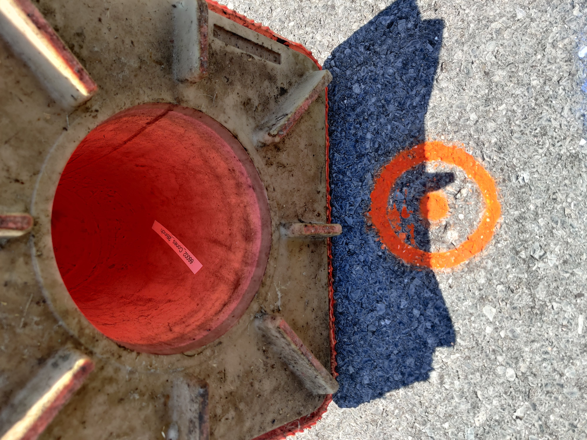

# Cone Markers
<!-- TABLE OF CONTENTS -->

  
<h2 style="display: inline-block">Table of Contents</h2>

  <ol>
    <li>
      <a href="#about-the-project">About the Project</a>
    </li>
    <li><a href="#scenario-1">Scenario 1</a>
    <li><a href="#scenario-2">Scenario 2</a></li>
    <li><a href="#scenario-3">Scenario 3</a></li>
    <li><a href="#scenario-4">Scenario 4</a></li>
  </ol>

***
## Scenario 1 
### Scenario 1.1 

**Channelizer 1 – 69001_Cones_28inch** 
<pre align="center">
  
  <figcaption>Fig.1 - Cone.</figcaption>
</pre>

**Channelizer 2 – 69002_Cones_28inch**
<pre align="center">
  
  <figcaption>Fig.2 - Cone.</figcaption>
</pre>

**Channelizer 3 – 68001_Cones_28inch**
<pre align="center">
  
  <figcaption>Fig.3 - Cone.</figcaption>
</pre>

**Channelizer 4 – 67001_Cones_28inch**
<pre align="center">
  
  <figcaption>Fig.4 - Cone.</figcaption>
</pre>

**Channelizer 5 – 67002_Cones_28inch**
<pre align="center">
  
  <figcaption>Fig.5 - Cone.</figcaption>
</pre>

**Channelizer 6 – 68002_Cones_28inch**
<pre align="center">
  
  <figcaption>Fig.6 - Cone.</figcaption>
</pre>

**Channelizer 7 – 68003_Cones_28inch**
<pre align="center">
  
  <figcaption>Fig.7 - Cone.</figcaption>
</pre>

**Channelizer 8 – 64001_Cones_28inch**
<pre align="center">
  
  <figcaption>Fig.8 - Cone.</figcaption>
</pre>

**Channelizer 9 – 64002_Cones_28inch**
<pre align="center">
  
  <figcaption>Fig.9 - Cone.</figcaption>
</pre>

**Channelizer 10 – 63002_Cones_28inch**
<pre align="center">
  
  <figcaption>Fig.10 - Cone.</figcaption>
</pre>

**Channelizer 11 – 63001_Cones_28inch**
<pre align="center">
  
  <figcaption>Fig.11 - Cone.</figcaption>
</pre>

**Channelizer 12 – 64003_Cones_28inch**
<pre align="center">
  
  <figcaption>Fig.12 - Cone.</figcaption>
</pre>

**Channelizer 13 – 65003_Cones_28inch**
<pre align="center">
  
  <figcaption>Fig.13 - Cone.</figcaption>
</pre>

**Channelizer 14 – 65004_Cones_28inch**
<pre align="center">
  
  <figcaption>Fig.14 - Cone.</figcaption>
</pre>

**Channelizer 15 – 64004_Cones_28inch**
<pre align="center">
  
  <figcaption>Fig.15 - Cone.</figcaption>
</pre>

**Channelizer 16 – 65002_Cones_28inch**
<pre align="center">
  
  <figcaption>Fig.16 - Cone.</figcaption>
</pre>

**Channelizer 17 – 65001_Cones_28inch**
<pre align="center">
  
  <figcaption>Fig.17 - Cone.</figcaption>
</pre>

**Channelizer 18 – 66001_Cones_28inch**
<pre align="center">
  
  <figcaption>Fig.18 - Cone.</figcaption>
</pre>

**Channelizer 19 – 66002_Cones_28inch**
<pre align="center">
  
  <figcaption>Fig.19 - Cone.</figcaption>
</pre>