# Hardware_WorkZones_PennsylvaniaADSEquipmentInventory

<!--
The following template is based on:
Best-README-Template
Search for this, and you will find!
>
<!-- PROJECT LOGO -->
 

  <!--  -->

  <h2 align="center"> Hardware_WorkZones_PennsylvaniaADSEquipmentInventory
  </h2>

  <pre align="center">
    
    <!--font size="-2">Photo by <a href="https://www.penndot.pa.gov/Pages/default.aspx"> -->
</pre>

  

    The purpose of this repo is to inventory the Pennsylvania ADS equipment.
  

***

<!-- TABLE OF CONTENTS -->

  
<h2 style="display: inline-block">Table of Contents</h2>

  <ol>
    <li>
      <a href="#about-the-project">About the Project</a>
    </li>
    <li><a href="#directories">Directories' Structure</a>
    <li><a href="#inventory">Equipment Inventory</a></li>
    <li><a href="#license">License</a></li>
    <li><a href="#contact">Contact</a></li>
  </ol>

***

<!-- ABOUT THE PROJECT -->
## About The Project

<a href="#hardware_workzones_pennsylvaniaadsequipmentinventory">Back to top</a>

***

<!-- STRUCTURE OF THE REPO -->
### Directories

The following are the top level directories within the repository:
<ul>
 <li>Documents folder: Explains the coding method for equipment. </li>
 <li>Images folder: COntains images for all equipment. </li>

<a href="#hardware_workzones_pennsylvaniaadsequipmentinventory">Back to top</a>

***

## Inventory

### **1) White**
A) "Speed Limit 45" signs - Quantity: 3

**10001_-SPEED-LIMIT-45-_IIA21**
<pre align="center">
  
  <figcaption>Fig.1 - "Speed Limit 45" sign.</figcaption>
</pre>

<pre align="center">
  
  <figcaption>Fig.2 - "Speed Limit 45" sign.</figcaption>
</pre>

<pre align="center">
  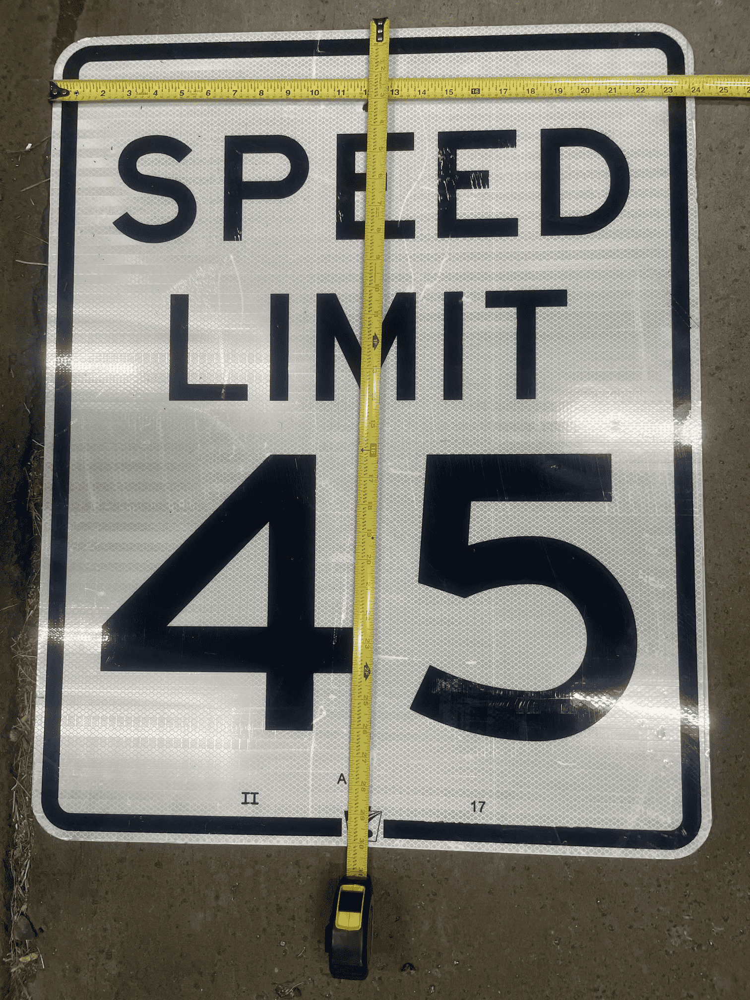
  <figcaption>Fig.3 - "Speed Limit 45" sign.</figcaption>
</pre>

**10002_-SPEED-LIMIT-45-_IIA21**
<pre align="center">
  
  <figcaption>Fig.4 - "Speed Limit 45" sign.</figcaption>
</pre>

<pre align="center">
  
  <figcaption>Fig.5 - "Speed Limit 45" sign.</figcaption>
</pre>

<pre align="center">
  
  <figcaption>Fig.6 - "Speed Limit 45" sign.</figcaption>
</pre>

**10003_-SPEED-LIMIT-45-_IIA21**
<pre align="center">
  
  <figcaption>Fig.7 - "Speed Limit 45" sign.</figcaption>
</pre>

<pre align="center">
  
  <figcaption>Fig.8 - "Speed Limit 45" sign.</figcaption>
</pre>

<pre align="center">
  
  <figcaption>Fig.9 - "Speed Limit 45" sign.</figcaption>
</pre>

B) "Speed Limit 35" signs - Quantity: 5

**10004_-SPEED-LIMIT-35-_IIA21**
<pre align="center">
  
  <figcaption>Fig.10 - "Speed Limit 35" sign.</figcaption>
</pre>

<pre align="center">
  
  <figcaption>Fig.11 - "Speed Limit 35" sign.</figcaption>
</pre>

<pre align="center">
  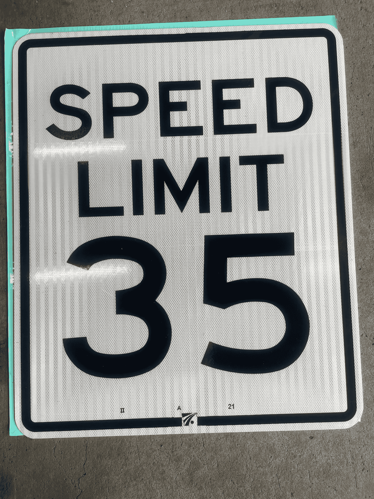
  <figcaption>Fig.12 - "Speed Limit 35" sign.</figcaption>
</pre>

**10005_-SPEED-LIMIT-35-_IIA21**
<pre align="center">
  
  <figcaption>Fig.13 - "Speed Limit 35" sign.</figcaption>
</pre>

<pre align="center">
  
  <figcaption>Fig.14 - "Speed Limit 35" sign.</figcaption>
</pre>

<pre align="center">
  
  <figcaption>Fig.15 - "Speed Limit 35" sign.</figcaption>
</pre>

**10006_-SPEED-LIMIT-35-_IIA21**
<pre align="center">
  
  <figcaption>Fig.16 - "Speed Limit 35" sign.</figcaption>
</pre>

<pre align="center">
  
  <figcaption>Fig.17 - "Speed Limit 35" sign.</figcaption>
</pre>

<pre align="center">
  
  <figcaption>Fig.18 - "Speed Limit 35" sign.</figcaption>
</pre>

**10007_-SPEED-LIMIT-35-_IIA21**
<pre align="center">
  
  <figcaption>Fig.19 - "Speed Limit 35" sign.</figcaption>
</pre>

<pre align="center">
  
  <figcaption>Fig.20 - "Speed Limit 35" sign.</figcaption>
</pre>

<pre align="center">
  
  <figcaption>Fig.21 - "Speed Limit 35" sign.</figcaption>
</pre>

**10008_-SPEED-LIMIT-35-_IIA21**
<pre align="center">
  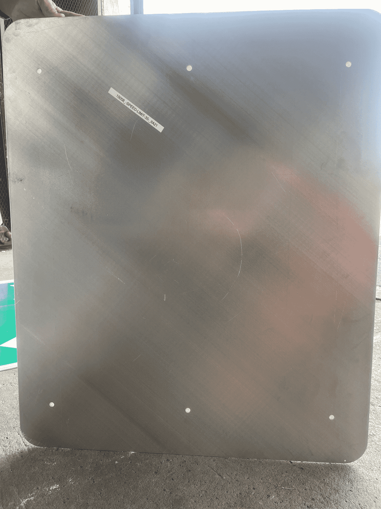
  <figcaption>Fig.22 - "Speed Limit 35" sign.</figcaption>
</pre>

<pre align="center">
  
  <figcaption>Fig.23 - "Speed Limit 35" sign.</figcaption>
</pre>

<pre align="center">
  
  <figcaption>Fig.24 - "Speed Limit 35" sign.</figcaption>
</pre>

C) "Speed Limit 30" signs - Quantity: 2

**100010_-SPEED-LIMIT-30-_IIA21**
<pre align="center">
  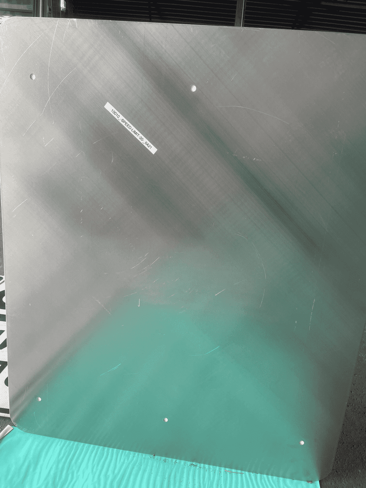
  <figcaption>Fig.25 - "Speed Limit 30" sign.</figcaption>
</pre>

<pre align="center">
  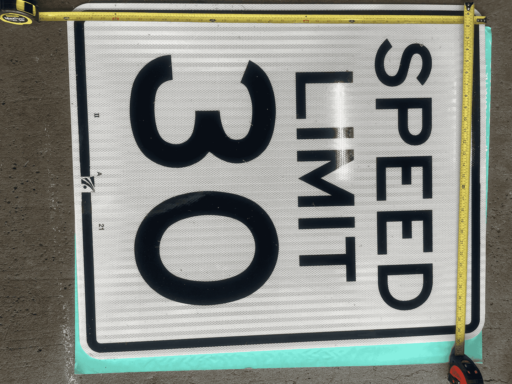
  <figcaption>Fig.26 - "Speed Limit 30" sign.</figcaption>
</pre>

<pre align="center">
  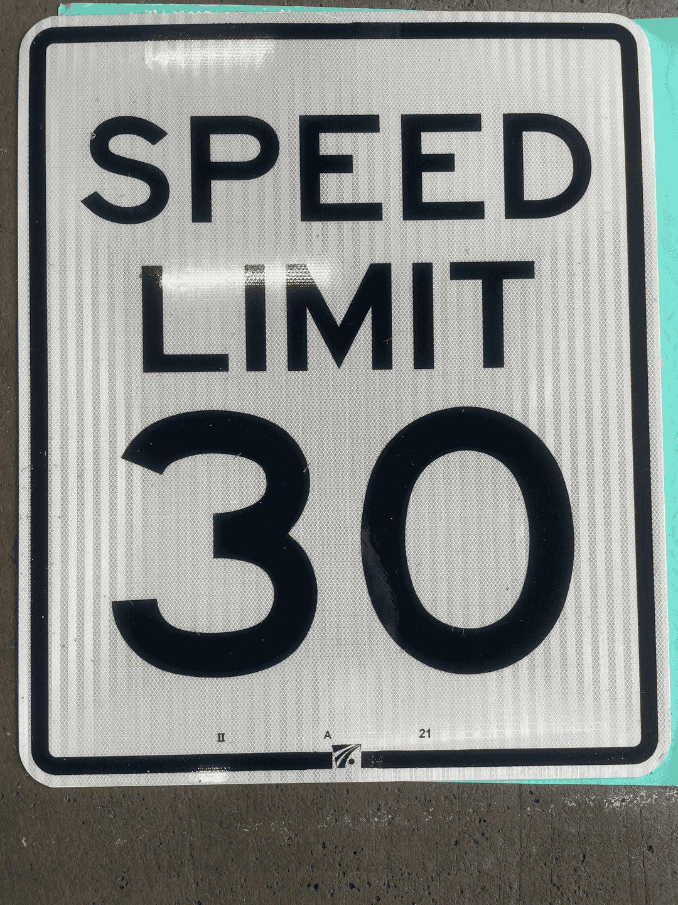
  <figcaption>Fig.27 - "Speed Limit 30" sign.</figcaption>
</pre>

**10009_-SPEED-LIMIT-30-_IIA21**
<pre align="center">
  
  <figcaption>Fig.28 - "Speed Limit 30" sign.</figcaption>
</pre>

<pre align="center">
  
  <figcaption>Fig.29 - "Speed Limit 30" sign.</figcaption>
</pre>

<pre align="center">
  
  <figcaption>Fig.30 - "Speed Limit 30" sign.</figcaption>
</pre>

D) "Speed Limit 25" sign - Quantity: 2

**100011_-SPEED-LIMIT-25-_IIA21**
<pre align="center">
  
  <figcaption>Fig.31 - "Speed Limit 25" sign.</figcaption>
</pre>

<pre align="center">
  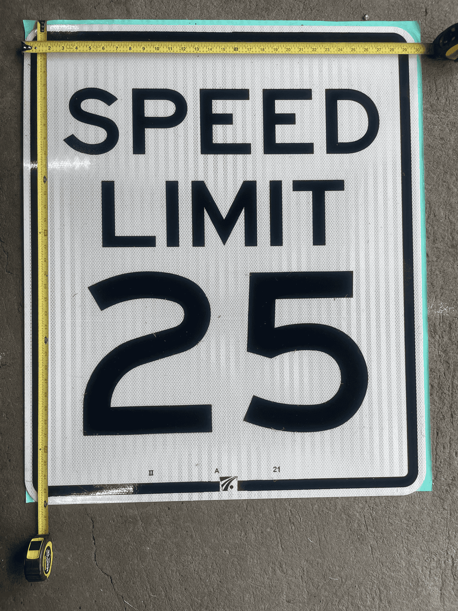
  <figcaption>Fig.32 - "Speed Limit 25" sign.</figcaption>
</pre>

<pre align="center">
  
  <figcaption>Fig.33 - "Speed Limit 25" sign.</figcaption>
</pre>

**100012_-SPEED-LIMIT-25-_IIA21**
<pre align="center">
  
  <figcaption>Fig.34 - "Speed Limit 25" sign.</figcaption>
</pre>
<pre align="center">
  
  <figcaption>Fig.35 - "Speed Limit 25" sign.</figcaption>
</pre>

<pre align="center">
  
  <figcaption>Fig.36 - "Speed Limit 25" sign.</figcaption>
</pre>

E) "Stay in lane" sign - Quantity: 1

**10013_-STAY-IN-LANE-_D**
<pre align="center">
  
  <figcaption>Fig.37 - "Stay in lane" sign.</figcaption>
</pre>
<pre align="center">
  
  <figcaption>Fig.38 - "Stay in lane" sign.</figcaption>
</pre>

<pre align="center">
  
  <figcaption>Fig.39 - "Stay in lane" sign.</figcaption>
</pre>

F) Pennsylvania Route "45" sign - Quantity: 10 

**10014_PennsylvaniaRoute_-45-_21BII**
<pre align="center">
  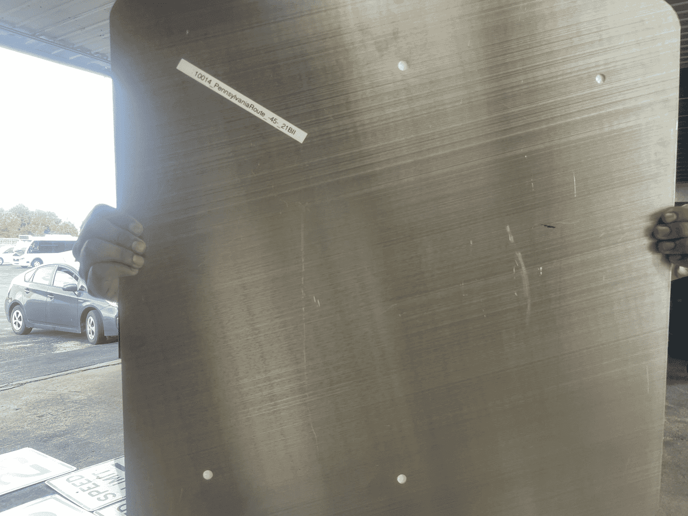
  <figcaption>Fig.40 - Pennsylvania Route "45" sign.</figcaption>
</pre>

<pre align="center">
  
  <figcaption>Fig.41 - Pennsylvania Route "45" sign.</figcaption>
</pre>

<pre align="center">
  
  <figcaption>Fig.42 - Pennsylvania Route "45" sign.</figcaption>
</pre>

**10015_PennsylvaniaRoute_-45-_21BII**
<pre align="center">
  
  <figcaption>Fig.43 - Pennsylvania Route "45" sign.</figcaption>
</pre>

<pre align="center">
  
  <figcaption>Fig.44 - Pennsylvania Route "45" sign.</figcaption>
</pre>

<pre align="center">
  
  <figcaption>Fig.45 - Pennsylvania Route "45" sign.</figcaption>
</pre>

**10017_PennsylvaniaRoute_-45-_21BII**
<pre align="center">
  
  <figcaption>Fig.46 - Pennsylvania Route "45" sign.</figcaption>
</pre>

<pre align="center">
  
  <figcaption>Fig.47 - Pennsylvania Route "45" sign.</figcaption>
</pre>

<pre align="center">
  
  <figcaption>Fig.48 - Pennsylvania Route "45" sign.</figcaption>
</pre>

**10018_PennsylvaniaRoute_-45-_21BII**
<pre align="center">
  
  <figcaption>Fig.49 - Pennsylvania Route "45" sign.</figcaption>
</pre>

<pre align="center">
  
  <figcaption>Fig.50 - Pennsylvania Route "45" sign.</figcaption>
</pre>

<pre align="center">
  
  <figcaption>Fig.51 - Pennsylvania Route "45" sign.</figcaption>
</pre>

**10020_PennsylvaniaRoute_-45-_21BII**
<pre align="center">
  
  <figcaption>Fig.52 - Pennsylvania Route "45" sign.</figcaption>
</pre>

<pre align="center">
  
  <figcaption>Fig.53 - Pennsylvania Route "45" sign.</figcaption>
</pre>

<pre align="center">
  
  <figcaption>Fig.54 - Pennsylvania Route "45" sign.</figcaption>
</pre>

**10021_PennsylvaniaRoute_-45-_21BII**
<pre align="center">
  
  <figcaption>Fig.55 - Pennsylvania Route "45" sign.</figcaption>
</pre>

<pre align="center">
  
  <figcaption>Fig.56 - Pennsylvania Route "45" sign.</figcaption>
</pre>

<pre align="center">
  
  <figcaption>Fig.57 - Pennsylvania Route "45" sign.</figcaption>
</pre>

**10022_PennsylvaniaRoute_-45-_21BII**
<pre align="center">
  
  <figcaption>Fig.58 - Pennsylvania Route "45" sign.</figcaption>
</pre>

<pre align="center">
  
  <figcaption>Fig.59 - Pennsylvania Route "45" sign.</figcaption>
</pre>

<pre align="center">
  
  <figcaption>Fig.60 - Pennsylvania Route "45" sign.</figcaption>
</pre>

**10023_PennsylvaniaRoute_-45-_21BII**
<pre align="center">
  
  <figcaption>Fig.61 - Pennsylvania Route "45" sign.</figcaption>
</pre>

<pre align="center">
  
  <figcaption>Fig.62 - Pennsylvania Route "45" sign.</figcaption>
</pre>

<pre align="center">
  
  <figcaption>Fig.63 - Pennsylvania Route "45" sign.</figcaption>
</pre>

G) Right Arrow signs - Quantity: 4

**10024_RightArrow_D22**
<pre align="center">
  
  <figcaption>Fig.64 - Right Arrow sign.</figcaption>
</pre>

<pre align="center">
  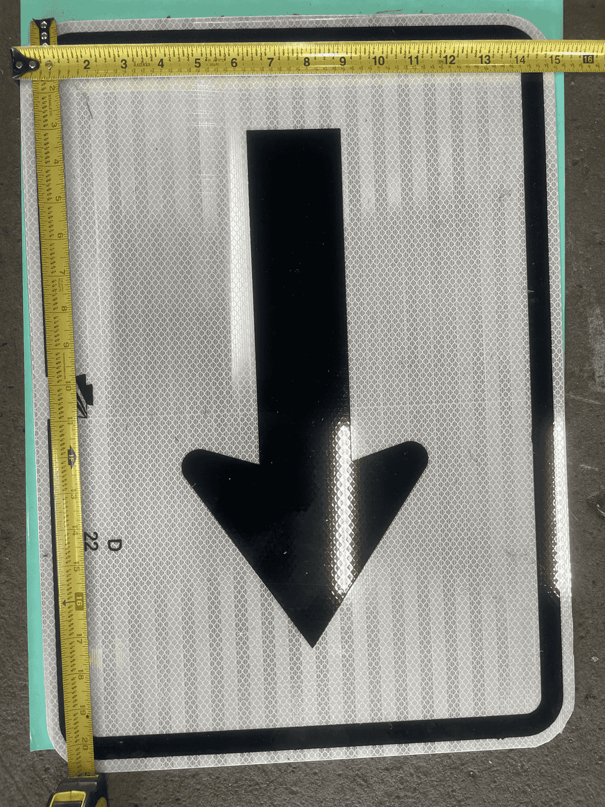
  <figcaption>Fig.65 - Right Arrow sign.</figcaption>
</pre>

<pre align="center">
  
  <figcaption>Fig.66 - Right Arrow sign.</figcaption>
</pre>

**10025_RightArrow_D22**
<pre align="center">
  
  <figcaption>Fig.67 - Right Arrow sign.</figcaption>
</pre>

<pre align="center">
  
  <figcaption>Fig.68 - Right Arrow sign.</figcaption>
</pre>

<pre align="center">
  
  <figcaption>Fig.69 - Right Arrow sign.</figcaption>
</pre>

**10026_RightArrow_D22**
<pre align="center">
  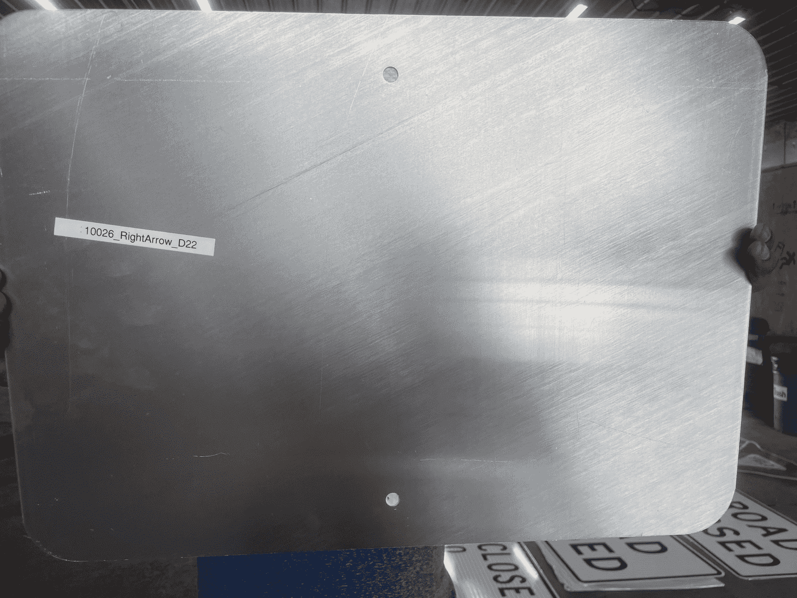
  <figcaption>Fig.70 - Right Arrow sign.</figcaption>
</pre>

<pre align="center">
  
  <figcaption>Fig.71 - Right Arrow sign.</figcaption>
</pre>

<pre align="center">
  
  <figcaption>Fig.72 - Right Arrow sign.</figcaption>
</pre>

**10027_RightArrow_D22**
<pre align="center">
  
  <figcaption>Fig.73 - Right Arrow sign.</figcaption>
</pre>
<pre align="center">
  
  <figcaption>Fig.74 - Right Arrow sign.</figcaption>
</pre>

<pre align="center">
  
  <figcaption>Fig.75 - Right Arrow sign.</figcaption>
</pre>

H) Up Arrow signs - Quantity: 3

**10028_UpArrow_A**
<pre align="center">
  
  <figcaption>Fig.76 - Up Arrow sign.</figcaption>
</pre>

<pre align="center">
  
  <figcaption>Fig.77 - Up Arrow sign.</figcaption>
</pre>

<pre align="center">
  
  <figcaption>Fig.78 - Up Arrow sign.</figcaption>
</pre>

**10029_UpArrow_A**
<pre align="center">
  
  <figcaption>Fig.79 - Up Arrow sign.</figcaption>
</pre>

<pre align="center">
  
  <figcaption>Fig.80 - Up Arrow sign.</figcaption>
</pre>

<pre align="center">
  
  <figcaption>Fig.81 - Up Arrow sign.</figcaption>
</pre>

**10030_UpArrow_A**
<pre align="center">
  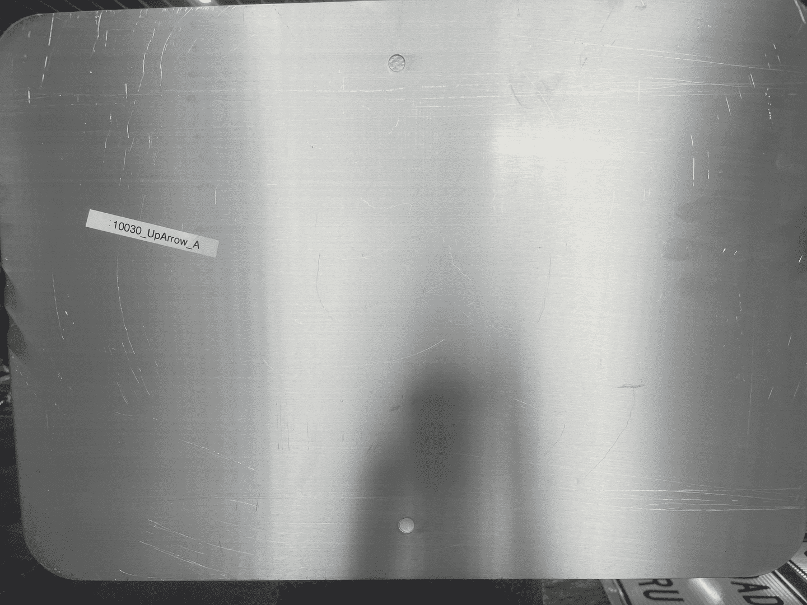
  <figcaption>Fig.82 - Up Arrow sign.</figcaption>
</pre>

<pre align="center">
  
  <figcaption>Fig.83 - Up Arrow sign.</figcaption>
</pre>

<pre align="center">
  
  <figcaption>Fig.84 - Up Arrow sign.</figcaption>
</pre>

I) Right Turn sign - Quantity: 1

**10031_RightTurn_D**
<pre align="center">
  
  <figcaption>Fig.85 - Up Arrow sign.</figcaption>
</pre>

<pre align="center">
  
  <figcaption>Fig.86 - Up Arrow sign.</figcaption>
</pre>

<pre align="center">
  
  <figcaption>Fig.87 - Up Arrow sign.</figcaption>
</pre>

J) Left Turn sign - Quantity: 2

**10032_LeftTurn_B**
<pre align="center">
  
  <figcaption>Fig.88 - Up Arrow sign.</figcaption>
</pre>

<pre align="center">
  
  <figcaption>Fig.89 - Up Arrow sign.</figcaption>
</pre>

<pre align="center">
  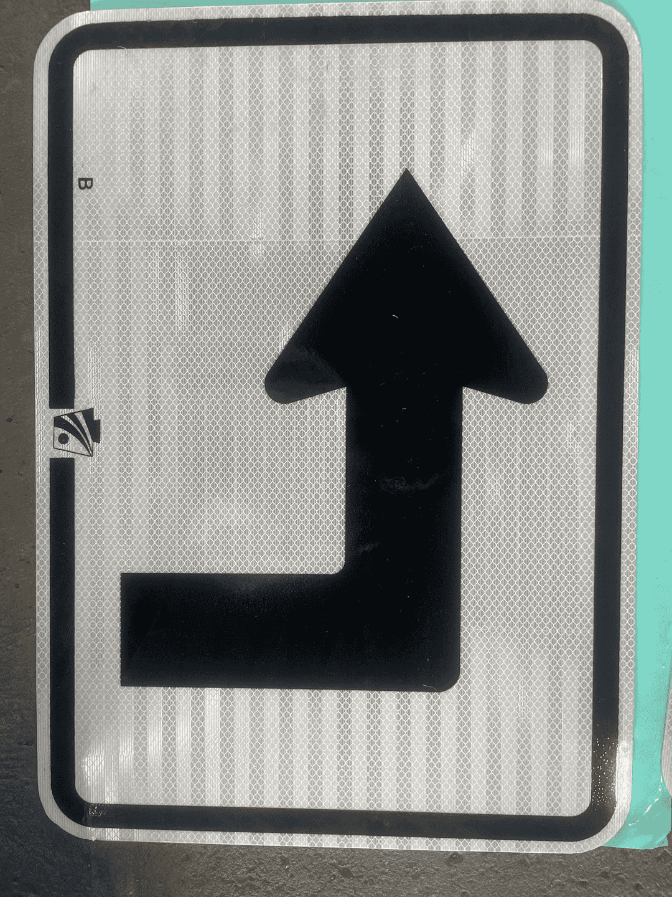
  <figcaption>Fig.90 - Up Arrow sign.</figcaption>
</pre>

**10033_LeftTurn_B**
<pre align="center">
  
  <figcaption>Fig.91 - Up Arrow sign.</figcaption>
</pre>

<pre align="center">
  
  <figcaption>Fig.92 - Up Arrow sign.</figcaption>
</pre>

<pre align="center">
  
  <figcaption>Fig.93 - Up Arrow sign.</figcaption>
</pre>

k) Left Corner ArroW "STOP HERE ON RED" sign - Quantity: 1

**10034_LeftCornerArrow_-STOP-HERE-ON-RED-_22B**
<pre align="center">
  
  <figcaption>Fig.94 - Left Corner ArroW "STOP HERE ON RED" sign.</figcaption>
</pre>

<pre align="center">
  
  <figcaption>Fig.95 - Left Corner ArroW "STOP HERE ON RED" sign.</figcaption>
</pre>

<pre align="center">
  
  <figcaption>Fig.96 - Left Corner ArroW "STOP HERE ON RED" sign.</figcaption>
</pre>

L) ROAD CLOSED sign - Quantity: 2

**10035_-ROAD-CLOSED-_B**
<pre align="center">
  
  <figcaption>Fig.97 - ROAD CLOSED sign.</figcaption>
</pre>

<pre align="center">
  
  <figcaption>Fig.98 - ROAD CLOSED sign.</figcaption>
</pre>

<pre align="center">
  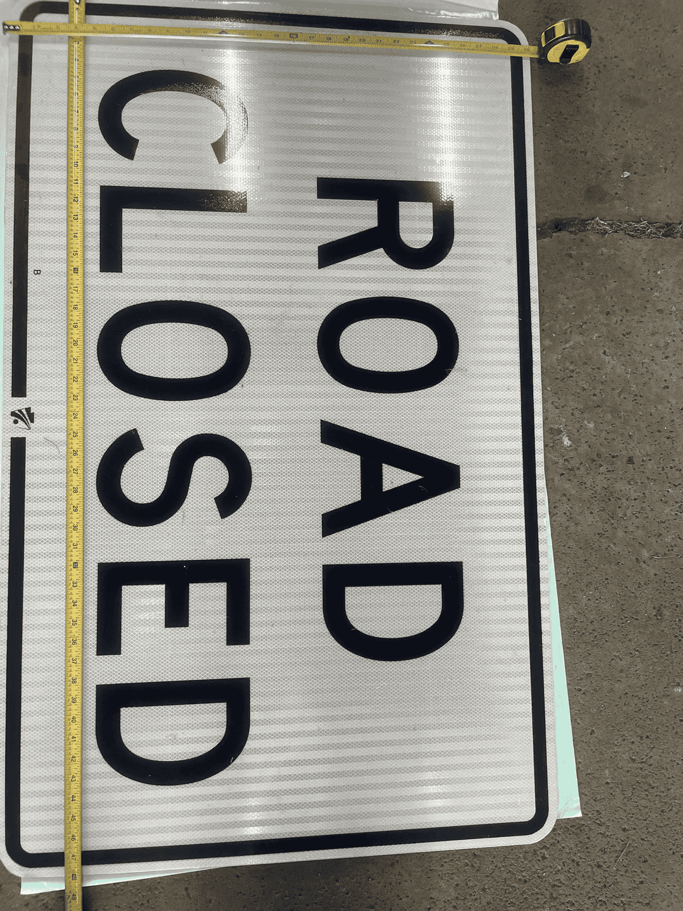
  <figcaption>Fig.99 - ROAD CLOSED sign.</figcaption>
</pre>

<pre align="center">
  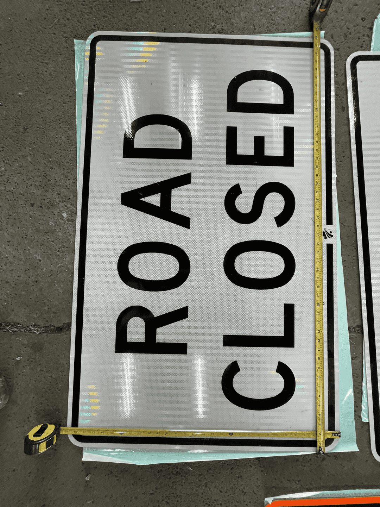
  <figcaption>Fig.100 - ROAD CLOSED sign.</figcaption>
</pre>

<pre align="center">
  
  <figcaption>Fig.101 - ROAD CLOSED sign.</figcaption>
</pre>

<pre align="center">
  
  <figcaption>Fig.102 - ROAD CLOSED sign.</figcaption>
</pre>

**10036_-ROAD-CLOSED-_B**
<pre align="center">
  
  <figcaption>Fig.103 - ROAD CLOSED sign.</figcaption>
</pre>

<pre align="center">
  
  <figcaption>Fig.104 - ROAD CLOSED sign.</figcaption>
</pre>

<pre align="center">
  
  <figcaption>Fig.105 - ROAD CLOSED sign.</figcaption>
</pre>

<pre align="center">
  
  <figcaption>Fig.106 - ROAD CLOSED sign.</figcaption>
</pre>

<pre align="center">
  
  <figcaption>Fig.107 - ROAD CLOSED sign.</figcaption>
</pre>

<pre align="center">
  
  <figcaption>Fig.108 - ROAD CLOSED sign.</figcaption>
</pre>

M) ROAD CLOSED /TO /THRU TRAFFIC sign - Quantity: 1

**10037_-ROAD+CLOSED-TO-THRU+TRAFFIC-_B**
<pre align="center">
  
  <figcaption>Fig.109 - ROAD CLOSED /TO /THRU TRAFFIC sign.</figcaption>
</pre>

<pre align="center">
  
  <figcaption>Fig.1110 - ROAD CLOSED /TO /THRU TRAFFIC sign.</figcaption>
</pre>

<pre align="center">
  
  <figcaption>Fig.111 - ROAD CLOSED /TO /THRU TRAFFIC sign.</figcaption>
</pre>

N) NORTH sign - Quantitiy: 10

**10038_-NORTH-_DIII22**
<pre align="center">
  
  <figcaption>Fig.112 - NORTH sign.</figcaption>
</pre>

<pre align="center">
  
  <figcaption>Fig.113 - NORTH sign.</figcaption>
</pre>

<pre align="center">
  
  <figcaption>Fig.114 - NORTH sign.</figcaption>
</pre>

**10039_-NORTH-_DIII22**
<pre align="center">
  
  <figcaption>Fig.115 - NORTH sign.</figcaption>
</pre>

<pre align="center">
  
  <figcaption>Fig.116 - NORTH sign.</figcaption>
</pre>

<pre align="center">
  
  <figcaption>Fig.117 - NORTH sign.</figcaption>
</pre>

**10040_-NORTH-_DIII22**
<pre align="center">
  
  <figcaption>Fig.118 - NORTH sign.</figcaption>
</pre>

<pre align="center">
  
  <figcaption>Fig.119 - NORTH sign.</figcaption>
</pre>

<pre align="center">
  
  <figcaption>Fig.120 - NORTH sign.</figcaption>
</pre>

**10041_-NORTH-_DIII22**
<pre align="center">
  
  <figcaption>Fig.121 - NORTH sign.</figcaption>
</pre>

<pre align="center">
  
  <figcaption>Fig.122 - NORTH sign.</figcaption>
</pre>

<pre align="center">
  
  <figcaption>Fig.123 - NORTH sign.</figcaption>
</pre>

**10042_-NORTH-_DIII22**
<pre align="center">
  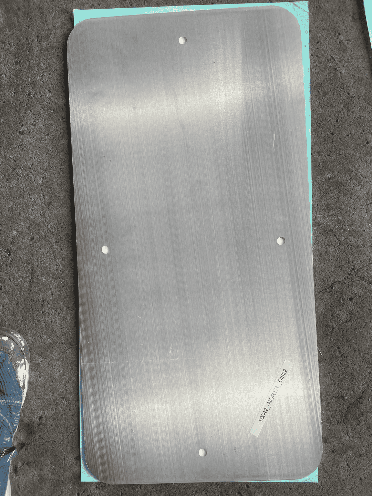
  <figcaption>Fig.124 - NORTH sign.</figcaption>
</pre>

<pre align="center">
  
  <figcaption>Fig.125 - NORTH sign.</figcaption>
</pre>

<pre align="center">
  
  <figcaption>Fig.126 - NORTH sign.</figcaption>
</pre>

**10043_-NORTH-_DIII22**
<pre align="center">
  
  <figcaption>Fig.127 - NORTH sign.</figcaption>
</pre>

<pre align="center">
  
  <figcaption>Fig.128 - NORTH sign.</figcaption>
</pre>

<pre align="center">
  
  <figcaption>Fig.129 - NORTH sign.</figcaption>
</pre>

**10044_-NORTH-_DIII22**
<pre align="center">
  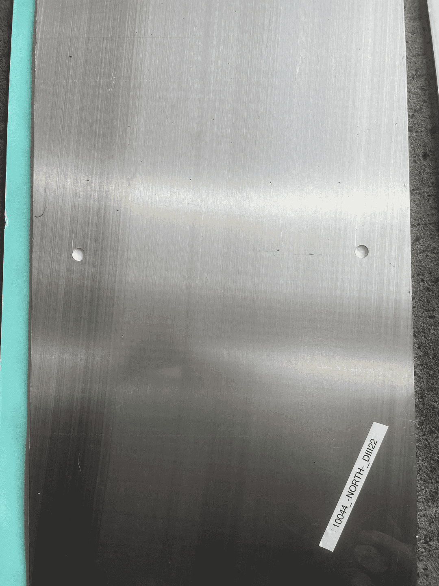
  <figcaption>Fig.130 - NORTH sign.</figcaption>
</pre>

<pre align="center">
  
  <figcaption>Fig.131 - NORTH sign.</figcaption>
</pre>

<pre align="center">
  
  <figcaption>Fig.132 - NORTH sign.</figcaption>
</pre>

**10045_-NORTH-_DIII22**
<pre align="center">
  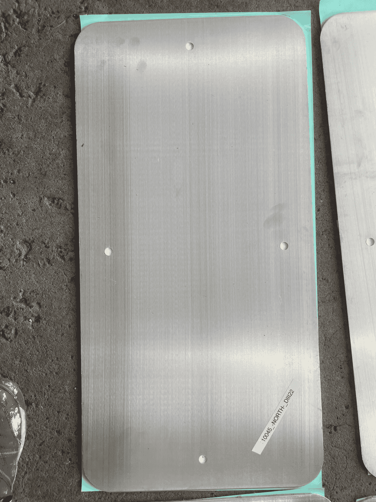
  <figcaption>Fig.133 - NORTH sign.</figcaption>
</pre>

<pre align="center">
  
  <figcaption>Fig.134 - NORTH sign.</figcaption>
</pre>

<pre align="center">
  
  <figcaption>Fig.135 - NORTH sign.</figcaption>
</pre>

**10046_-NORTH-_DIII22**
<pre align="center">
  
  <figcaption>Fig.136 - NORTH sign.</figcaption>
</pre>

<pre align="center">
  
  <figcaption>Fig.137 - NORTH sign.</figcaption>
</pre>

<pre align="center">
  
  <figcaption>Fig.138 - NORTH sign.</figcaption>
</pre>

**10047_-NORTH-_DIII22**
<pre align="center">
  
  <figcaption>Fig.139 - NORTH sign.</figcaption>
</pre>

<pre align="center">
  
  <figcaption>Fig.140 - NORTH sign.</figcaption>
</pre>

<pre align="center">
  
  <figcaption>Fig.141 - NORTH sign.</figcaption>
</pre>

O) SOUTH sign - Quantitiy: 10

**10048_-SOUTH-_22DIII**
<pre align="center">
  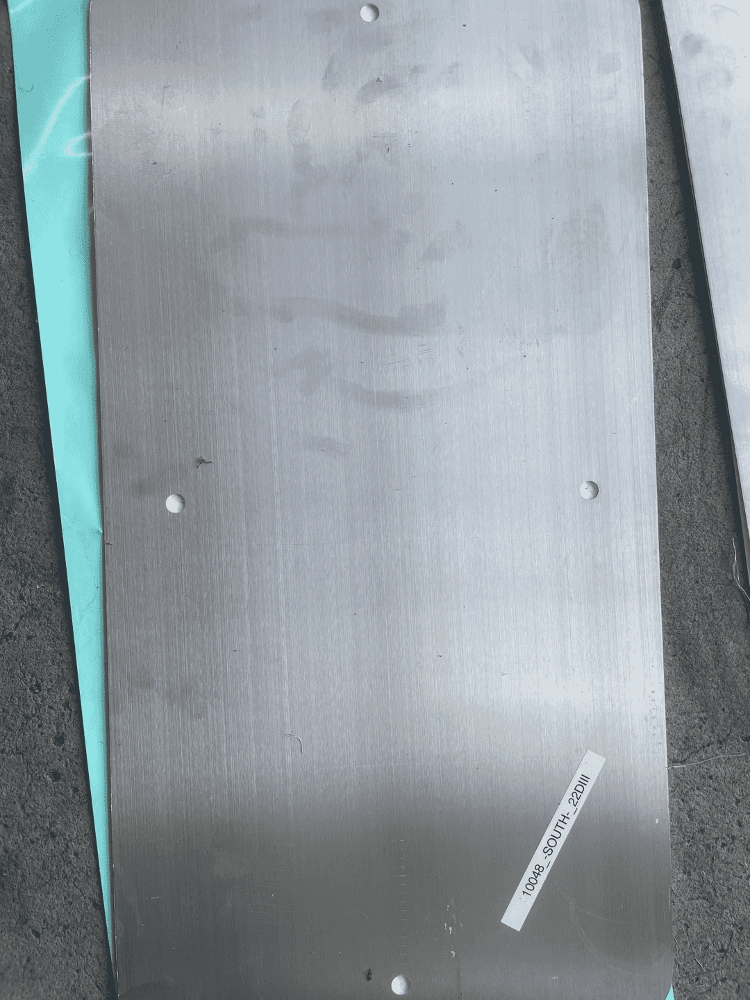
  <figcaption>Fig.142 - SOUTH sign.</figcaption>
</pre>

<pre align="center">
  
  <figcaption>Fig.143 - SOUTH sign.</figcaption>
</pre>

<pre align="center">
  
  <figcaption>Fig.144 - SOUTH sign.</figcaption>
</pre>

**10049_-SOUTH-_22DIII**
<pre align="center">
  
  <figcaption>Fig.145 - SOUTH sign.</figcaption>
</pre>
<pre align="center">
  
  <figcaption>Fig.146 - SOUTH sign.</figcaption>
</pre>

<pre align="center">
  
  <figcaption>Fig.147 - SOUTH sign.</figcaption>
</pre>

**10050_-SOUTH-_22DIII**
<pre align="center">
  
  <figcaption>Fig.148 - SOUTH sign.</figcaption>
</pre>
<pre align="center">
  
  <figcaption>Fig.149 - SOUTH sign.</figcaption>
</pre>

<pre align="center">
  
  <figcaption>Fig.150 - SOUTH sign.</figcaption>
</pre>

**10051_-SOUTH-_22DIII**
<pre align="center">
  
  <figcaption>Fig.151 - SOUTH sign.</figcaption>
</pre>
<pre align="center">
  
  <figcaption>Fig.152 - .</figcaption>
</pre>

<pre align="center">
  
  <figcaption>Fig.153 - SOUTH sign.</figcaption>
</pre>

**10052_-SOUTH-_22DIII**
<pre align="center">
  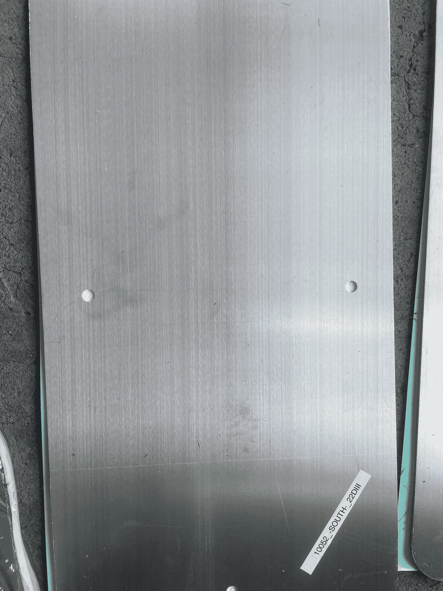
  <figcaption>Fig.154 - SOUTH sign.</figcaption>
</pre>
<pre align="center">
  
  <figcaption>Fig.155 - SOUTH sign.</figcaption>
</pre>

<pre align="center">
  
  <figcaption>Fig.156 - SOUTH sign.</figcaption>
</pre>

**10053_-SOUTH-_22DIII**
<pre align="center">
  
  <figcaption>Fig.157 - SOUTH sign.</figcaption>
</pre>
<pre align="center">
  
  <figcaption>Fig.158 - SOUTH sign.</figcaption>
</pre>

<pre align="center">
  
  <figcaption>Fig.159 - SOUTH sign.</figcaption>
</pre>

**10054_-SOUTH-_22DIII**
<pre align="center">
  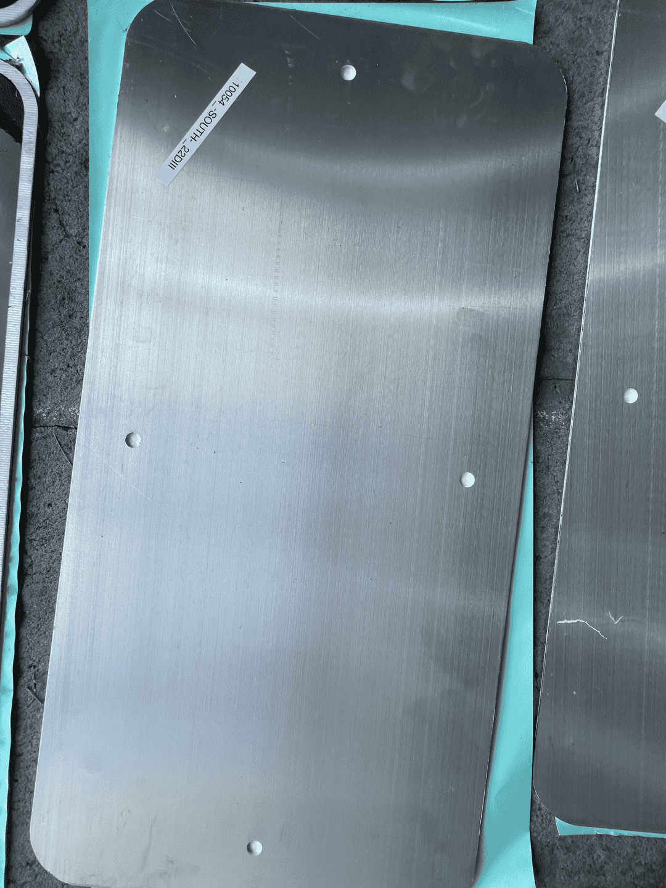
  <figcaption>Fig.160 - SOUTH sign.</figcaption>
</pre>
<pre align="center">
  
  <figcaption>Fig.161 - SOUTH sign.</figcaption>
</pre>

<pre align="center">
  
  <figcaption>Fig.162 - SOUTH sign.</figcaption>
</pre>

**10055_-SOUTH-_22DIII**
<pre align="center">
  
  <figcaption>Fig.163 - SOUTH sign.</figcaption>
</pre>
<pre align="center">
  
  <figcaption>Fig.164 - SOUTH sign.</figcaption>
</pre>

<pre align="center">
  
  <figcaption>Fig.165 - SOUTH sign.</figcaption>
</pre>

**10056_-SOUTH-_22DIII**
<pre align="center">
  
  <figcaption>Fig.166 - SOUTH sign.</figcaption>
</pre>
<pre align="center">
  
  <figcaption>Fig.167 - SOUTH sign.</figcaption>
</pre>

<pre align="center">
  
  <figcaption>Fig.168 - SOUTH sign.</figcaption>
</pre>

**10057_-SOUTH-_22DIII**
<pre align="center">
  
  <figcaption>Fig.169 - SOUTH sign.</figcaption>
</pre>
<pre align="center">
  
  <figcaption>Fig.170 - SOUTH sign.</figcaption>
</pre>

<pre align="center">
  
  <figcaption>Fig.171 - SOUTH sign.</figcaption>
</pre>

P) EAST sign - Quantitiy: 10

**10058_-EAST-_22DIII**
<pre align="center">
  
  <figcaption>Fig.172 - EAST sign.</figcaption>
</pre>
<pre align="center">
  
  <figcaption>Fig.173 - EAST sign.</figcaption>
</pre>

<pre align="center">
  
  <figcaption>Fig.174 - EAST sign.</figcaption>
</pre>

**10059_-EAST-_22DIII**
<pre align="center">
  
  <figcaption>Fig.175 - EAST sign.</figcaption>
</pre>
<pre align="center">
  
  <figcaption>Fig.176 - EAST sign.</figcaption>
</pre>

<pre align="center">
  
  <figcaption>Fig.177 - EAST sign.</figcaption>
</pre>

**10060_-EAST-_22DIII**
<pre align="center">
  
  <figcaption>Fig.178- EAST sign.</figcaption>
</pre>
<pre align="center">
  
  <figcaption>Fig.179 - EAST sign.</figcaption>
</pre>

<pre align="center">
  
  <figcaption>Fig.180 - EAST sign.</figcaption>
</pre>

**10061_-EAST-_22DIII**
<pre align="center">
  
  <figcaption>Fig.181 - EAST sign.</figcaption>
</pre>
<pre align="center">
  
  <figcaption>Fig.182 - EAST sign.</figcaption>
</pre>

<pre align="center">
  
  <figcaption>Fig.183 - EAST sign.</figcaption>
</pre>

**10062_-EAST-_22DIII**
<pre align="center">
  
  <figcaption>Fig.184 - EAST sign.</figcaption>
</pre>
<pre align="center">
  
  <figcaption>Fig.185 - EAST sign.</figcaption>
</pre>

<pre align="center">
  
  <figcaption>Fig.186 - EAST sign.</figcaption>
</pre>

**10063_-EAST-_22DIII**
<pre align="center">
  
  <figcaption>Fig.187 - EAST sign.</figcaption>
</pre>
<pre align="center">
  
  <figcaption>Fig.188 - EAST sign.</figcaption>
</pre>

<pre align="center">
  
  <figcaption>Fig.189 - EAST sign.</figcaption>
</pre>

**10064_-EAST-_22DIII**
<pre align="center">
  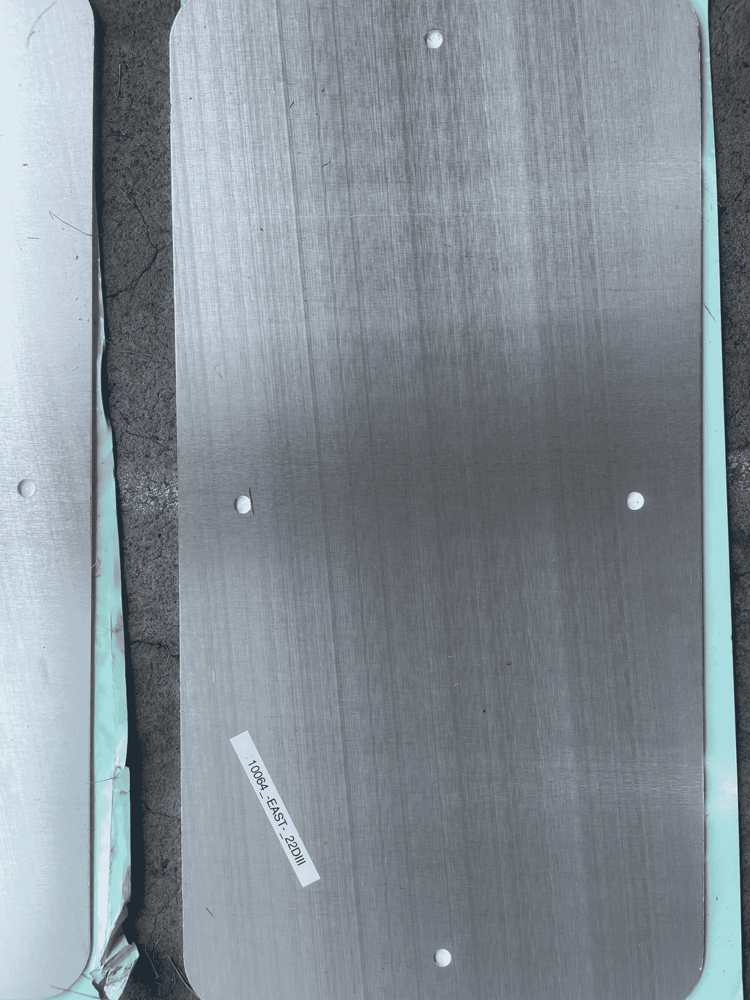
  <figcaption>Fig.190 - EAST sign.</figcaption>
</pre>

<pre align="center">
  
  <figcaption>Fig.191 - EAST sign.</figcaption>
</pre>

<pre align="center">
  
  <figcaption>Fig.192 - EAST sign.</figcaption>
</pre>
**10065_-EAST-_22DIII**
<pre align="center">
  
  <figcaption>Fig.193 - EAST sign.</figcaption>
</pre>

<pre align="center">
  
  <figcaption>Fig.194 - EAST sign.</figcaption>
</pre>

<pre align="center">
  
  <figcaption>Fig.195 - EAST sign.</figcaption>
</pre>

**10066_-EAST-_22DIII**
<pre align="center">
  
  <figcaption>Fig.196 - EAST sign.</figcaption>
</pre>

<pre align="center">
  
  <figcaption>Fig.197 - EAST sign.</figcaption>
</pre>

<pre align="center">
  
  <figcaption>Fig.198 - EAST sign.</figcaption>
</pre>

**10067_-EAST-_22DIII**
<pre align="center">
  
  <figcaption>Fig.199 - EAST sign.</figcaption>
</pre>

<pre align="center">
  
  <figcaption>Fig.200 - EAST sign.</figcaption>
</pre>

<pre align="center">
  
  <figcaption>Fig.201 - EAST sign.</figcaption>
</pre>

Q) WEST sign - Quantitiy: 10

**10068_-WEST-_IIID22**
<pre align="center">
  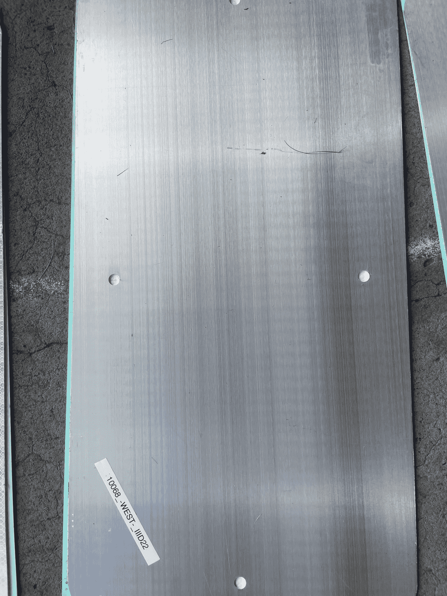
  <figcaption>Fig.202 - WEST sign.</figcaption>
</pre>
<pre align="center">
  
  <figcaption>Fig.203 - WEST sign.</figcaption>
</pre>

<pre align="center">
  
  <figcaption>Fig.204 - WEST sign.</figcaption>
</pre>

**10069_-WEST-_IIID22**
<pre align="center">
  
  <figcaption>Fig.205 - WEST sign.</figcaption>
</pre>
<pre align="center">
  
  <figcaption>Fig.206 - WEST sign.</figcaption>
</pre>

<pre align="center">
  
  <figcaption>Fig.207 - WEST sign.</figcaption>
</pre>

**10070_-WEST-_IIID22**
<pre align="center">
  
  <figcaption>Fig.208 - WEST sign.</figcaption>
</pre>
<pre align="center">
  
  <figcaption>Fig.208 - WEST sign.</figcaption>
</pre>

<pre align="center">
  
  <figcaption>Fig.209 - WEST sign.</figcaption>
</pre>

**10071_-WEST-_IIID22**
<pre align="center">
  
  <figcaption>Fig.210 - WEST sign.</figcaption>
</pre>
<pre align="center">
  
  <figcaption>Fig.211 - WEST sign.</figcaption>
</pre>

<pre align="center">
  
  <figcaption>Fig.212 - WEST sign.</figcaption>
</pre>

**10072_-WEST-_IIID22**
<pre align="center">
  
  <figcaption>Fig.213 - WEST sign.</figcaption>
</pre>
<pre align="center">
  
  <figcaption>Fig.214 - WEST sign.</figcaption>
</pre>

<pre align="center">
  
  <figcaption>Fig.215 - WEST sign.</figcaption>
</pre>

**10073_-WEST-_IIID22**
<pre align="center">
  
  <figcaption>Fig.216 - WEST sign.</figcaption>
</pre>
<pre align="center">
  
  <figcaption>Fig.217 - WEST sign.</figcaption>
</pre>

<pre align="center">
  
  <figcaption>Fig.218 - WEST sign.</figcaption>
</pre>

**10074_-WEST-_IIID22**
<pre align="center">
  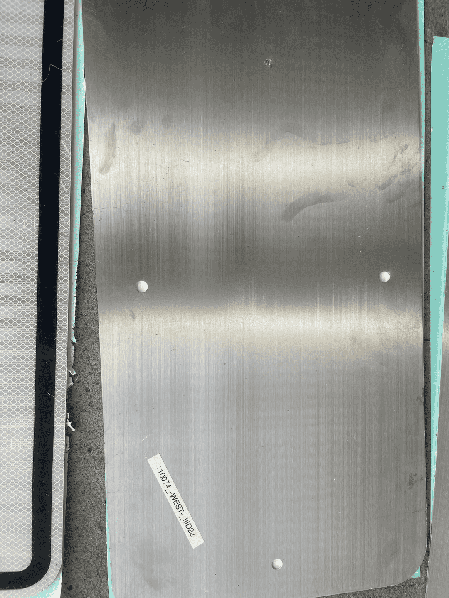
  <figcaption>Fig.219 - WEST sign.</figcaption>
</pre>
<pre align="center">
  
  <figcaption>Fig.220 - WEST sign.</figcaption>
</pre>

<pre align="center">
  
  <figcaption>Fig.221 - WEST sign.</figcaption>
</pre>

**10075_-WEST-_IIID22**
<pre align="center">
  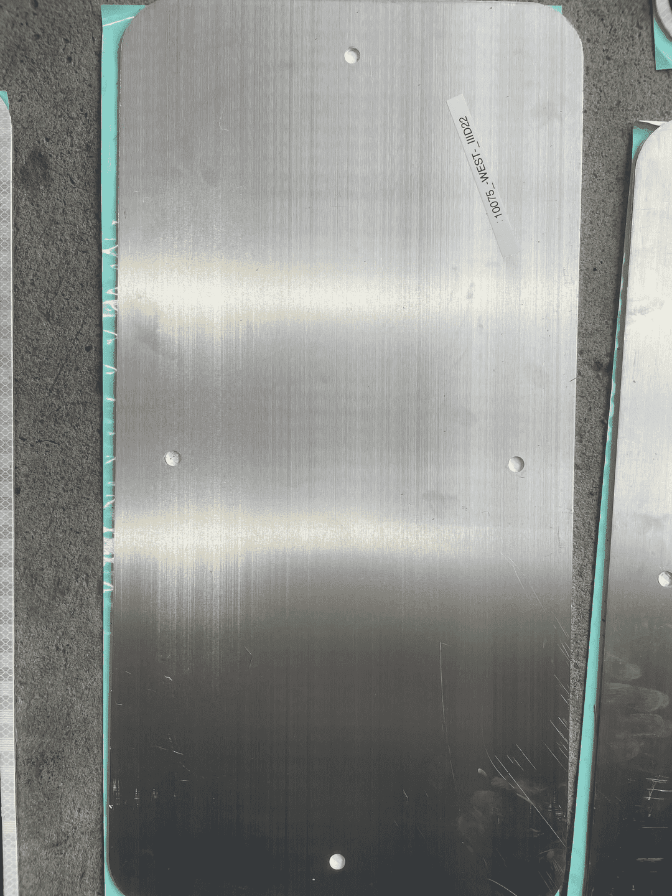
  <figcaption>Fig.222 - WEST sign.</figcaption>
</pre>
<pre align="center">
  
  <figcaption>Fig.223 - WEST sign.</figcaption>
</pre>

<pre align="center">
  
  <figcaption>Fig.224 - WEST sign.</figcaption>
</pre>

**10076_-WEST-_IIID22**
<pre align="center">
  
  <figcaption>Fig.225 - WEST sign.</figcaption>
</pre>
<pre align="center">
  
  <figcaption>Fig.226 - WEST sign.</figcaption>
</pre>

<pre align="center">
  
  <figcaption>Fig.227 - WEST sign.</figcaption>
</pre>

**10077_-WEST-_IIID22**
<pre align="center">
  
  <figcaption>Fig.228 - WEST sign.</figcaption>
</pre>
<pre align="center">
  
  <figcaption>Fig.229 - WEST sign.</figcaption>
</pre>

<pre align="center">
  
  <figcaption>Fig.230 - WEST sign.</figcaption>
</pre>

### **2) Yellow**

A) CENTER LANE CLOSED AHEAD sign - Quantity: 1

**20001_-CENTER+LANE-CLOSED-AHEAD-_22DIII**
<pre align="center">
  
  <figcaption>Fig.231 - CENTER LANE CLOSED AHEAD sign.</figcaption>
</pre>

<pre align="center">
  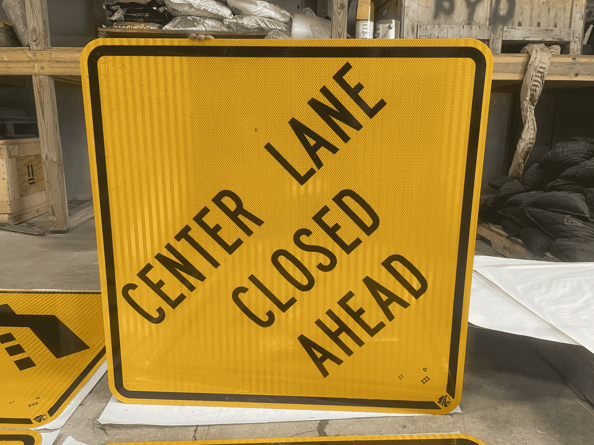
  <figcaption>Fig.232 - CENTER LANE CLOSED AHEAD sign.</figcaption>
</pre>

<pre align="center">
  
  <figcaption>Fig.233 - CENTER LANE CLOSED AHEAD sign.</figcaption>
</pre>

<pre align="center">
  
  <figcaption>Fig.235 - CENTER LANE CLOSED AHEAD sign.</figcaption>
</pre>

<pre align="center">
  
  <figcaption>Fig.236 - CENTER LANE CLOSED AHEAD sign.</figcaption>
</pre>

B) Doble Lane Right Swerve sign - Quantity: 2

**20002_DoubleLaneRightSwerve_22DIII**

<pre align="center">
  
  <figcaption>Fig.237 - Doble Lane Right Swerve sign.</figcaption>
</pre>

**20003_DoubleLaneRightSwerve_22DIII**
<pre align="center">
  
  <figcaption>Fig.238 - Doble Lane Right Swerve sign.</figcaption>
</pre>

<pre align="center">
  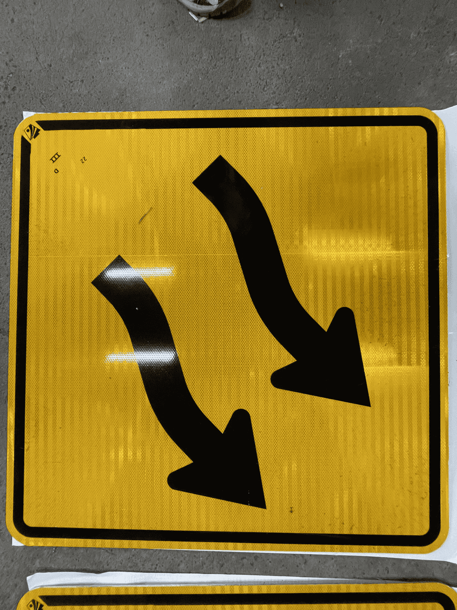
  <figcaption>Fig.239 - Doble Lane Right Swerve sign.</figcaption>
</pre>

<pre align="center">
  
  <figcaption>Fig.240 - Doble Lane Right Swerve sign.</figcaption>
</pre>

C) Double Lane Left Swerve sign - Quantity: 1
**20004_DoubleLaneLeftSwerve_22DIII**

<pre align="center">
  
  <figcaption>Fig.241 -  Double Lane Left Swerve sign.</figcaption>
</pre>

<pre align="center">
  
  <figcaption>Fig.242 -  Double Lane Left Swerve sign.</figcaption>
</pre>

<pre align="center">
  
  <figcaption>Fig.243 -  Double Lane Left Swerve sign.</figcaption>
</pre>

<pre align="center">
  
  <figcaption>Fig.244 -  Double Lane Left Swerve sign.</figcaption>
</pre>

D) Merging Traffic From Right Ahead sign - Quantity: 1
**20005_MergingTrafficFromRightAhead_22DIII**
<pre align="center">
  
  <figcaption>Fig.245 - Merging Traffic From Right Ahead sign.</figcaption>
</pre>

<pre align="center">
  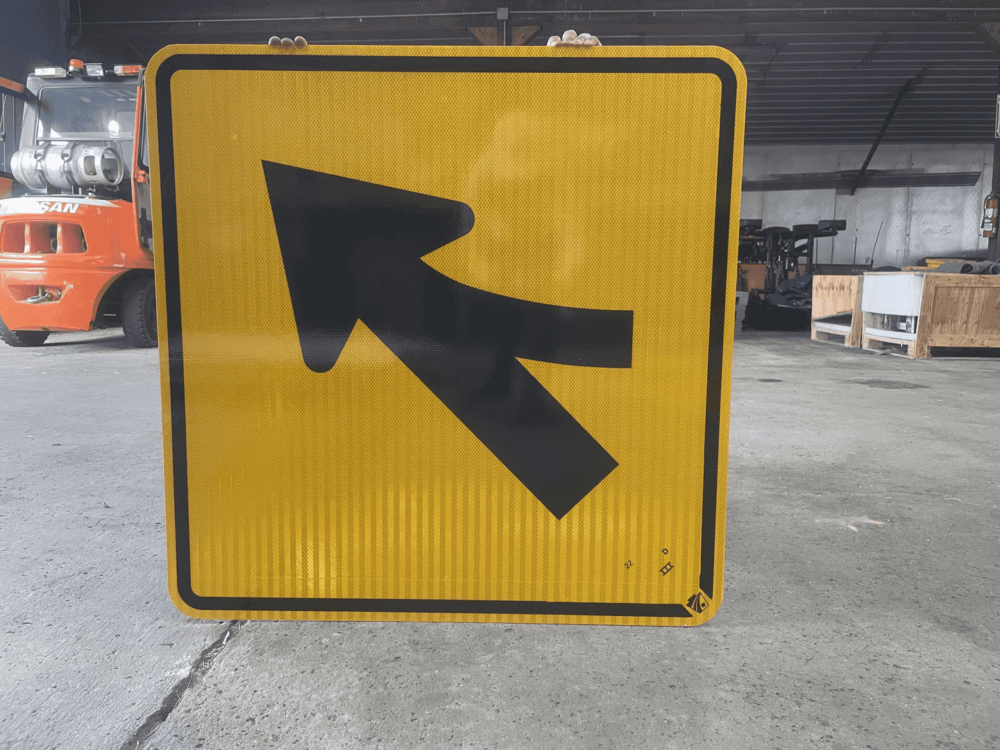
  <figcaption>Fig.246 - Merging Traffic From Right Ahead sign.</figcaption>
</pre>

<pre align="center">
  
  <figcaption>Fig.247 - Merging Traffic From Right Ahead sign.</figcaption>
</pre>

<pre align="center">
  
  <figcaption>Fig.248 - Merging Traffic From Right Ahead sign.</figcaption>
</pre>

<pre align="center">
  
  <figcaption>Fig.249 - Merging Traffic From Right Ahead sign.</figcaption>
</pre>

E) Right Lane Ends Sign - Quantity: 2

**20006_RightLaneEnds_22DIII**
<pre align="center">
  
  <figcaption>Fig.250 - Right Lane Ends Sign.</figcaption>
</pre>

<pre align="center">
  
  <figcaption>Fig.251 - Right Lane Ends Sign.</figcaption>
</pre>

<pre align="center">
  
  <figcaption>Fig.252 - Right Lane Ends Sign.</figcaption>
</pre>

<pre align="center">
  
  <figcaption>Fig.253 - Right Lane Ends Sign.</figcaption>
</pre>

<pre align="center">
  
  <figcaption>Fig.254 - Right Lane Ends Sign.</figcaption>
</pre>

**20007_RightLaneEnds_22DIII**
<pre align="center">
  
  <figcaption>Fig.255 - Right Lane Ends Sign.</figcaption>
</pre>

<pre align="center">
  
  <figcaption>Fig.256 - Right Lane Ends Sign.</figcaption>
</pre>

<pre align="center">
  
  <figcaption>Fig.257 - Right Lane Ends Sign.</figcaption>
</pre>

<pre align="center">
  
  <figcaption>Fig.258 - Right Lane Ends Sign.</figcaption>
</pre>

<pre align="center">
  
  <figcaption>Fig.259 - Right Lane Ends Sign.</figcaption>
</pre>

F) Right Reverse Curve sign - Quantity: 1

**20008_RightReverseCurve_22DIII**
<pre align="center">
  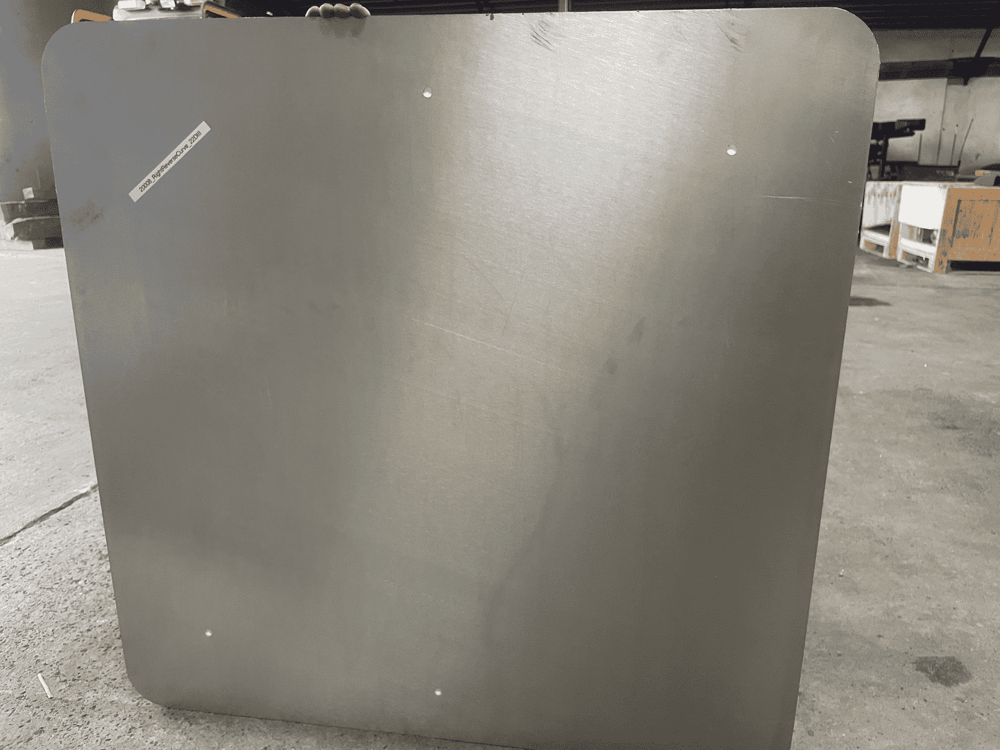
  <figcaption>Fig.260 - Right Reverse Curve sign.</figcaption>
</pre>

<pre align="center">
  
  <figcaption>Fig.261 - Right Reverse Curve sign.</figcaption>
</pre>

<pre align="center">
  
  <figcaption>Fig.262 - Right Reverse Curve sign.</figcaption>
</pre>

<pre align="center">
  
  <figcaption>Fig.263 - Right Reverse Curve sign.</figcaption>
</pre>

<pre align="center">
  
  <figcaption>Fig.264 - Right Reverse Curve sign.</figcaption>
</pre>

G) Left Reverse Curve sign - Quantity: 1

**20009_LeftReverseCurve_22DIII**
<pre align="center">
  
  <figcaption>Fig.265 - Left Reverse Curve sign.</figcaption>
</pre>

<pre align="center">
  
  <figcaption>Fig.266 - Left Reverse Curve sign.</figcaption>
</pre>

<pre align="center">
  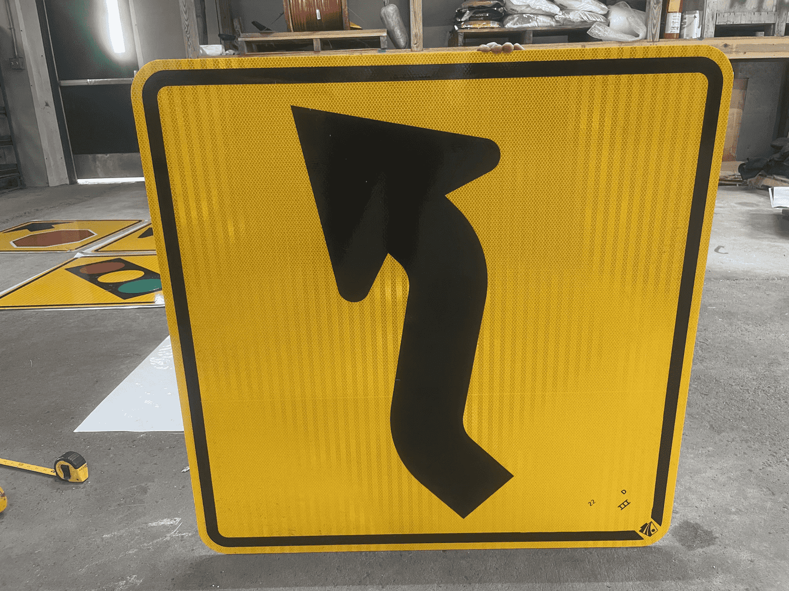
  <figcaption>Fig.267 - Left Reverse Curve sign.</figcaption>
</pre>

<pre align="center">
  
  <figcaption>Fig.268 - Left Reverse Curve sign.</figcaption>
</pre>

<pre align="center">
  
  <figcaption>Fig.269 - Left Reverse Curve sign.</figcaption>
</pre>

<pre align="center">
  
  <figcaption>Fig.270 - Left Reverse Curve sign.</figcaption>
</pre>

H) Stop Sign Ahead - Quantity: 1

**20010_StopSignAhead_22BIII**
<pre align="center">
  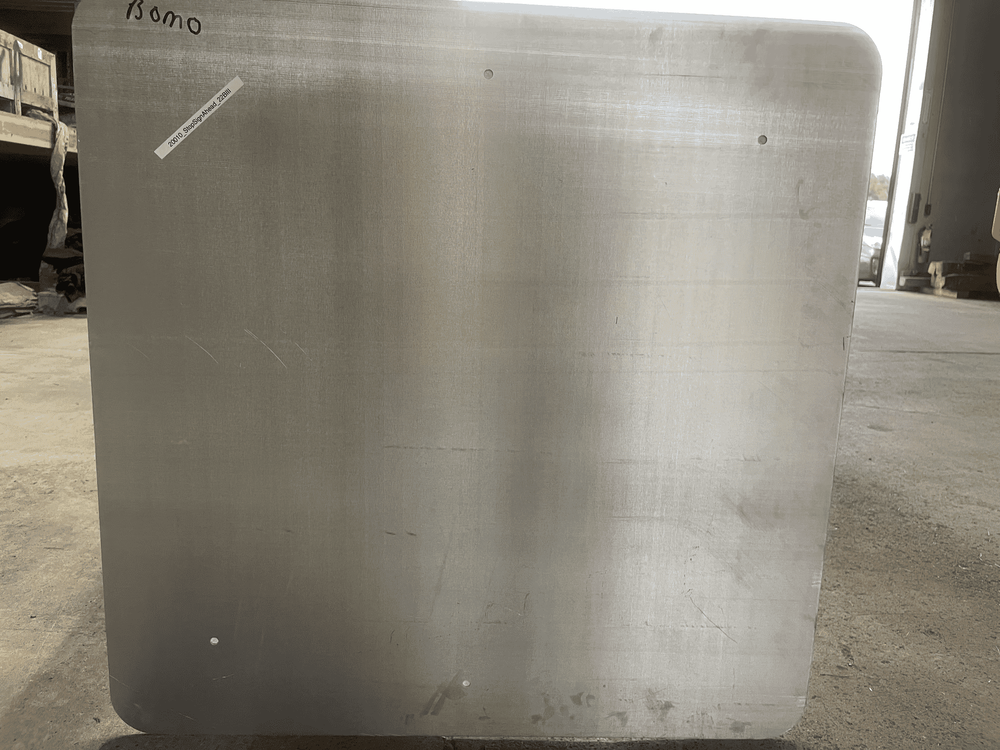
  <figcaption>Fig.271 - Stop Sign Ahead.</figcaption>
</pre>

<pre align="center">
  
  <figcaption>Fig.272 - Stop Sign Ahead.</figcaption>
</pre>

<pre align="center">
  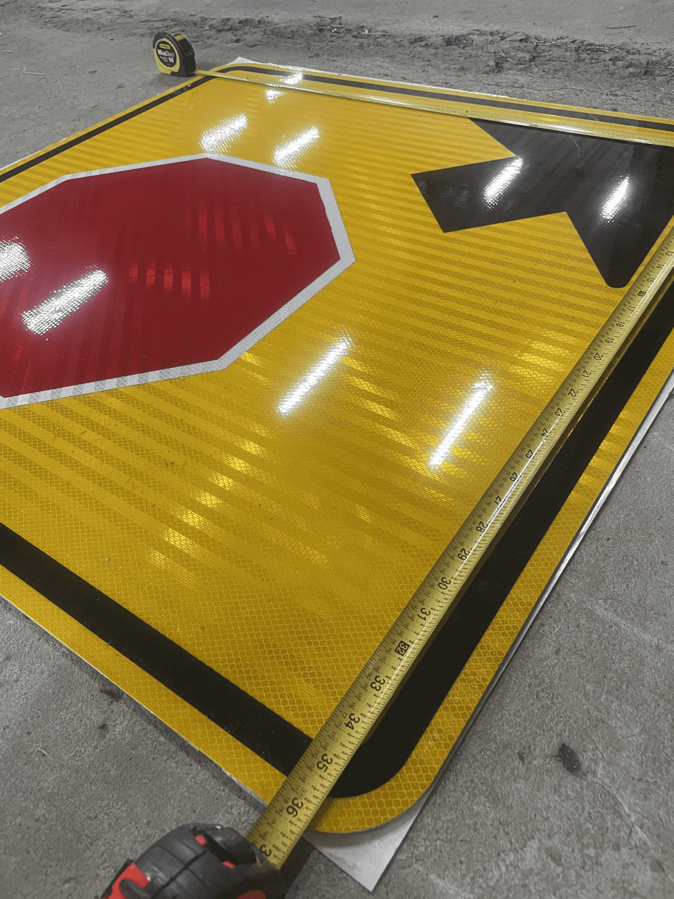
  <figcaption>Fig.273 - Stop Sign Ahead.</figcaption>
</pre>

<pre align="center">
  
  <figcaption>Fig.274 - Stop Sign Ahead.</figcaption>
</pre>

<pre align="center">
  
  <figcaption>Fig.275 - Stop Sign Ahead.</figcaption>
</pre>

I) Traffic Signal Ahead - Quantity: 1

**20011_TrafficSignalAhead_22DIII**
<pre align="center">
  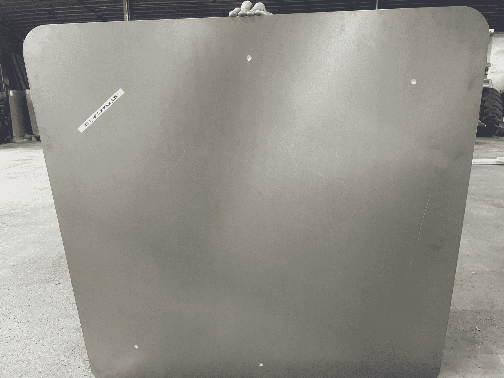
  <figcaption>Fig.276 - Traffic Signal Ahead.</figcaption>
</pre>

<pre align="center">
  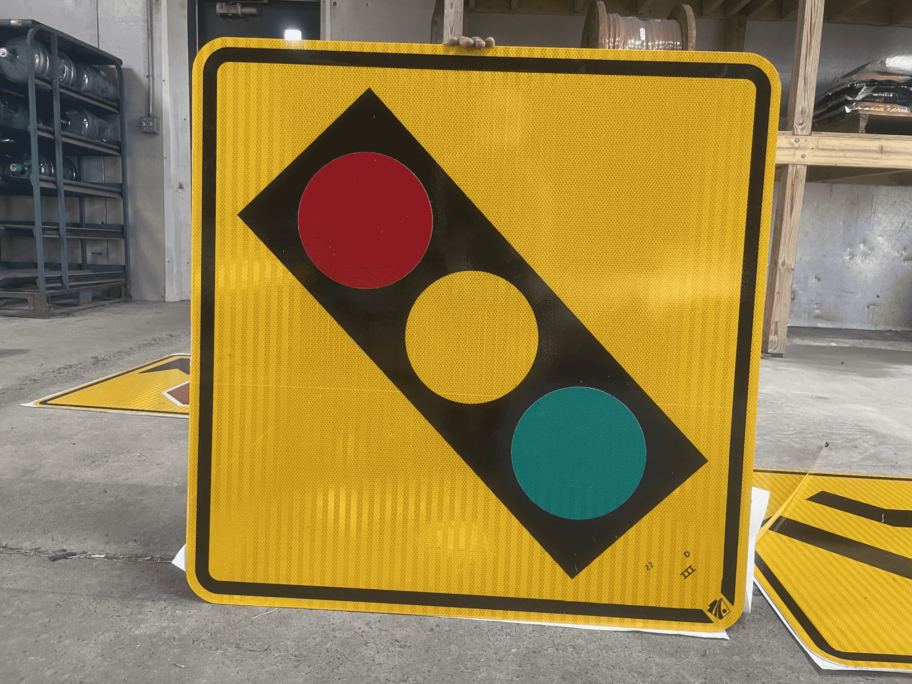
  <figcaption>Fig.277 - Traffic Signal Ahead.</figcaption>
</pre>

<pre align="center">
  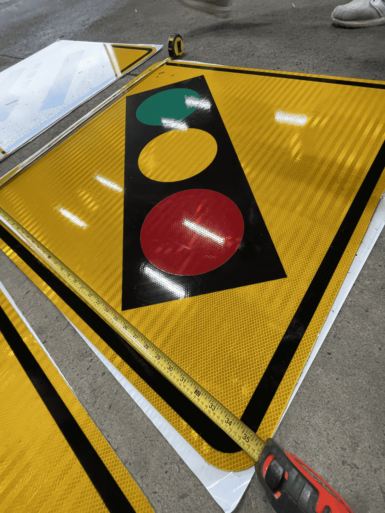
  <figcaption>Fig.278 - Traffic Signal Ahead.</figcaption>
</pre>

<pre align="center">
  
  <figcaption>Fig.279 - Traffic Signal Ahead.</figcaption>
</pre>

<pre align="center">
  
  <figcaption>Fig.280 - Traffic Signal Ahead.</figcaption>
</pre>

J) NO PASSING ZONE sign - Quantity: 1

**20012_-NO-PASSING-ZONE-_A**
<pre align="center">
  
  <figcaption>Fig.281 - NO PASSING ZONE sign.</figcaption>
</pre>

<pre align="center">
  
  <figcaption>Fig.282 - NO PASSING ZONE sign.</figcaption>
</pre>

<pre align="center">
  
  <figcaption>Fig.283 - NO PASSING ZONE sign.</figcaption>
</pre>

<pre align="center">
  
  <figcaption>Fig.284 - NO PASSING ZONE sign.</figcaption>
</pre>

<pre align="center">
  
  <figcaption>Fig.285 - NO PASSING ZONE sign.</figcaption>
</pre>

### **3) Orange**

A) One lane road ahead sign - Quantity: 2

**30001_-ONE+LANE-ROAD-AHEAD-_21DIII**
<pre align="center">
  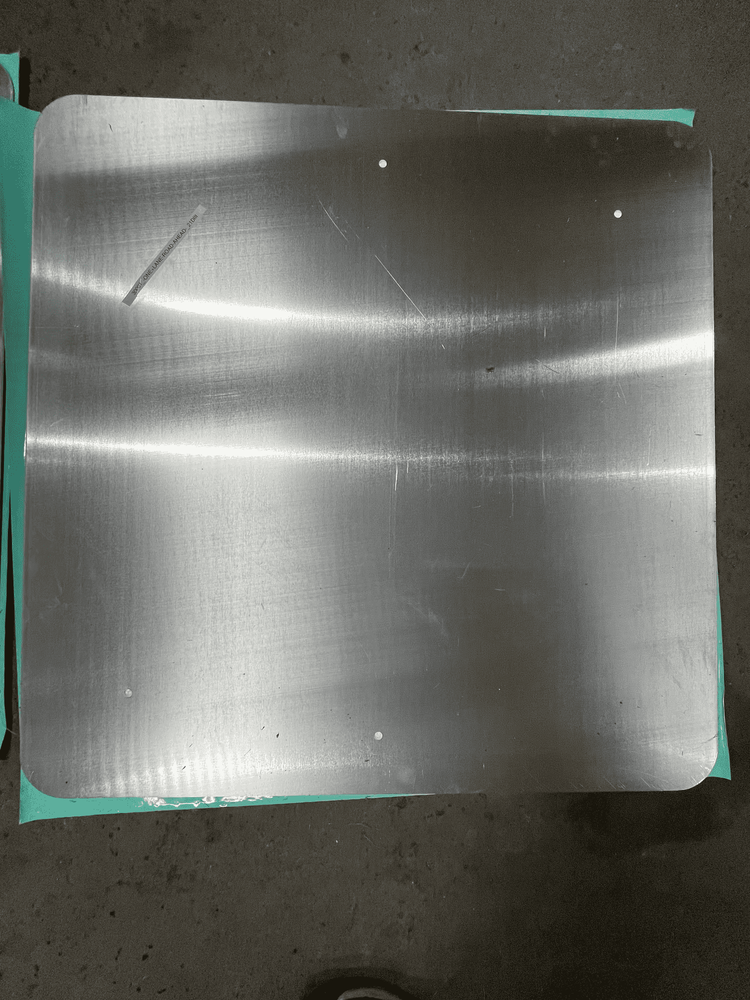
  <figcaption>Fig.286 - One lane road ahead sign.</figcaption>
</pre>

<pre align="center">
  
  <figcaption>Fig.287 - One lane road ahead sign.</figcaption>
</pre>

<pre align="center">
  
  <figcaption>Fig.288 - One lane road ahead sign.</figcaption>
</pre>

<pre align="center">
  
  <figcaption>Fig.289 - One lane road ahead sign.</figcaption>
</pre>

<pre align="center">
  
  <figcaption>Fig.290 - One lane road ahead sign.</figcaption>
</pre>

**30002_-ONE+LANE-ROAD-AHEAD-_21DIII**
<pre align="center">
  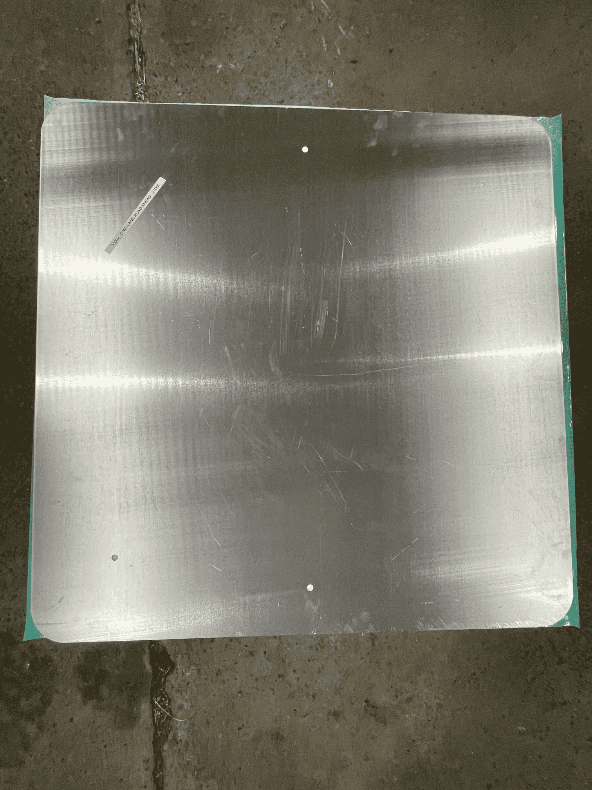
  <figcaption>Fig.291 - One lane road ahead sign.</figcaption>
</pre>

<pre align="center">
  
  <figcaption>Fig.292 - One lane road ahead sign.</figcaption>
</pre>

<pre align="center">
  
  <figcaption>Fig.293 - One lane road ahead sign.</figcaption>
</pre>

<pre align="center">
  
  <figcaption>Fig.294 - One lane road ahead sign.</figcaption>
</pre>

<pre align="center">
  
  <figcaption>Fig.295 - One lane road ahead sign.</figcaption>
</pre>

B) Left lane closed ahead sign - Quantity: 1

**30003_-LEFT+LANE-CLOSED-AHEAD-_21DIII**
<pre align="center">
  
  <figcaption>Fig.296 - Left lane closed ahead sign.</figcaption>
</pre>

<pre align="center">
  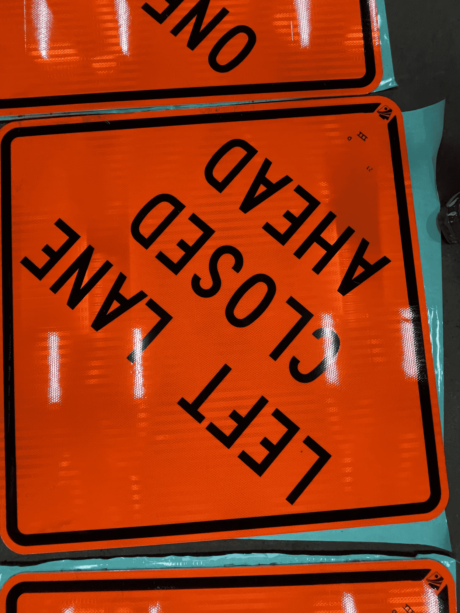
  <figcaption>Fig.297 - Left lane closed ahead sign.</figcaption>
</pre>

<pre align="center">
  
  <figcaption>Fig.298 - Left lane closed ahead sign.</figcaption>
</pre>

<pre align="center">
  
  <figcaption>Fig.299 - Left lane closed ahead sign.</figcaption>
</pre>

<pre align="center">
  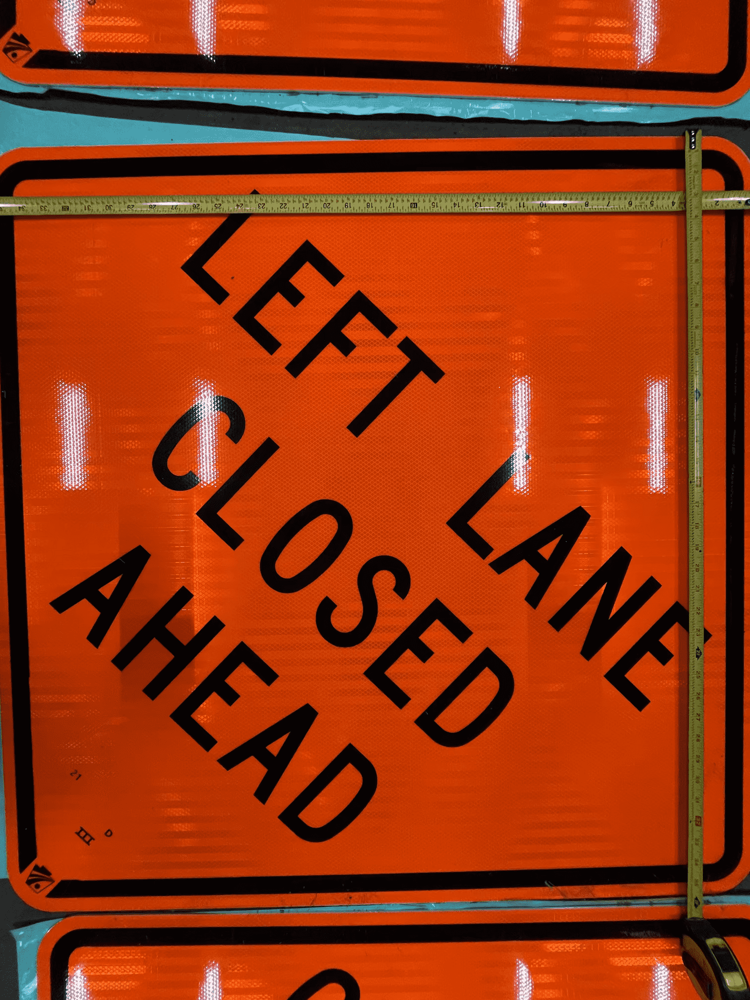
  <figcaption>Fig.300 - Left lane closed ahead sign.</figcaption>
</pre>

C) Lanes shift ahead sign - Quantity: 3

**30004_-LANES-SHIFT-AHEAD-_21DIII**
<pre align="center">
  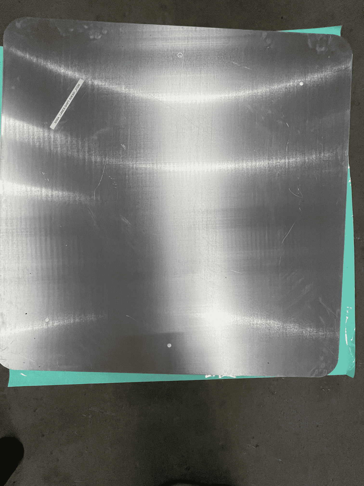
  <figcaption>Fig.301 - Lanes shift ahead sign.</figcaption>
</pre>

<pre align="center">
  
  <figcaption>Fig.302 - Lanes shift ahead sign.</figcaption>
</pre>

<pre align="center">
  
  <figcaption>Fig.303 - Lanes shift ahead sign.</figcaption>
</pre>

<pre align="center">
  
  <figcaption>Fig.303 - Lanes shift ahead sign.</figcaption>
</pre>

<pre align="center">
  
  <figcaption>Fig.304 - Lanes shift ahead sign.</figcaption>
</pre>

**30005_-LANES-SHIFT-AHEAD-_21DIII**
<pre align="center">
  
  <figcaption>Fig.305 - Lanes shift ahead sign.</figcaption>
</pre>

<pre align="center">
  
  <figcaption>Fig.306 - Lanes shift ahead sign.</figcaption>
</pre>

<pre align="center">
  
  <figcaption>Fig.307 - Lanes shift ahead sign.</figcaption>
</pre>

<pre align="center">
  
  <figcaption>Fig.308 - Lanes shift ahead sign.</figcaption>
</pre>

<pre align="center">
  
  <figcaption>Fig.309 - Lanes shift ahead sign.</figcaption>
</pre>

**30006_-LANES-SHIFT-AHEAD-_21DIII**
<pre align="center">
  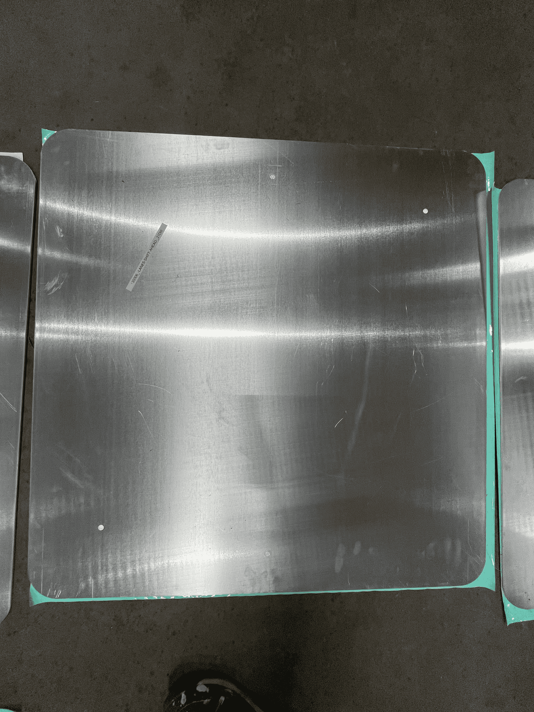
  <figcaption>Fig.310 - Lanes shift ahead sign.</figcaption>
</pre>

<pre align="center">
  
  <figcaption>Fig.311 - Lanes shift ahead sign.</figcaption>
</pre>

<pre align="center">
  
  <figcaption>Fig.312 - Lanes shift ahead sign.</figcaption>
</pre>

<pre align="center">
  
  <figcaption>Fig.313 - Lanes shift ahead sign.</figcaption>
</pre>

<pre align="center">
  
  <figcaption>Fig.314 - Lanes shift ahead sign.</figcaption>
</pre>

D) Road work ahead sign - Quantity: 4

**30007_-ROAD-WORK-AHEAD-_21DIII**
<pre align="center">
  
  <figcaption>Fig.315 - Road work ahead sign.</figcaption>
</pre>

<pre align="center">
  
  <figcaption>Fig.316 - Road work ahead sign.</figcaption>
</pre>

<pre align="center">
  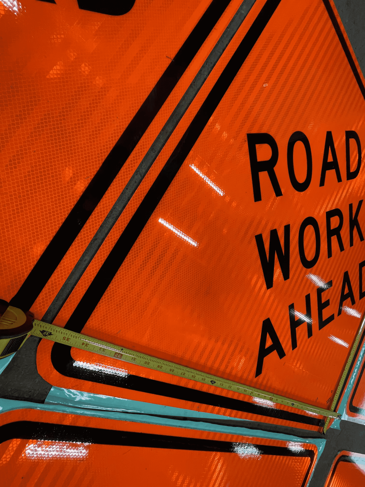
  <figcaption>Fig.317 - Road work ahead sign.</figcaption>
</pre>

<pre align="center">
  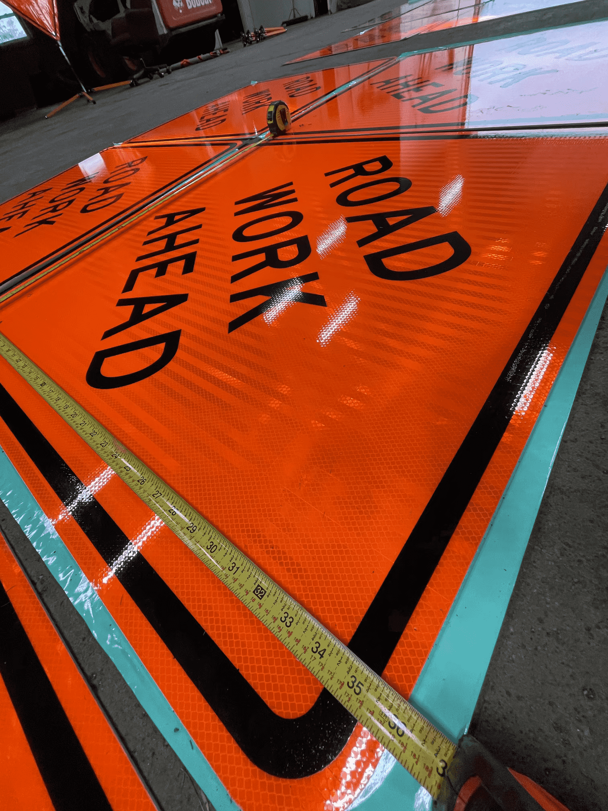
  <figcaption>Fig.318 - Road work ahead sign.</figcaption>
</pre>

<pre align="center">
  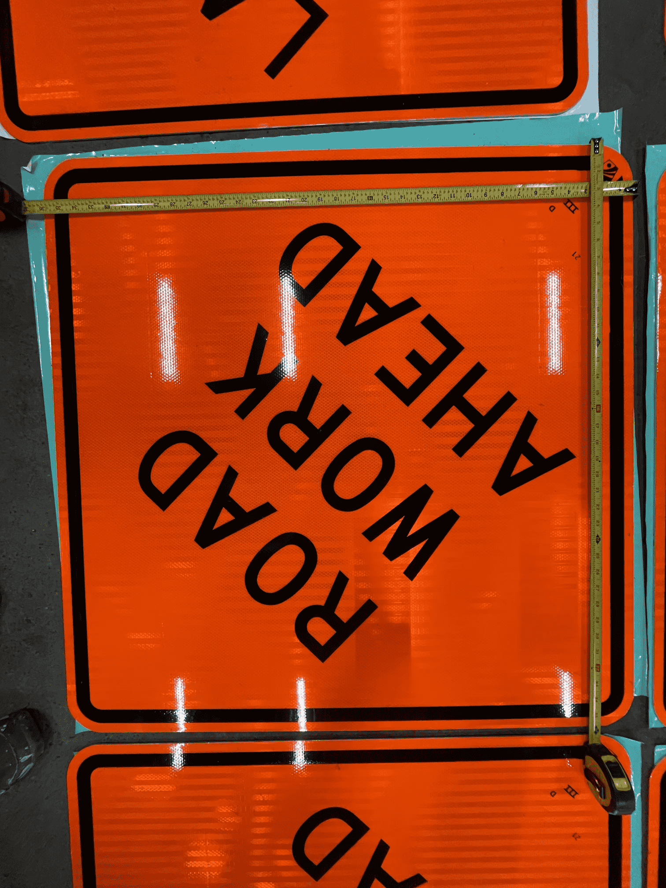
  <figcaption>Fig.319 - Road work ahead sign.</figcaption>
</pre>

**30008_-ROAD-WORK-AHEAD-_21DIII**
<pre align="center">
  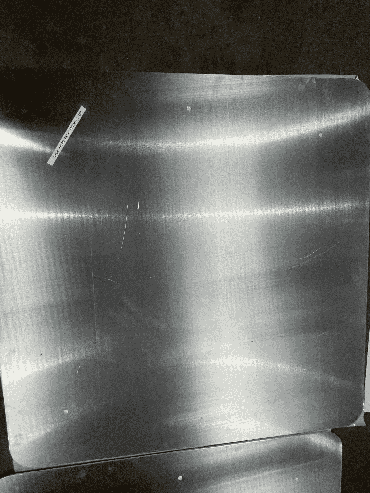
  <figcaption>Fig.320 - Road work ahead sign.</figcaption>
</pre>

<pre align="center">
  
  <figcaption>Fig.321 - Road work ahead sign.</figcaption>
</pre>

<pre align="center">
  
  <figcaption>Fig.322 - Road work ahead sign.</figcaption>
</pre>

<pre align="center">
  
  <figcaption>Fig.323 - Road work ahead sign.</figcaption>
</pre>

<pre align="center">
  
  <figcaption>Fig.324 - Road work ahead sign.</figcaption>
</pre>

**30009_-ROAD-WORK-AHEAD-_21DIII**
<pre align="center">
  
  <figcaption>Fig.325 - Road work ahead sign.</figcaption>
</pre>

<pre align="center">
  
  <figcaption>Fig.326 - Road work ahead sign.</figcaption>
</pre>

<pre align="center">
  
  <figcaption>Fig.327 - Road work ahead sign.</figcaption>
</pre>

<pre align="center">
  
  <figcaption>Fig.328 - Road work ahead sign.</figcaption>
</pre>

<pre align="center">
  
  <figcaption>Fig.329 - Road work ahead sign.</figcaption>
</pre>

**30010_-ROAD-WORK-AHEAD-_21DIII**
<pre align="center">
  
  <figcaption>Fig.330 - Road work ahead sign.</figcaption>
</pre>

<pre align="center">
  
  <figcaption>Fig.331 - Road work ahead sign.</figcaption>
</pre>

<pre align="center">
  
  <figcaption>Fig.332 - Road work ahead sign.</figcaption>
</pre>

<pre align="center">
  
  <figcaption>Fig.333 - Road work ahead sign.</figcaption>
</pre>

<pre align="center">
  
  <figcaption>Fig.334 - Road work ahead sign.</figcaption>
</pre>

E) Right lane closed ahead sign - Quantity: 4

**30011_-RIGHT+LANE-CLOSED-AHEAD-_21DIII**
<pre align="center">
  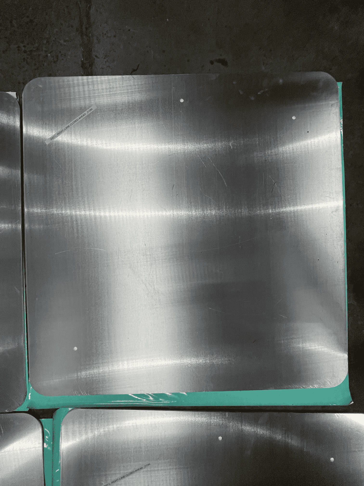
  <figcaption>Fig.335 - Right lane closed ahead sign.</figcaption>
</pre>

<pre align="center">
  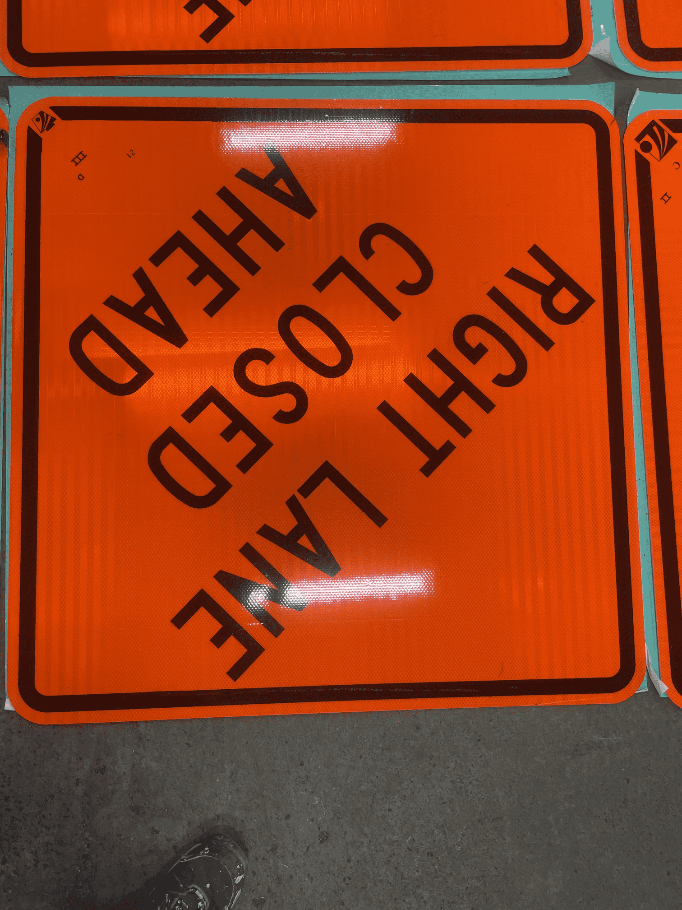
  <figcaption>Fig.336 - Right lane closed ahead sign.</figcaption>
</pre>

<pre align="center">
  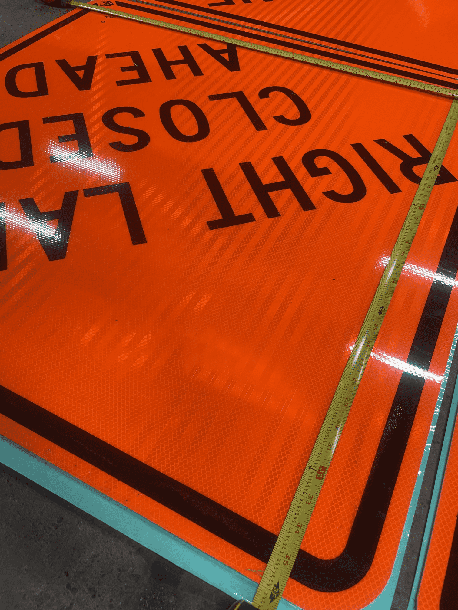
  <figcaption>Fig.337 - Right lane closed ahead sign.</figcaption>
</pre>

<pre align="center">
  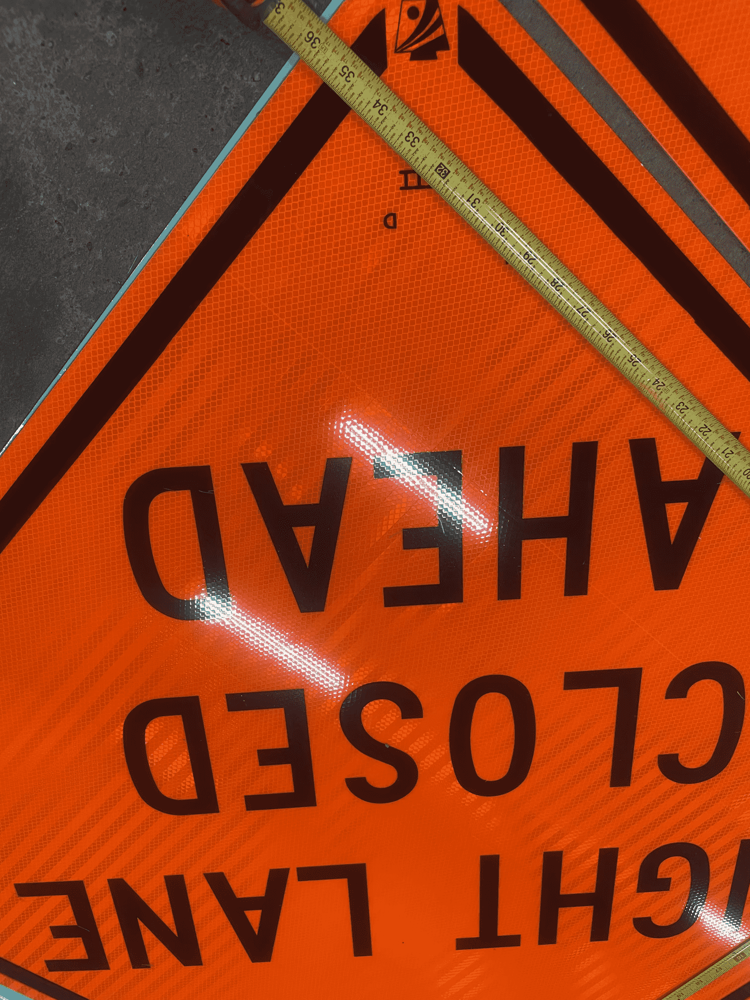
  <figcaption>Fig.338 - Right lane closed ahead sign.</figcaption>
</pre>

<pre align="center">
  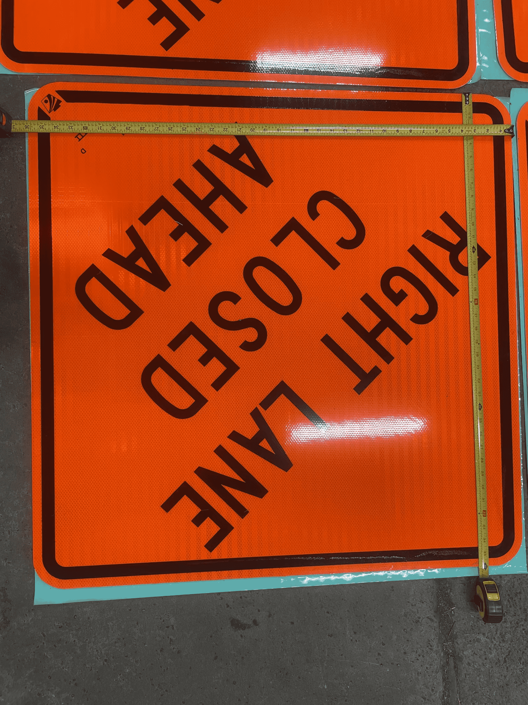
  <figcaption>Fig.339 - Right lane closed ahead sign.</figcaption>
</pre>

**30012_-RIGHT+LANE-CLOSED-AHEAD-_21DIII**
<pre align="center">
  
  <figcaption>Fig.340 - Right lane closed ahead sign.</figcaption>
</pre>

<pre align="center">
  
  <figcaption>Fig.341 - Right lane closed ahead sign.</figcaption>
</pre>

<pre align="center">
  
  <figcaption>Fig.342 - Right lane closed ahead sign.</figcaption>
</pre>

<pre align="center">
  
  <figcaption>Fig.343 - Right lane closed ahead sign.</figcaption>
</pre>

<pre align="center">
  
  <figcaption>Fig.344 - Right lane closed ahead sign.</figcaption>
</pre>

**30013_-RIGHT+LANE-CLOSED-AHEAD-_21DIII**
<pre align="center">
  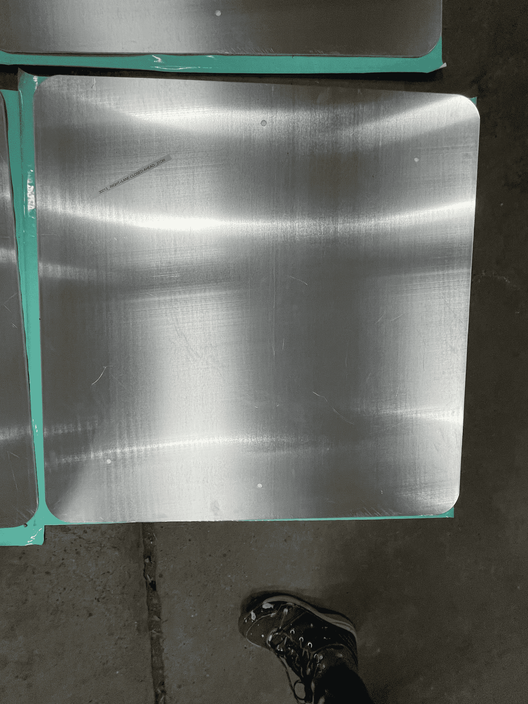
  <figcaption>Fig.345 - Right lane closed ahead sign.</figcaption>
</pre>

<pre align="center">
  
  <figcaption>Fig.346 - Right lane closed ahead sign.</figcaption>
</pre>

<pre align="center">
  
  <figcaption>Fig.347 - Right lane closed ahead sign.</figcaption>
</pre>

<pre align="center">
  
  <figcaption>Fig.348 - Right lane closed ahead sign.</figcaption>
</pre>

<pre align="center">
  
  <figcaption>Fig.349 - Right lane closed ahead sign.</figcaption>
</pre>

**30014_-RIGHT+LANE-CLOSED-AHEAD-_21DIII**
<pre align="center">
  
  <figcaption>Fig.350 - Right lane closed ahead sign.</figcaption>
</pre>

<pre align="center">
  
  <figcaption>Fig.351 - Right lane closed ahead sign.</figcaption>
</pre>

<pre align="center">
  
  <figcaption>Fig.352 - Right lane closed ahead sign.</figcaption>
</pre>

<pre align="center">
  
  <figcaption>Fig.353 - Right lane closed ahead sign.</figcaption>
</pre>

<pre align="center">
  
  <figcaption>Fig.354 - Right lane closed ahead sign.</figcaption>
</pre>

F) Road closed ahead sign - Quantity: 2

**30015_-ROAD-CLOSED-AHEAD-_20CIII**
<pre align="center">
  
  <figcaption>Fig.355 - Road closed ahead sign.</figcaption>
</pre>

<pre align="center">
  
  <figcaption>Fig.356 - Road closed ahead sign.</figcaption>
</pre>

<pre align="center">
  
  <figcaption>Fig.357 - Road closed ahead sign.</figcaption>
</pre>

<pre align="center">
  
  <figcaption>Fig.358 - Road closed ahead sign.</figcaption>
</pre>

<pre align="center">
  
  <figcaption>Fig.359 - Road closed ahead sign.</figcaption>
</pre>

**30016_-ROAD-CLOSED-AHEAD-_20CIII**
<pre align="center">
  
  <figcaption>Fig.360 - Road closed ahead sign.</figcaption>
</pre>

<pre align="center">
  
  <figcaption>Fig.361 - Road closed ahead sign.</figcaption>
</pre>

<pre align="center">
  
  <figcaption>Fig.362 - Road closed ahead sign.</figcaption>
</pre>

<pre align="center">
  
  <figcaption>Fig.363 - Road closed ahead sign.</figcaption>
</pre>

<pre align="center">
  
  <figcaption>Fig.364 - Road closed ahead sign.</figcaption>
</pre>

G) End road work sign - Quantity: 1

**30017_-END-ROAD+WORK-_**
<pre align="center">
  
  <figcaption>Fig.365 - End road work sign.</figcaption>
</pre>

<pre align="center">
  
  <figcaption>Fig.366 - End road work sign.</figcaption>
</pre>

<pre align="center">
  
  <figcaption>Fig.367 - End road work sign.</figcaption>
</pre>

<pre align="center">
  
  <figcaption>Fig.368 - End road work sign.</figcaption>
</pre>

<pre align="center">
  
  <figcaption>Fig.369 - End road work sign.</figcaption>
</pre>

H) End detour sign - Quantity: 1

**30018_-END-DETOUR-_**
<pre align="center">
  
  <figcaption>Fig.370 - End detour sign.</figcaption>
</pre>

<pre align="center">
  
  <figcaption>Fig.371 - End detour sign.</figcaption>
</pre>

<pre align="center">
  
  <figcaption>Fig.372 - End detour sign.</figcaption>
</pre>

I) Detour ahead - Quantity: 2

**30019_-DETOUR-AHEAD-_B**
<pre align="center">
  
  <figcaption>Fig.373 - Detour ahead.</figcaption>
</pre>

<pre align="center">
  
  <figcaption>Fig.374 - Detour ahead.</figcaption>
</pre>

<pre align="center">
  
  <figcaption>Fig.375 - Detour ahead.</figcaption>
</pre>

<pre align="center">
  
  <figcaption>Fig.376 - Detour ahead.</figcaption>
</pre>

<pre align="center">
  
  <figcaption>Fig.377 - Detour ahead.</figcaption>
</pre>

<pre align="center">
  
  <figcaption>Fig.378 - Detour ahead.</figcaption>
</pre>

**30020_-DETOUR-AHEAD-_B**
<pre align="center">
  
  <figcaption>Fig.379 - Detour ahead.</figcaption>
</pre>

<pre align="center">
  
  <figcaption>Fig.380 - Detour ahead.</figcaption>
</pre>

<pre align="center">
  
  <figcaption>Fig.381 - Detour ahead.</figcaption>
</pre>

<pre align="center">
  
  <figcaption>Fig.382 - Detour ahead.</figcaption>
</pre>

<pre align="center">
  
  <figcaption>Fig.383 - Detour ahead.</figcaption>
</pre>

<pre align="center">
  
  <figcaption>Fig.384 - Detour ahead.</figcaption>
</pre>

J) Up Arrow Detour sign - Quantity: 2

**30021_UpArrow_-DETOUR-_B**
<pre align="center">
  
  <figcaption>Fig.385 - Up Arrow Detour sign.</figcaption>
</pre>

<pre align="center">
  
  <figcaption>Fig.386 - Up Arrow Detour sign.</figcaption>
</pre>

<pre align="center">
  
  <figcaption>Fig.387 - Up Arrow Detour sign.</figcaption>
</pre>

**30022_UpArrow_-DETOUR-_B**
<pre align="center">
  
  <figcaption>Fig.388 - Up Arrow Detour sign.</figcaption>
</pre>

<pre align="center">
  
  <figcaption>Fig.389 - Up Arrow Detour sign.</figcaption>
</pre>

<pre align="center">
  
  <figcaption>Fig.390 - Up Arrow Detour sign.</figcaption>
</pre>

K) Right Arrow Detour sign - Quantity: 2

**30023_RightArrow_-DETOUR-_D21**
<pre align="center">
  
  <figcaption>Fig.391 - Right Arrow Detour sign.</figcaption>
</pre>

**30024_RightArrow_-DETOUR-_D21**
<pre align="center">
  
  <figcaption>Fig.392 - Right Arrow Detour sign.</figcaption>
</pre>

L) NO PASSING ZONE - Quantity: 2

**30025_LeftArrow_-DETOUR-_21D**
<pre align="center">
  
  <figcaption>Fig.393 - Right Arrow Detour sign.</figcaption>
</pre>

**30026_LeftArrow_-DETOUR-_21D**
<pre align="center">
  
  <figcaption>Fig.394 - Right Arrow Detour sign.</figcaption>
</pre>

M) Detour - Quantity: 10

**30027_-DETOUR-_BIII22**
<pre align="center">
  
  <figcaption>Fig.395 - Detour.</figcaption>
</pre>

<pre align="center">
  
  <figcaption>Fig.396 - Detour.</figcaption>
</pre>

<pre align="center">
  
  <figcaption>Fig.397 - Detour.</figcaption>
</pre>

**30028_-DETOUR-_BIII22**
<pre align="center">
  
  <figcaption>Fig.398 - Detour.</figcaption>
</pre>

<pre align="center">
  
  <figcaption>Fig.399 - Detour.</figcaption>
</pre>

<pre align="center">
  
  <figcaption>Fig.400 - Detour.</figcaption>
</pre>

**30029_-DETOUR-_BIII22**
<pre align="center">
  
  <figcaption>Fig.401 - Detour.</figcaption>
</pre>

<pre align="center">
  
  <figcaption>Fig.402 - Detour.</figcaption>
</pre>

<pre align="center">
  
  <figcaption>Fig.403 - Detour.</figcaption>
</pre>

**30030_-DETOUR-_BIII22**
<pre align="center">
  
  <figcaption>Fig.404 - Detour.</figcaption>
</pre>

<pre align="center">
  
  <figcaption>Fig.405 - Detour.</figcaption>
</pre>

<pre align="center">
  
  <figcaption>Fig.406 - Detour.</figcaption>
</pre>

**30031_-DETOUR-_BIII22**
<pre align="center">
  
  <figcaption>Fig.407 - Detour.</figcaption>
</pre>

<pre align="center">
  
  <figcaption>Fig.408 - Detour.</figcaption>
</pre>

<pre align="center">
  
  <figcaption>Fig.409 - Detour.</figcaption>
</pre>

**30032_-DETOUR-_BIII22**
<pre align="center">
  
  <figcaption>Fig.410 - Detour.</figcaption>
</pre>

<pre align="center">
  
  <figcaption>Fig.411 - Detour.</figcaption>
</pre>

<pre align="center">
  
  <figcaption>Fig.412 - Detour.</figcaption>
</pre>

**30033_-DETOUR-_BIII22**
<pre align="center">
  
  <figcaption>Fig.413 - Detour.</figcaption>
</pre>

<pre align="center">
  
  <figcaption>Fig.414 - Detour.</figcaption>
</pre>

<pre align="center">
  
  <figcaption>Fig.415 - Detour.</figcaption>
</pre>

**30034_-DETOUR-_BIII22**
<pre align="center">
  
  <figcaption>Fig.416 - Detour.</figcaption>
</pre>

<pre align="center">
  
  <figcaption>Fig.417 - Detour.</figcaption>
</pre>

<pre align="center">
  
  <figcaption>Fig.418 - Detour.</figcaption>
</pre>

**30035_-DETOUR-_BIII22**
<pre align="center">
  
  <figcaption>Fig.419 - Detour.</figcaption>
</pre>

<pre align="center">
  
  <figcaption>Fig.420 - Detour.</figcaption>
</pre>

<pre align="center">
  
  <figcaption>Fig.421 - Detour.</figcaption>
</pre>

**30036_-DETOUR-_BIII22**
<pre align="center">
  
  <figcaption>Fig.422 - Detour.</figcaption>
</pre>

<pre align="center">
  
  <figcaption>Fig.423 - Detour.</figcaption>
</pre>

<pre align="center">
  
  <figcaption>Fig.424 - Detour.</figcaption>
</pre>
N) Left Arrow Detour sign - Quantity: 1

**30037_LeftArrow_-DETOUR-_22DVII**
<pre align="center">
  
  <figcaption>Fig.425 - Left Arrow Detour sign.</figcaption>
</pre>

<pre align="center">
  
  <figcaption>Fig.426 - Left Arrow Detour sign.</figcaption>
</pre>

<pre align="center">
  
  <figcaption>Fig.427 - Left Arrow Detour sign.</figcaption>
</pre>

<pre align="center">
  
  <figcaption>Fig.428 - Left Arrow Detour sign.</figcaption>
</pre>

<pre align="center">
  
  <figcaption>Fig.429 - Left Arrow Detour sign.</figcaption>
</pre>

O) Road work ahead fabric - Quantity: 3

**30038_-ROAD-WORK-AHEAD-_Fabric**
<pre align="center">
  
  <figcaption>Fig.430 - Road work ahead fabric.</figcaption>
</pre>

**30039_Flagger_Fabric**
<pre align="center">
  
  <figcaption>Fig.431 - Flagger fabric.</figcaption>
</pre>

**30040_-BE-PREPARED-TO+STOP-_Fabric**
<pre align="center">
  
  <figcaption>Fig.432 - Be prepared to stop fabric.</figcaption>
</pre>

### **4) Red**

A) STOP sign - Quantity: 7

**40001_-STOP-_B22**
<pre align="center">
  
  <figcaption>Fig.433 - STOP sign.</figcaption>
</pre>

<pre align="center">
  
  <figcaption>Fig.434 - STOP sign.</figcaption>
</pre>

<pre align="center">
  
  <figcaption>Fig.435 - STOP sign.</figcaption>
</pre>

**40002_-STOP-_B22**
<pre align="center">
  
  <figcaption>Fig.436 - STOP sign.</figcaption>
</pre>

<pre align="center">
  
  <figcaption>Fig.437 - STOP sign.</figcaption>
</pre>

<pre align="center">
  
  <figcaption>Fig.438 - STOP sign.</figcaption>
</pre>

**40003_-STOP-_B22**
<pre align="center">
  
  <figcaption>Fig.439 - STOP sign.</figcaption>
</pre>

<pre align="center">
  
  <figcaption>Fig.440 - STOP sign.</figcaption>
</pre>

<pre align="center">
  
  <figcaption>Fig.441 - STOP sign.</figcaption>
</pre>

**40004_-STOP-_B22**
<pre align="center">
  
  <figcaption>Fig.442 - STOP sign.</figcaption>
</pre>

<pre align="center">
  
  <figcaption>Fig.443 - STOP sign.</figcaption>
</pre>

<pre align="center">
  
  <figcaption>Fig.444 - STOP sign.</figcaption>
</pre>

**40005_-STOP-_97AII_inService**
<pre align="center">
  
  <figcaption>Fig.445 - STOP sign.</figcaption>
</pre>

<pre align="center">
  
  <figcaption>Fig.446 - STOP sign.</figcaption>
</pre>

<pre align="center">
  
  <figcaption>Fig.447 - STOP sign.</figcaption>
</pre>

**40006_-STOP-_96CII_OutOfService**
<pre align="center">
  
  <figcaption>Fig.448 - STOP sign.</figcaption>
</pre>

<pre align="center">
  
  <figcaption>Fig.449 - STOP sign.</figcaption>
</pre>

<pre align="center">
  
  <figcaption>Fig.450 - STOP sign.</figcaption>
</pre>

**40007_-STOP-_ OutOfService**
<pre align="center">
  
  <figcaption>Fig.451 - STOP sign.</figcaption>
</pre>

<pre align="center">
  
  <figcaption>Fig.452 - STOP sign.</figcaption>
</pre>

<pre align="center">
  
  <figcaption>Fig.453 - STOP sign.</figcaption>
</pre>

B) YIELD sign - Quantity: 3

**40008_-YIELD-_IIA07_inService**
<pre align="center">
  
  <figcaption>Fig.454 - YIELD sign.</figcaption>
</pre>

<pre align="center">
  
  <figcaption>Fig.455 - YIELD sign.</figcaption>
</pre>

<pre align="center">
  
  <figcaption>Fig.456 - YIELD sign.</figcaption>
</pre>

<pre align="center">
  
  <figcaption>Fig.457 - YIELD sign.</figcaption>
</pre>

<pre align="center">
  
  <figcaption>Fig.458 - YIELD sign.</figcaption>
</pre>

**40009_-YIELD-_II02C_inService**
<pre align="center">
  
  <figcaption>Fig.459 - YIELD sign.</figcaption>
</pre>

<pre align="center">
  
  <figcaption>Fig.460 - YIELD sign.</figcaption>
</pre>

<pre align="center">
  
  <figcaption>Fig.461 - YIELD sign.</figcaption>
</pre>

<pre align="center">
  
  <figcaption>Fig.462 - YIELD sign.</figcaption>
</pre>

<pre align="center">
  
  <figcaption>Fig.463 - YIELD sign.</figcaption>
</pre>

**40010_-YIELD-_ IIB05_OutOfService**
<pre align="center">
  
  <figcaption>Fig.464 - YIELD sign.</figcaption>
</pre>

<pre align="center">
  
  <figcaption>Fig.465 - YIELD sign.</figcaption>
</pre>

<pre align="center">
  
  <figcaption>Fig.466 - YIELD sign.</figcaption>
</pre>

### **5) Green** 

A) Right Corner Arrow sign - Quantity: 1

**50001_RightCornerArrow_-EXIT-_**
<pre align="center">
  
  <figcaption>Fig.467 - Right Corner Arrow sign.</figcaption>
</pre>
<pre align="center">
  
  <figcaption>Fig.468 - Right Corner Arrow sign.</figcaption>
</pre>
<pre align="center">
  
  <figcaption>Fig.469 - Right Corner Arrow sign.</figcaption>
</pre>
<pre align="center">
  
  <figcaption>Fig.470 - Right Corner Arrow sign.</figcaption>
</pre>

### **6) Cones/Barrels/Vertical Panels**

A) Cones - Quantity: 3

**60001_Cones_36inch**
<pre align="center">
  
  <figcaption>Fig.471 -  Cone.</figcaption>
</pre>

**60002_Cones_36inch**
<pre align="center">
  
  <figcaption>Fig.472 -  Cone.</figcaption>
</pre>

**60003_Cones_36inch**
<pre align="center">
  
  <figcaption>Fig.473 -  Cone.</figcaption>
</pre>

***Below are the cones received on 7/11/2023. These cones are not entirely new. Thus, they are given a grade from 0 to 9 based on their quality, where 0 means new and 9 means very old/out of service. The grade is shown right after the number 6 at the beginning of their code number. For example 63001 is a cone of grade 3.***

<pre align="center">
  
  <figcaption>Fig.474 -  Cone.</figcaption>
</pre>

<pre align="center">
  
  <figcaption>Fig.475 -  Cone.</figcaption>
</pre>

<pre align="center">
  
  <figcaption>Fig.476 -  Cone.</figcaption>
</pre>

**Grade 3 - Quantity: 2**

**63001_Cones_28inch**
<pre align="center">
  
  <figcaption>Fig.477 -  Cone.</figcaption>
</pre>

<pre align="center">
  
  <figcaption>Fig.478 -  Cone.</figcaption>
</pre>

<pre align="center">
  
  <figcaption>Fig.479 -  Cone.</figcaption>
</pre>

<pre align="center">
  
  <figcaption>Fig.480 -  Cone.</figcaption>
</pre>

<pre align="center">
  
  <figcaption>Fig.481 -  Cone.</figcaption>
</pre>

**63002_Cones_28inch**

<pre align="center">
  
  <figcaption>Fig.482 -  Cone.</figcaption>
</pre>

<pre align="center">
  
  <figcaption>Fig.483 -  Cone.</figcaption>
</pre>

<pre align="center">
  
  <figcaption>Fig.484 -  Cone.</figcaption>
</pre>

<pre align="center">
  
  <figcaption>Fig.482 -  Cone.</figcaption>
</pre>

<pre align="center">
  
  <figcaption>Fig.485 -  Cone.</figcaption>
</pre>

**Grade 4 - Quantity: 4**

**64001_Cones_28inch**
<pre align="center">
  
  <figcaption>Fig.486 -  Cone.</figcaption>
</pre>

<pre align="center">
  
  <figcaption>Fig.487 -  Cone.</figcaption>
</pre>

<pre align="center">
  
  <figcaption>Fig.488 -  Cone.</figcaption>
</pre>

<pre align="center">
  
  <figcaption>Fig.489 -  Cone.</figcaption>
</pre>

<pre align="center">
  
  <figcaption>Fig.490 -  Cone.</figcaption>
</pre>

**64002_Cones_28inch**
<pre align="center">
  
  <figcaption>Fig.491 -  Cone.</figcaption>
</pre>

<pre align="center">
  
  <figcaption>Fig.492 -  Cone.</figcaption>
</pre>

<pre align="center">
  
  <figcaption>Fig.493 -  Cone.</figcaption>
</pre>

<pre align="center">
  
  <figcaption>Fig.494 -  Cone.</figcaption>
</pre>

<pre align="center">
  
  <figcaption>Fig.495 -  Cone.</figcaption>
</pre>

**64003_Cones_28inch**
<pre align="center">
  
  <figcaption>Fig.496 -  Cone.</figcaption>
</pre>
<pre align="center">
  
  <figcaption>Fig.497 -  Cone.</figcaption>
</pre>
<pre align="center">
  
  <figcaption>Fig.498 -  Cone.</figcaption>
</pre>
<pre align="center">
  
  <figcaption>Fig.499 -  Cone.</figcaption>
</pre>
<pre align="center">
  
  <figcaption>Fig.500 -  Cone.</figcaption>
</pre>

**64004_Cones_28inch**
<pre align="center">
  
  <figcaption>Fig.501 -  Cone.</figcaption>
</pre>
<pre align="center">
  
  <figcaption>Fig.502 -  Cone.</figcaption>
</pre>
<pre align="center">
  
  <figcaption>Fig.503 -  Cone.</figcaption>
</pre>
<pre align="center">
  
  <figcaption>Fig.504 -  Cone.</figcaption>
</pre>
<pre align="center">
  
  <figcaption>Fig.505 -  Cone.</figcaption>
</pre>

**Grade 5 - Quantity: 4**

**65001_Cones_28inch**
<pre align="center">
  
  <figcaption>Fig.506 -  Cone.</figcaption>
</pre>
<pre align="center">
  
  <figcaption>Fig.507 -  Cone.</figcaption>
</pre>
<pre align="center">
  
  <figcaption>Fig.508 -  Cone.</figcaption>
</pre>
<pre align="center">
  
  <figcaption>Fig.509 -  Cone.</figcaption>
</pre>
<pre align="center">
  
  <figcaption>Fig.510 -  Cone.</figcaption>
</pre>

**65002_Cones_28inch**
<pre align="center">
  
  <figcaption>Fig.511 -  Cone.</figcaption>
</pre>
<pre align="center">
  
  <figcaption>Fig.512 -  Cone.</figcaption>
</pre>
<pre align="center">
  
  <figcaption>Fig.513 -  Cone.</figcaption>
</pre>
<pre align="center">
  
  <figcaption>Fig.514 -  Cone.</figcaption>
</pre>
<pre align="center">
  
  <figcaption>Fig.515 -  Cone.</figcaption>
</pre>

**65003_Cones_28inch**
<pre align="center">
  
  <figcaption>Fig.516 -  Cone.</figcaption>
</pre>
<pre align="center">
  
  <figcaption>Fig.517 -  Cone.</figcaption>
</pre>
<pre align="center">
  
  <figcaption>Fig.518 -  Cone.</figcaption>
</pre>
<pre align="center">
  
  <figcaption>Fig.519 -  Cone.</figcaption>
</pre>
<pre align="center">
  
  <figcaption>Fig.520 -  Cone.</figcaption>
</pre>

**65004_Cones_28inch**
<pre align="center">
  
  <figcaption>Fig.521 -  Cone.</figcaption>
</pre>
<pre align="center">
  
  <figcaption>Fig.522 -  Cone.</figcaption>
</pre>
<pre align="center">
  
  <figcaption>Fig.523 -  Cone.</figcaption>
</pre>
<pre align="center">
  
  <figcaption>Fig.524 -  Cone.</figcaption>
</pre>
<pre align="center">
  
  <figcaption>Fig.525 -  Cone.</figcaption>
</pre>

**Grade 6 - Quantity: 3**

**66001_Cones_28inch**
<pre align="center">
  
  <figcaption>Fig.526 -  Cone.</figcaption>
</pre>
<pre align="center">
  
  <figcaption>Fig.527 -  Cone.</figcaption>
</pre>
<pre align="center">
  
  <figcaption>Fig.528 -  Cone.</figcaption>
</pre>
<pre align="center">
  
  <figcaption>Fig.529 -  Cone.</figcaption>
</pre>
<pre align="center">
  
  <figcaption>Fig.530 -  Cone.</figcaption>
</pre>

**66002_Cones_28inch**
<pre align="center">
  
  <figcaption>Fig.531 -  Cone.</figcaption>
</pre>
<pre align="center">
  
  <figcaption>Fig.532 -  Cone.</figcaption>
</pre>
<pre align="center">
  
  <figcaption>Fig.533 -  Cone.</figcaption>
</pre>
<pre align="center">
  
  <figcaption>Fig.534 -  Cone.</figcaption>
</pre>
<pre align="center">
  
  <figcaption>Fig.535 -  Cone.</figcaption>
</pre>

**66003_Cones_28inch**
<pre align="center">
  
  <figcaption>Fig.536 -  Cone.</figcaption>
</pre>
<pre align="center">
  
  <figcaption>Fig.537 -  Cone.</figcaption>
</pre>
<pre align="center">
  
  <figcaption>Fig.538 -  Cone.</figcaption>
</pre>
<pre align="center">
  
  <figcaption>Fig.539 -  Cone.</figcaption>
</pre>
<pre align="center">
  
  <figcaption>Fig.540 -  Cone.</figcaption>
</pre>

**Grade 7 - Quantity: 2**

**67001_Cones_28inch**
<pre align="center">
  
  <figcaption>Fig.541 -  Cone.</figcaption>
</pre>
<pre align="center">
  
  <figcaption>Fig.542 -  Cone.</figcaption>
</pre>
<pre align="center">
  
  <figcaption>Fig.543 -  Cone.</figcaption>
</pre>
<pre align="center">
  
  <figcaption>Fig.544 -  Cone.</figcaption>
</pre>
<pre align="center">
  
  <figcaption>Fig.545 -  Cone.</figcaption>
</pre>

**67002_Cones_28inch**
<pre align="center">
  
  <figcaption>Fig.546 -  Cone.</figcaption>
</pre>
<pre align="center">
  
  <figcaption>Fig.547 -  Cone.</figcaption>
</pre>
<pre align="center">
  
  <figcaption>Fig.548 -  Cone.</figcaption>
</pre>
<pre align="center">
  
  <figcaption>Fig.549 -  Cone.</figcaption>
</pre>
<pre align="center">
  
  <figcaption>Fig.550 -  Cone.</figcaption>
</pre>

**Grade 8 - Quantity: 3**

**68001_Cones_28inch**
<pre align="center">
  
  <figcaption>Fig.551 -  Cone.</figcaption>
</pre>
<pre align="center">
  
  <figcaption>Fig.552 -  Cone.</figcaption>
</pre>
<pre align="center">
  
  <figcaption>Fig.553 -  Cone.</figcaption>
</pre>
<pre align="center">
  
  <figcaption>Fig.554 -  Cone.</figcaption>
</pre>
<pre align="center">
  
  <figcaption>Fig.555 -  Cone.</figcaption>
</pre>

**68002_Cones_28inch**
<pre align="center">
  
  <figcaption>Fig.556 -  Cone.</figcaption>
</pre>
<pre align="center">
  
  <figcaption>Fig.557 -  Cone.</figcaption>
</pre>
<pre align="center">
  
  <figcaption>Fig.558 -  Cone.</figcaption>
</pre>
<pre align="center">
  
  <figcaption>Fig.559 -  Cone.</figcaption>
</pre>
<pre align="center">
  
  <figcaption>Fig.560 -  Cone.</figcaption>
</pre>

**68003_Cones_28inch**
<pre align="center">
  
  <figcaption>Fig.561 -  Cone.</figcaption>
</pre>
<pre align="center">
  
  <figcaption>Fig.562 -  Cone.</figcaption>
</pre>
<pre align="center">
  
  <figcaption>Fig.563 -  Cone.</figcaption>
</pre>
<pre align="center">
  
  <figcaption>Fig.564 -  Cone.</figcaption>
</pre>
<pre align="center">
  
  <figcaption>Fig.565 -  Cone.</figcaption>
</pre>

**Grade 9 - Quantity: 2**

**69001_Cones_28inch**
<pre align="center">
  
  <figcaption>Fig.566 -  Cone.</figcaption>
</pre>
<pre align="center">
  
  <figcaption>Fig.567 -  Cone.</figcaption>
</pre>
<pre align="center">
  
  <figcaption>Fig.568 -  Cone.</figcaption>
</pre>
<pre align="center">
  
  <figcaption>Fig.569 -  Cone.</figcaption>
</pre>
<pre align="center">
  
  <figcaption>Fig.570 -  Cone.</figcaption>
</pre>

**69002_Cones_28inch**
<pre align="center">
  
  <figcaption>Fig.570 -  Cone.</figcaption>
</pre>
<pre align="center">
  
  <figcaption>Fig.571 -  Cone.</figcaption>
</pre>
<pre align="center">
  
  <figcaption>Fig.572 -  Cone.</figcaption>
</pre>
<pre align="center">
  
  <figcaption>Fig.573 -  Cone.</figcaption>
</pre>
<pre align="center">
  
  <figcaption>Fig.574 -  Cone.</figcaption>
</pre>

B) Vertical traffic panel - Quantity: 3

**60004_VerticalTrafficPanel_36inch**
<pre align="center">
  
  <figcaption>Fig.575 - Vertical traffic panel.</figcaption>
</pre>

**60005_VerticalTrafficPanel_36inch**
<pre align="center">
  
  <figcaption>Fig.576 - Vertical traffic panel.</figcaption>
</pre>

**60006_VerticalTrafficPanel_36inch**
<pre align="center">
  
  <figcaption>Fig.577 - Vertical traffic panel.</figcaption>
</pre>

C) Single Spring Stand With Steel Legs - Quantity: 3

**60007_SingleSpringStandWithSteelLegs**
<pre align="center">
  
  <figcaption>Fig.578 - Single Spring Stand With Steel Legs.</figcaption>
</pre>

**60008_SingleSpringStandWithSteelLegs**
<pre align="center">
  
  <figcaption>Fig.579 - Single Spring Stand With Steel Legs.</figcaption>
</pre>

**60009_SingleSpringStandWithSteelLegs**
<pre align="center">
  
  <figcaption>Fig.580 - Single Spring Stand With Steel Legs.</figcaption>
</pre>

D) XLarge Safety Vest - Quantity: 3

**60010_XLarge_SafetyVest**
<pre align="center">
  
  <figcaption>Fig.581 - XLarge Safety Vest.</figcaption>
</pre>

**60011_XLarge_SafetyVest**
<pre align="center">
  
  <figcaption>Fig.582 - XLarge Safety Vest.</figcaption>
</pre>

**60012_XLarge_SafetyVest**
<pre align="center">
  
  <figcaption>Fig.583 - XLarge Safety Vest.</figcaption>
</pre>

E) Large Safety Vest - Quantity: 2

**60013_Large_SafetyVest**
<pre align="center">
  
  <figcaption>Fig.584 - Large Safety Vest.</figcaption>
</pre>

**60014_Large_SafetyVest**
<pre align="center">
  
  <figcaption>Fig.585 - Large Safety Vest.</figcaption>
</pre>

F) Regular Safety Vest - Quantity: 1

**60015_Regular_SafetyVest**
<pre align="center">
  
  <figcaption>Fig.586 - Regular Safety Vest.</figcaption>
</pre>

**60016_Regular_SafetyVest**
<pre align="center">
  
  <figcaption>Fig.587 - Regular Safety Vest.</figcaption>
</pre>

G) Safety Vest Class 3 Level 2 - Quantity: 1

**60017_SafetyVest_Class3_Level2**

***Note: Vest mislabelled as 60016***

<pre align="center">
  
  <figcaption>Fig.588 - Safety Vest Class 3 Level 2.</figcaption>
</pre>

### **7) Boxes/Shipments**

<pre align="center">
  
  <figcaption>Fig.589 - Shipment.</figcaption>
</pre>

<pre align="center">
  
  <figcaption>Fig.590 - Shipment.</figcaption>
</pre>

<a href="#hardware_workzones_pennsylvaniaadsequipmentinventory">Back to top</a>

***

<!-- LICENSE -->
## License

Distributed under the MIT License. See `LICENSE` for more information.

<a href="#hardware_workzones_pennsylvaniaadsequipmentinventory">Back to top</a>

***

<!-- CONTACT -->
## Contact

Sean Brennan - sbrennan@psu.edu

Project Link: [https://github.com/ivsg-psu/Hardware_WorkZones_PennsylvaniaADSEquipmentInventory](https://github.com/ivsg-psu/Hardware_WorkZones_PennsylvaniaADSEquipmentInventory)

<a href="#hardware_workzones_pennsylvaniaadsequipmentinventory">Back to top</a>

***

<!-- MARKDOWN LINKS & IMAGES -->
<!-- https://www.markdownguide.org/basic-syntax/#reference-style-links -->
