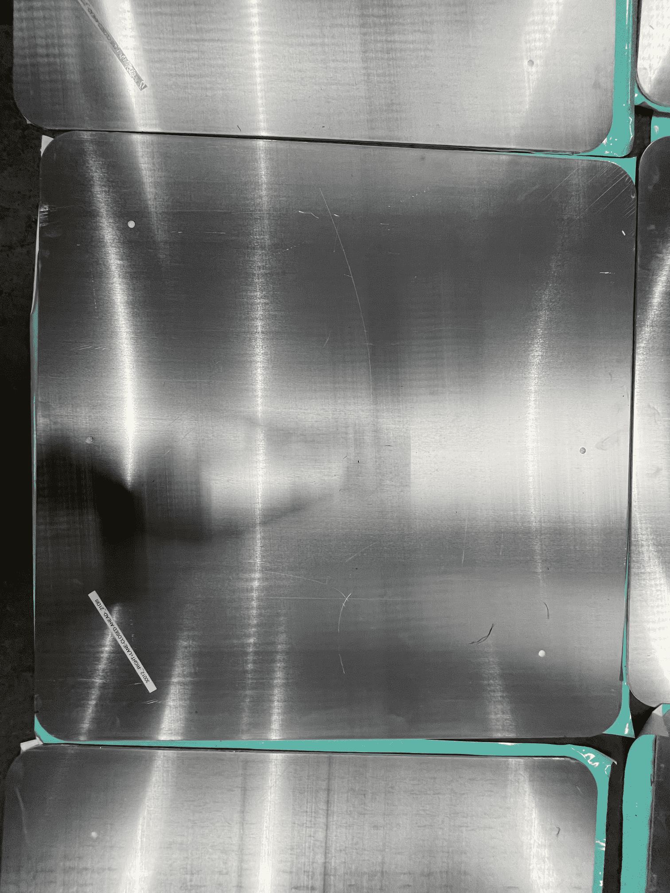
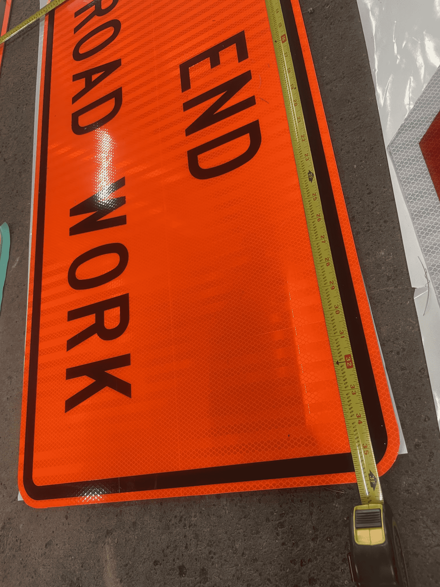
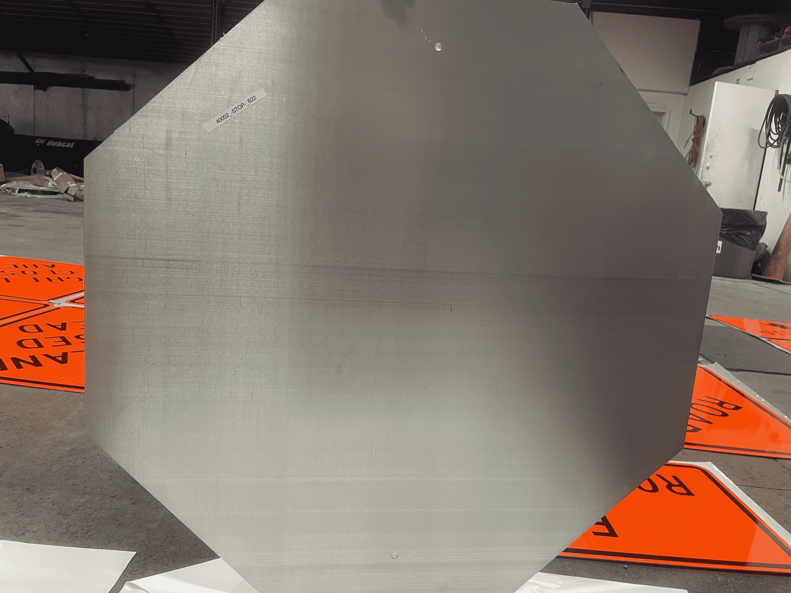

# Hardware_WorkZones_PennsylvaniaADSEquipmentInventory

<!--
The following template is based on:
Best-README-Template
Search for this, and you will find!
>
<!-- PROJECT LOGO -->
 

  <!--  -->

  <h2 align="center"> Hardware_WorkZones_PennsylvaniaADSEquipmentInventory
  </h2>

  <pre align="center">
    
    <!--font size="-2">Photo by <a href="https://www.penndot.pa.gov/Pages/default.aspx"> -->
</pre>

  

    The purpose of this repo is to inventory the Pennsylvania ADS equipment.
  

***

<!-- TABLE OF CONTENTS -->

  
<h2 style="display: inline-block">Table of Contents</h2>

  <ol>
    <li>
      <a href="#about-the-project">About the Project</a>
    </li>
    <li><a href="#directories">Directories' Structure</a>
    <li><a href="#inventory">Equipment Inventory</a></li>
    <li><a href="#license">License</a></li>
    <li><a href="#contact">Contact</a></li>
  </ol>

***

<!-- ABOUT THE PROJECT -->
## About The Project

<a href="#hardware_workzones_pennsylvaniaadsequipmentinventory">Back to top</a>

***

<!-- STRUCTURE OF THE REPO -->
### Directories

The following are the top level directories within the repository:
<ul>
 <li>Documents folder: Explains the coding method for equipment. </li>
 <li>Images folder: COntains images for all equipment. </li>

<a href="#hardware_workzones_pennsylvaniaadsequipmentinventory">Back to top</a>

***

## Inventory

### **1) White**
A) "Speed Limit 45" signs - Quantity: 3

**10001_-SPEED-LIMIT-45-_IIA21**
<pre align="center">
  
  <figcaption>Fig.1 - "Speed Limit 45" sign.</figcaption>
</pre>

<pre align="center">
  
  <figcaption>Fig.2 - "Speed Limit 45" sign.</figcaption>
</pre>

<pre align="center">
  
  <figcaption>Fig.3 - "Speed Limit 45" sign.</figcaption>
</pre>

**10002_-SPEED-LIMIT-45-_IIA21**
<pre align="center">
  
  <figcaption>Fig.4 - "Speed Limit 45" sign.</figcaption>
</pre>

<pre align="center">
  
  <figcaption>Fig.5 - "Speed Limit 45" sign.</figcaption>
</pre>

<pre align="center">
  
  <figcaption>Fig.6 - "Speed Limit 45" sign.</figcaption>
</pre>

**10003_-SPEED-LIMIT-45-_IIA21**
<pre align="center">
  
  <figcaption>Fig.7 - "Speed Limit 45" sign.</figcaption>
</pre>

<pre align="center">
  
  <figcaption>Fig.8 - "Speed Limit 45" sign.</figcaption>
</pre>

<pre align="center">
  
  <figcaption>Fig.9 - "Speed Limit 45" sign.</figcaption>
</pre>

B) "Speed Limit 35" signs - Quantity: 5

**10004_-SPEED-LIMIT-35-_IIA21**
<pre align="center">
  
  <figcaption>Fig.10 - "Speed Limit 35" sign.</figcaption>
</pre>

<pre align="center">
  
  <figcaption>Fig.11 - "Speed Limit 35" sign.</figcaption>
</pre>

<pre align="center">
  
  <figcaption>Fig.12 - "Speed Limit 35" sign.</figcaption>
</pre>

**10005_-SPEED-LIMIT-35-_IIA21**
<pre align="center">
  
  <figcaption>Fig.13 - "Speed Limit 35" sign.</figcaption>
</pre>

<pre align="center">
  
  <figcaption>Fig.14 - "Speed Limit 35" sign.</figcaption>
</pre>

<pre align="center">
  
  <figcaption>Fig.15 - "Speed Limit 35" sign.</figcaption>
</pre>

**10006_-SPEED-LIMIT-35-_IIA21**
<pre align="center">
  
  <figcaption>Fig.16 - "Speed Limit 35" sign.</figcaption>
</pre>

<pre align="center">
  
  <figcaption>Fig.17 - "Speed Limit 35" sign.</figcaption>
</pre>

<pre align="center">
  
  <figcaption>Fig.18 - "Speed Limit 35" sign.</figcaption>
</pre>

**10007_-SPEED-LIMIT-35-_IIA21**
<pre align="center">
  
  <figcaption>Fig.19 - "Speed Limit 35" sign.</figcaption>
</pre>

<pre align="center">
  
  <figcaption>Fig.20 - "Speed Limit 35" sign.</figcaption>
</pre>

<pre align="center">
  
  <figcaption>Fig.21 - "Speed Limit 35" sign.</figcaption>
</pre>

**10008_-SPEED-LIMIT-35-_IIA21**
<pre align="center">
  
  <figcaption>Fig.22 - "Speed Limit 35" sign.</figcaption>
</pre>

<pre align="center">
  
  <figcaption>Fig.23 - "Speed Limit 35" sign.</figcaption>
</pre>

<pre align="center">
  
  <figcaption>Fig.24 - "Speed Limit 35" sign.</figcaption>
</pre>

C) "Speed Limit 30" signs - Quantity: 2

**100010_-SPEED-LIMIT-30-_IIA21**
<pre align="center">
  
  <figcaption>Fig.25 - "Speed Limit 30" sign.</figcaption>
</pre>

<pre align="center">
  
  <figcaption>Fig.26 - "Speed Limit 30" sign.</figcaption>
</pre>

<pre align="center">
  
  <figcaption>Fig.27 - "Speed Limit 30" sign.</figcaption>
</pre>

**10009_-SPEED-LIMIT-30-_IIA21**
<pre align="center">
  
  <figcaption>Fig.28 - "Speed Limit 30" sign.</figcaption>
</pre>

<pre align="center">
  
  <figcaption>Fig.29 - "Speed Limit 30" sign.</figcaption>
</pre>

<pre align="center">
  
  <figcaption>Fig.30 - "Speed Limit 30" sign.</figcaption>
</pre>

D) "Speed Limit 25" sign - Quantity: 2

**100011_-SPEED-LIMIT-25-_IIA21**
<pre align="center">
  
  <figcaption>Fig.31 - "Speed Limit 25" sign.</figcaption>
</pre>

<pre align="center">
  
  <figcaption>Fig.32 - "Speed Limit 25" sign.</figcaption>
</pre>

<pre align="center">
  
  <figcaption>Fig.33 - "Speed Limit 25" sign.</figcaption>
</pre>

**100012_-SPEED-LIMIT-25-_IIA21**
<pre align="center">
  
  <figcaption>Fig.34 - "Speed Limit 25" sign.</figcaption>
</pre>
<pre align="center">
  
  <figcaption>Fig.35 - "Speed Limit 25" sign.</figcaption>
</pre>

<pre align="center">
  
  <figcaption>Fig.36 - "Speed Limit 25" sign.</figcaption>
</pre>

E) "Stay in lane" sign - Quantity: 1

**10013_-STAY-IN-LANE-_D**
<pre align="center">
  
  <figcaption>Fig.37 - "Stay in lane" sign.</figcaption>
</pre>
<pre align="center">
  
  <figcaption>Fig.38 - "Stay in lane" sign.</figcaption>
</pre>

<pre align="center">
  
  <figcaption>Fig.39 - "Stay in lane" sign.</figcaption>
</pre>

F) Pennsylvania Route "45" sign - Quantity: 10 

**10014_PennsylvaniaRoute_-45-_21BII**
<pre align="center">
  
  <figcaption>Fig.40 - Pennsylvania Route "45" sign.</figcaption>
</pre>

<pre align="center">
  
  <figcaption>Fig.41 - Pennsylvania Route "45" sign.</figcaption>
</pre>

<pre align="center">
  
  <figcaption>Fig.42 - Pennsylvania Route "45" sign.</figcaption>
</pre>

**10015_PennsylvaniaRoute_-45-_21BII**
<pre align="center">
  
  <figcaption>Fig.43 - Pennsylvania Route "45" sign.</figcaption>
</pre>

<pre align="center">
  
  <figcaption>Fig.44 - Pennsylvania Route "45" sign.</figcaption>
</pre>

<pre align="center">
  
  <figcaption>Fig.45 - Pennsylvania Route "45" sign.</figcaption>
</pre>

**10017_PennsylvaniaRoute_-45-_21BII**
<pre align="center">
  
  <figcaption>Fig.46 - Pennsylvania Route "45" sign.</figcaption>
</pre>

<pre align="center">
  
  <figcaption>Fig.47 - Pennsylvania Route "45" sign.</figcaption>
</pre>

<pre align="center">
  
  <figcaption>Fig.48 - Pennsylvania Route "45" sign.</figcaption>
</pre>

**10018_PennsylvaniaRoute_-45-_21BII**
<pre align="center">
  
  <figcaption>Fig.49 - Pennsylvania Route "45" sign.</figcaption>
</pre>

<pre align="center">
  
  <figcaption>Fig.50 - Pennsylvania Route "45" sign.</figcaption>
</pre>

<pre align="center">
  
  <figcaption>Fig.51 - Pennsylvania Route "45" sign.</figcaption>
</pre>

**10020_PennsylvaniaRoute_-45-_21BII**
<pre align="center">
  
  <figcaption>Fig.52 - Pennsylvania Route "45" sign.</figcaption>
</pre>

<pre align="center">
  
  <figcaption>Fig.53 - Pennsylvania Route "45" sign.</figcaption>
</pre>

<pre align="center">
  
  <figcaption>Fig.54 - Pennsylvania Route "45" sign.</figcaption>
</pre>

**10021_PennsylvaniaRoute_-45-_21BII**
<pre align="center">
  
  <figcaption>Fig.55 - Pennsylvania Route "45" sign.</figcaption>
</pre>

<pre align="center">
  
  <figcaption>Fig.56 - Pennsylvania Route "45" sign.</figcaption>
</pre>

<pre align="center">
  
  <figcaption>Fig.57 - Pennsylvania Route "45" sign.</figcaption>
</pre>

**10022_PennsylvaniaRoute_-45-_21BII**
<pre align="center">
  
  <figcaption>Fig.58 - Pennsylvania Route "45" sign.</figcaption>
</pre>

<pre align="center">
  
  <figcaption>Fig.59 - Pennsylvania Route "45" sign.</figcaption>
</pre>

<pre align="center">
  
  <figcaption>Fig.60 - Pennsylvania Route "45" sign.</figcaption>
</pre>

**10023_PennsylvaniaRoute_-45-_21BII**
<pre align="center">
  
  <figcaption>Fig.61 - Pennsylvania Route "45" sign.</figcaption>
</pre>

<pre align="center">
  
  <figcaption>Fig.62 - Pennsylvania Route "45" sign.</figcaption>
</pre>

<pre align="center">
  
  <figcaption>Fig.63 - Pennsylvania Route "45" sign.</figcaption>
</pre>

G) Right Arrow signs - Quantity: 4

**10024_RightArrow_D22**
<pre align="center">
  
  <figcaption>Fig.64 - Right Arrow sign.</figcaption>
</pre>

<pre align="center">
  
  <figcaption>Fig.65 - Right Arrow sign.</figcaption>
</pre>

<pre align="center">
  
  <figcaption>Fig.66 - Right Arrow sign.</figcaption>
</pre>

**10025_RightArrow_D22**
<pre align="center">
  
  <figcaption>Fig.67 - Right Arrow sign.</figcaption>
</pre>

<pre align="center">
  
  <figcaption>Fig.68 - Right Arrow sign.</figcaption>
</pre>

<pre align="center">
  
  <figcaption>Fig.69 - Right Arrow sign.</figcaption>
</pre>

**10026_RightArrow_D22**
<pre align="center">
  
  <figcaption>Fig.70 - Right Arrow sign.</figcaption>
</pre>

<pre align="center">
  
  <figcaption>Fig.71 - Right Arrow sign.</figcaption>
</pre>

<pre align="center">
  
  <figcaption>Fig.72 - Right Arrow sign.</figcaption>
</pre>

**10027_RightArrow_D22**
<pre align="center">
  
  <figcaption>Fig.73 - Right Arrow sign.</figcaption>
</pre>
<pre align="center">
  
  <figcaption>Fig.74 - Right Arrow sign.</figcaption>
</pre>

<pre align="center">
  
  <figcaption>Fig.75 - Right Arrow sign.</figcaption>
</pre>

H) Up Arrow signs - Quantity: 3

**10028_UpArrow_A**
<pre align="center">
  
  <figcaption>Fig.1 - .</figcaption>
</pre>

<pre align="center">
  
  <figcaption>Fig.1 - .</figcaption>
</pre>

<pre align="center">
  
  <figcaption>Fig.1 - .</figcaption>
</pre>

**10029_UpArrow_A**
<pre align="center">
  
  <figcaption>Fig.1 - .</figcaption>
</pre>

<pre align="center">
  
  <figcaption>Fig.1 - .</figcaption>
</pre>

<pre align="center">
  
  <figcaption>Fig.1 - .</figcaption>
</pre>

**10030_UpArrow_A**
<pre align="center">
  
  <figcaption>Fig.1 - .</figcaption>
</pre>

<pre align="center">
  
  <figcaption>Fig.1 - .</figcaption>
</pre>

<pre align="center">
  
  <figcaption>Fig.1 - .</figcaption>
</pre>

I) Right Turn sign - Quantity: 1

**10031_RightTurn_D**
<pre align="center">
  
  <figcaption>Fig.1 - .</figcaption>
</pre>

<pre align="center">
  
  <figcaption>Fig.1 - .</figcaption>
</pre>

<pre align="center">
  
  <figcaption>Fig.1 - .</figcaption>
</pre>

J) Left Turn sign - Quantity: 2

**10032_LeftTurn_B**
<pre align="center">
  
  <figcaption>Fig.1 - .</figcaption>
</pre>

<pre align="center">
  
  <figcaption>Fig.1 - .</figcaption>
</pre>

<pre align="center">
  
  <figcaption>Fig.1 - .</figcaption>
</pre>

**10033_LeftTurn_B**
<pre align="center">
  
  <figcaption>Fig.1 - .</figcaption>
</pre>

<pre align="center">
  
  <figcaption>Fig.1 - .</figcaption>
</pre>

<pre align="center">
  
  <figcaption>Fig.1 - .</figcaption>
</pre>

k) Left Corner ArroW "STOP HERE ON RED" sign - Quantity: 1

**10034_LeftCornerArrow_-STOP-HERE-ON-RED-_22B**
<pre align="center">
  
  <figcaption>Fig.1 - .</figcaption>
</pre>

<pre align="center">
  
  <figcaption>Fig.1 - .</figcaption>
</pre>

<pre align="center">
  
  <figcaption>Fig.1 - .</figcaption>
</pre>

L) ROAD CLOSED sign - Quantity: 2

**10035_-ROAD-CLOSED-_B**
<pre align="center">
  
  <figcaption>Fig.1 - .</figcaption>
</pre>

<pre align="center">
  
  <figcaption>Fig.1 - .</figcaption>
</pre>

<pre align="center">
  
  <figcaption>Fig.1 - .</figcaption>
</pre>

<pre align="center">
  
  <figcaption>Fig.1 - .</figcaption>
</pre>

<pre align="center">
  
  <figcaption>Fig.1 - .</figcaption>
</pre>

<pre align="center">
  
  <figcaption>Fig.1 - .</figcaption>
</pre>

**10036_-ROAD-CLOSED-_B**
<pre align="center">
  
  <figcaption>Fig.1 - .</figcaption>
</pre>

<pre align="center">
  
  <figcaption>Fig.1 - .</figcaption>
</pre>

<pre align="center">
  
  <figcaption>Fig.1 - .</figcaption>
</pre>

<pre align="center">
  
  <figcaption>Fig.1 - .</figcaption>
</pre>

<pre align="center">
  
  <figcaption>Fig.1 - .</figcaption>
</pre>

<pre align="center">
  
  <figcaption>Fig.1 - .</figcaption>
</pre>

M) ROAD CLOSED /TO /THRU TRAFFIC sign - Quantity: 1

**10037_-ROAD+CLOSED-TO-THRU+TRAFFIC-_B**
<pre align="center">
  
  <figcaption>Fig.1 - .</figcaption>
</pre>

<pre align="center">
  
  <figcaption>Fig.1 - .</figcaption>
</pre>

<pre align="center">
  
  <figcaption>Fig.1 - .</figcaption>
</pre>

N) NORTH sign - Quantitiy: 10

**10038_-NORTH-_DIII22**
<pre align="center">
  
  <figcaption>Fig.1 - .</figcaption>
</pre>

<pre align="center">
  
  <figcaption>Fig.1 - .</figcaption>
</pre>

<pre align="center">
  
  <figcaption>Fig.1 - .</figcaption>
</pre>

**10039_-NORTH-_DIII22**
<pre align="center">
  
  <figcaption>Fig.1 - .</figcaption>
</pre>

<pre align="center">
  
  <figcaption>Fig.1 - .</figcaption>
</pre>

<pre align="center">
  
  <figcaption>Fig.1 - .</figcaption>
</pre>

**10040_-NORTH-_DIII22**
<pre align="center">
  
  <figcaption>Fig.1 - .</figcaption>
</pre>

<pre align="center">
  
  <figcaption>Fig.1 - .</figcaption>
</pre>

<pre align="center">
  
  <figcaption>Fig.1 - .</figcaption>
</pre>

**10041_-NORTH-_DIII22**
<pre align="center">
  
  <figcaption>Fig.1 - .</figcaption>
</pre>

<pre align="center">
  
  <figcaption>Fig.1 - .</figcaption>
</pre>

<pre align="center">
  
  <figcaption>Fig.1 - .</figcaption>
</pre>

**10042_-NORTH-_DIII22**
<pre align="center">
  
  <figcaption>Fig.1 - .</figcaption>
</pre>

<pre align="center">
  
  <figcaption>Fig.1 - .</figcaption>
</pre>

<pre align="center">
  
  <figcaption>Fig.1 - .</figcaption>
</pre>

**10043_-NORTH-_DIII22**
<pre align="center">
  
  <figcaption>Fig.1 - .</figcaption>
</pre>

<pre align="center">
  
  <figcaption>Fig.1 - .</figcaption>
</pre>

<pre align="center">
  
  <figcaption>Fig.1 - .</figcaption>
</pre>

**10044_-NORTH-_DIII22**
<pre align="center">
  
  <figcaption>Fig.1 - .</figcaption>
</pre>

<pre align="center">
  
  <figcaption>Fig.1 - .</figcaption>
</pre>

<pre align="center">
  
  <figcaption>Fig.1 - .</figcaption>
</pre>

**10045_-NORTH-_DIII22**
<pre align="center">
  
  <figcaption>Fig.1 - .</figcaption>
</pre>

<pre align="center">
  
  <figcaption>Fig.1 - .</figcaption>
</pre>

<pre align="center">
  
  <figcaption>Fig.1 - .</figcaption>
</pre>

**10046_-NORTH-_DIII22**
<pre align="center">
  
  <figcaption>Fig.1 - .</figcaption>
</pre>

<pre align="center">
  
  <figcaption>Fig.1 - .</figcaption>
</pre>

<pre align="center">
  
  <figcaption>Fig.1 - .</figcaption>
</pre>

**10047_-NORTH-_DIII22**
<pre align="center">
  
  <figcaption>Fig.1 - .</figcaption>
</pre>

<pre align="center">
  
  <figcaption>Fig.1 - .</figcaption>
</pre>

<pre align="center">
  
  <figcaption>Fig.1 - .</figcaption>
</pre>

O) SOUTH - Quantitiy: 10

**10048_-SOUTH-_22DIII**
<pre align="center">
  
  <figcaption>Fig.1 - .</figcaption>
</pre>

<pre align="center">
  
  <figcaption>Fig.1 - .</figcaption>
</pre>

<pre align="center">
  
  <figcaption>Fig.1 - .</figcaption>
</pre>

**10049_-SOUTH-_22DIII**
<pre align="center">
  
  <figcaption>Fig.1 - .</figcaption>
</pre>
<pre align="center">
  
  <figcaption>Fig.1 - .</figcaption>
</pre>

<pre align="center">
  
  <figcaption>Fig.1 - .</figcaption>
</pre>

**10050_-SOUTH-_22DIII**
<pre align="center">
  
  <figcaption>Fig.1 - .</figcaption>
</pre>
<pre align="center">
  
  <figcaption>Fig.1 - .</figcaption>
</pre>

<pre align="center">
  
  <figcaption>Fig.1 - .</figcaption>
</pre>

**10051_-SOUTH-_22DIII**
<pre align="center">
  
  <figcaption>Fig.1 - .</figcaption>
</pre>
<pre align="center">
  
  <figcaption>Fig.1 - .</figcaption>
</pre>

<pre align="center">
  
  <figcaption>Fig.1 - .</figcaption>
</pre>

**10052_-SOUTH-_22DIII**
<pre align="center">
  
  <figcaption>Fig.1 - .</figcaption>
</pre>
<pre align="center">
  
  <figcaption>Fig.1 - .</figcaption>
</pre>

<pre align="center">
  
  <figcaption>Fig.1 - .</figcaption>
</pre>

**10053_-SOUTH-_22DIII**
<pre align="center">
  
  <figcaption>Fig.1 - .</figcaption>
</pre>
<pre align="center">
  
  <figcaption>Fig.1 - .</figcaption>
</pre>

<pre align="center">
  
  <figcaption>Fig.1 - .</figcaption>
</pre>

**10054_-SOUTH-_22DIII**
<pre align="center">
  
  <figcaption>Fig.1 - .</figcaption>
</pre>
<pre align="center">
  
  <figcaption>Fig.1 - .</figcaption>
</pre>

<pre align="center">
  
  <figcaption>Fig.1 - .</figcaption>
</pre>

**10055_-SOUTH-_22DIII**
<pre align="center">
  
  <figcaption>Fig.1 - .</figcaption>
</pre>
<pre align="center">
  
  <figcaption>Fig.1 - .</figcaption>
</pre>

<pre align="center">
  
  <figcaption>Fig.1 - .</figcaption>
</pre>

**10056_-SOUTH-_22DIII**
<pre align="center">
  
  <figcaption>Fig.1 - .</figcaption>
</pre>
<pre align="center">
  
  <figcaption>Fig.1 - .</figcaption>
</pre>

<pre align="center">
  
  <figcaption>Fig.1 - .</figcaption>
</pre>

**10057_-SOUTH-_22DIII**
<pre align="center">
  
  <figcaption>Fig.1 - .</figcaption>
</pre>
<pre align="center">
  
  <figcaption>Fig.1 - .</figcaption>
</pre>

<pre align="center">
  
  <figcaption>Fig.1 - .</figcaption>
</pre>

P) EAST - Quantitiy: 10

**10058_-EAST-_22DIII**
<pre align="center">
  
  <figcaption>Fig.1 - .</figcaption>
</pre>
<pre align="center">
  
  <figcaption>Fig.1 - .</figcaption>
</pre>

<pre align="center">
  
  <figcaption>Fig.1 - .</figcaption>
</pre>

**10059_-EAST-_22DIII**
<pre align="center">
  
  <figcaption>Fig.1 - .</figcaption>
</pre>
<pre align="center">
  
  <figcaption>Fig.1 - .</figcaption>
</pre>

<pre align="center">
  
  <figcaption>Fig.1 - .</figcaption>
</pre>

**10060_-EAST-_22DIII**
<pre align="center">
  
  <figcaption>Fig.1 - .</figcaption>
</pre>
<pre align="center">
  
  <figcaption>Fig.1 - .</figcaption>
</pre>

<pre align="center">
  
  <figcaption>Fig.1 - .</figcaption>
</pre>

**10061_-EAST-_22DIII**
<pre align="center">
  
  <figcaption>Fig.1 - .</figcaption>
</pre>
<pre align="center">
  
  <figcaption>Fig.1 - .</figcaption>
</pre>

<pre align="center">
  
  <figcaption>Fig.1 - .</figcaption>
</pre>

**10062_-EAST-_22DIII**
<pre align="center">
  
  <figcaption>Fig.1 - .</figcaption>
</pre>
<pre align="center">
  
  <figcaption>Fig.1 - .</figcaption>
</pre>

<pre align="center">
  
  <figcaption>Fig.1 - .</figcaption>
</pre>

**10063_-EAST-_22DIII**
<pre align="center">
  
  <figcaption>Fig.1 - .</figcaption>
</pre>
<pre align="center">
  
  <figcaption>Fig.1 - .</figcaption>
</pre>

<pre align="center">
  
  <figcaption>Fig.1 - .</figcaption>
</pre>

**10064_-EAST-_22DIII**
<pre align="center">
  
  <figcaption>Fig.1 - .</figcaption>
</pre>

<pre align="center">
  
  <figcaption>Fig.1 - .</figcaption>
</pre>

<pre align="center">
  
  <figcaption>Fig.1 - .</figcaption>
</pre>
**10065_-EAST-_22DIII**
<pre align="center">
  
  <figcaption>Fig.1 - .</figcaption>
</pre>

<pre align="center">
  
  <figcaption>Fig.1 - .</figcaption>
</pre>

<pre align="center">
  
  <figcaption>Fig.1 - .</figcaption>
</pre>

**10066_-EAST-_22DIII**
<pre align="center">
  
  <figcaption>Fig.1 - .</figcaption>
</pre>

<pre align="center">
  
  <figcaption>Fig.1 - .</figcaption>
</pre>

<pre align="center">
  
  <figcaption>Fig.1 - .</figcaption>
</pre>

**10067_-EAST-_22DIII**
<pre align="center">
  
  <figcaption>Fig.1 - .</figcaption>
</pre>

<pre align="center">
  
  <figcaption>Fig.1 - .</figcaption>
</pre>

<pre align="center">
  
  <figcaption>Fig.1 - .</figcaption>
</pre>

Q) WEST - Quantitiy: 10

**10068_-WEST-_IIID22**
<pre align="center">
  
  <figcaption>Fig.1 - .</figcaption>
</pre>
<pre align="center">
  
  <figcaption>Fig.1 - .</figcaption>
</pre>

<pre align="center">
  
  <figcaption>Fig.1 - .</figcaption>
</pre>

**10069_-WEST-_IIID22**
<pre align="center">
  
  <figcaption>Fig.1 - .</figcaption>
</pre>
<pre align="center">
  
  <figcaption>Fig.1 - .</figcaption>
</pre>

<pre align="center">
  
  <figcaption>Fig.1 - .</figcaption>
</pre>

**10070_-WEST-_IIID22**
<pre align="center">
  
  <figcaption>Fig.1 - .</figcaption>
</pre>
<pre align="center">
  
  <figcaption>Fig.1 - .</figcaption>
</pre>

<pre align="center">
  
  <figcaption>Fig.1 - .</figcaption>
</pre>

**10071_-WEST-_IIID22**
<pre align="center">
  
  <figcaption>Fig.1 - .</figcaption>
</pre>
<pre align="center">
  
  <figcaption>Fig.1 - .</figcaption>
</pre>

<pre align="center">
  
  <figcaption>Fig.1 - .</figcaption>
</pre>

**10072_-WEST-_IIID22**
<pre align="center">
  
  <figcaption>Fig.1 - .</figcaption>
</pre>
<pre align="center">
  
  <figcaption>Fig.1 - .</figcaption>
</pre>

<pre align="center">
  
  <figcaption>Fig.1 - .</figcaption>
</pre>

**10073_-WEST-_IIID22**
<pre align="center">
  
  <figcaption>Fig.1 - .</figcaption>
</pre>
<pre align="center">
  
  <figcaption>Fig.1 - .</figcaption>
</pre>

<pre align="center">
  
  <figcaption>Fig.1 - .</figcaption>
</pre>

**10074_-WEST-_IIID22**
<pre align="center">
  
  <figcaption>Fig.1 - .</figcaption>
</pre>
<pre align="center">
  
  <figcaption>Fig.1 - .</figcaption>
</pre>

<pre align="center">
  
  <figcaption>Fig.1 - .</figcaption>
</pre>

**10075_-WEST-_IIID22**
<pre align="center">
  
  <figcaption>Fig.1 - .</figcaption>
</pre>
<pre align="center">
  
  <figcaption>Fig.1 - .</figcaption>
</pre>

<pre align="center">
  
  <figcaption>Fig.1 - .</figcaption>
</pre>

**10076_-WEST-_IIID22**
<pre align="center">
  
  <figcaption>Fig.1 - .</figcaption>
</pre>
<pre align="center">
  
  <figcaption>Fig.1 - .</figcaption>
</pre>

<pre align="center">
  
  <figcaption>Fig.1 - .</figcaption>
</pre>

**10077_-WEST-_IIID22**
<pre align="center">
  
  <figcaption>Fig.1 - .</figcaption>
</pre>
<pre align="center">
  
  <figcaption>Fig.1 - .</figcaption>
</pre>

<pre align="center">
  
  <figcaption>Fig.1 - .</figcaption>
</pre>

### **2) Yellow**

A) CENTER LANE CLOSED AHEAD - Quantity: 1

**20001_-CENTER+LANE-CLOSED-AHEAD-_22DIII**
<pre align="center">
  
  <figcaption>Fig.1 - .</figcaption>
</pre>

<pre align="center">
  
  <figcaption>Fig.1 - .</figcaption>
</pre>

<pre align="center">
  
  <figcaption>Fig.1 - .</figcaption>
</pre>

<pre align="center">
  
  <figcaption>Fig.1 - .</figcaption>
</pre>

<pre align="center">
  
  <figcaption>Fig.1 - .</figcaption>
</pre>

B) Doble Lane Right Swerve - Quantity: 2

**20002_DoubleLaneRightSwerve_22DIII**

<pre align="center">
  
  <figcaption>Fig.1 - .</figcaption>
</pre>

**20003_DoubleLaneRightSwerve_22DIII**
<pre align="center">
  
  <figcaption>Fig.1 - .</figcaption>
</pre>

<pre align="center">
  
  <figcaption>Fig.1 - .</figcaption>
</pre>

<pre align="center">
  
  <figcaption>Fig.1 - .</figcaption>
</pre>

C) Double Lane Left Swerve - Quantity: 1
**20004_DoubleLaneLeftSwerve_22DIII**

<pre align="center">
  
  <figcaption>Fig.1 - .</figcaption>
</pre>

<pre align="center">
  
  <figcaption>Fig.1 - .</figcaption>
</pre>

<pre align="center">
  
  <figcaption>Fig.1 - .</figcaption>
</pre>

<pre align="center">
  
  <figcaption>Fig.1 - .</figcaption>
</pre>

D) Merging Traffic From Right Ahead - Quantity: 1
**20005_MergingTrafficFromRightAhead_22DIII**
<pre align="center">
  
  <figcaption>Fig.1 - .</figcaption>
</pre>

<pre align="center">
  
  <figcaption>Fig.1 - .</figcaption>
</pre>

<pre align="center">
  
  <figcaption>Fig.1 - .</figcaption>
</pre>

<pre align="center">
  
  <figcaption>Fig.1 - .</figcaption>
</pre>

<pre align="center">
  
  <figcaption>Fig.1 - .</figcaption>
</pre>

E) Right Lane Ends - Quantity: 2

**20006_RightLaneEnds_22DIII**
<pre align="center">
  
  <figcaption>Fig.1 - .</figcaption>
</pre>

<pre align="center">
  
  <figcaption>Fig.1 - .</figcaption>
</pre>

<pre align="center">
  
  <figcaption>Fig.1 - .</figcaption>
</pre>

<pre align="center">
  
  <figcaption>Fig.1 - .</figcaption>
</pre>

<pre align="center">
  
  <figcaption>Fig.1 - .</figcaption>
</pre>

**20007_RightLaneEnds_22DIII**
<pre align="center">
  
  <figcaption>Fig.1 - .</figcaption>
</pre>

<pre align="center">
  
  <figcaption>Fig.1 - .</figcaption>
</pre>

<pre align="center">
  
  <figcaption>Fig.1 - .</figcaption>
</pre>

<pre align="center">
  
  <figcaption>Fig.1 - .</figcaption>
</pre>

<pre align="center">
  
  <figcaption>Fig.1 - .</figcaption>
</pre>

F) Right Reverse Curve - Quantity: 1

**20008_RightReverseCurve_22DIII**
<pre align="center">
  
  <figcaption>Fig.1 - .</figcaption>
</pre>

<pre align="center">
  
  <figcaption>Fig.1 - .</figcaption>
</pre>

<pre align="center">
  
  <figcaption>Fig.1 - .</figcaption>
</pre>

<pre align="center">
  
  <figcaption>Fig.1 - .</figcaption>
</pre>

<pre align="center">
  
  <figcaption>Fig.1 - .</figcaption>
</pre>

G) Left Reverse Curve - Quantity: 1

**20009_LeftReverseCurve_22DIII**
<pre align="center">
  
  <figcaption>Fig.1 - .</figcaption>
</pre>

<pre align="center">
  
  <figcaption>Fig.1 - .</figcaption>
</pre>

<pre align="center">
  
  <figcaption>Fig.1 - .</figcaption>
</pre>

<pre align="center">
  
  <figcaption>Fig.1 - .</figcaption>
</pre>

<pre align="center">
  
  <figcaption>Fig.1 - .</figcaption>
</pre>

<pre align="center">
  
  <figcaption>Fig.1 - .</figcaption>
</pre>

H) Stop Sign Ahead - Quantity: 1

**20010_StopSignAhead_22BIII**
<pre align="center">
  
  <figcaption>Fig.1 - .</figcaption>
</pre>

<pre align="center">
  
  <figcaption>Fig.1 - .</figcaption>
</pre>

<pre align="center">
  
  <figcaption>Fig.1 - .</figcaption>
</pre>

<pre align="center">
  
  <figcaption>Fig.1 - .</figcaption>
</pre>

<pre align="center">
  
  <figcaption>Fig.1 - .</figcaption>
</pre>

I) Traffic Signal Ahead - Quantity: 1

**20011_TrafficSignalAhead_22DIII**
<pre align="center">
  
  <figcaption>Fig.1 - .</figcaption>
</pre>

<pre align="center">
  
  <figcaption>Fig.1 - .</figcaption>
</pre>

<pre align="center">
  
  <figcaption>Fig.1 - .</figcaption>
</pre>

<pre align="center">
  
  <figcaption>Fig.1 - .</figcaption>
</pre>

<pre align="center">
  
  <figcaption>Fig.1 - .</figcaption>
</pre>

J) NO PASSING ZONE - Quantity: 1

**20012_-NO-PASSING-ZONE-_A**

<pre align="center">
  
  <figcaption>Fig.1 - .</figcaption>
</pre>

<pre align="center">
  
  <figcaption>Fig.1 - .</figcaption>
</pre>

<pre align="center">
  
  <figcaption>Fig.1 - .</figcaption>
</pre>

<pre align="center">
  
  <figcaption>Fig.1 - .</figcaption>
</pre>

<pre align="center">
  
  <figcaption>Fig.1 - .</figcaption>
</pre>

### **3) Orange**

A) NO PASSING ZONE - Quantity: 2

**30001_-ONE+LANE-ROAD-AHEAD-_21DIII**
<pre align="center">
  
  <figcaption>Fig.1 - .</figcaption>
</pre>

<pre align="center">
  
  <figcaption>Fig.1 - .</figcaption>
</pre>

<pre align="center">
  
  <figcaption>Fig.1 - .</figcaption>
</pre>

<pre align="center">
  
  <figcaption>Fig.1 - .</figcaption>
</pre>

<pre align="center">
  
  <figcaption>Fig.1 - .</figcaption>
</pre>

**30002_-ONE+LANE-ROAD-AHEAD-_21DIII**
<pre align="center">
  
  <figcaption>Fig.1 - .</figcaption>
</pre>

<pre align="center">
  
  <figcaption>Fig.1 - .</figcaption>
</pre>

<pre align="center">
  
  <figcaption>Fig.1 - .</figcaption>
</pre>

<pre align="center">
  
  <figcaption>Fig.1 - .</figcaption>
</pre>

<pre align="center">
  
  <figcaption>Fig.1 - .</figcaption>
</pre>

B) NO PASSING ZONE - Quantity: 1

**30003_-LEFT+LANE-CLOSED-AHEAD-_21DIII**
<pre align="center">
  
  <figcaption>Fig.1 - .</figcaption>
</pre>

<pre align="center">
  
  <figcaption>Fig.1 - .</figcaption>
</pre>

<pre align="center">
  
  <figcaption>Fig.1 - .</figcaption>
</pre>

<pre align="center">
  
  <figcaption>Fig.1 - .</figcaption>
</pre>

<pre align="center">
  
  <figcaption>Fig.1 - .</figcaption>
</pre>

C) Lanes shift ahead - Quantity: 3

**30004_-LANES-SHIFT-AHEAD-_21DIII**
<pre align="center">
  
  <figcaption>Fig.1 - .</figcaption>
</pre>

<pre align="center">
  
  <figcaption>Fig.1 - .</figcaption>
</pre>

<pre align="center">
  
  <figcaption>Fig.1 - .</figcaption>
</pre>

<pre align="center">
  
  <figcaption>Fig.1 - .</figcaption>
</pre>

<pre align="center">
  
  <figcaption>Fig.1 - .</figcaption>
</pre>

**30005_-LANES-SHIFT-AHEAD-_21DIII**
<pre align="center">
  
  <figcaption>Fig.1 - .</figcaption>
</pre>

<pre align="center">
  
  <figcaption>Fig.1 - .</figcaption>
</pre>

<pre align="center">
  
  <figcaption>Fig.1 - .</figcaption>
</pre>

<pre align="center">
  
  <figcaption>Fig.1 - .</figcaption>
</pre>

<pre align="center">
  
  <figcaption>Fig.1 - .</figcaption>
</pre>

**30006_-LANES-SHIFT-AHEAD-_21DIII**
<pre align="center">
  
  <figcaption>Fig.1 - .</figcaption>
</pre>

<pre align="center">
  
  <figcaption>Fig.1 - .</figcaption>
</pre>

<pre align="center">
  
  <figcaption>Fig.1 - .</figcaption>
</pre>

<pre align="center">
  
  <figcaption>Fig.1 - .</figcaption>
</pre>

<pre align="center">
  
  <figcaption>Fig.1 - .</figcaption>
</pre>

D) Road work ahead - Quantity: 4

**30007_-ROAD-WORK-AHEAD-_21DIII**
<pre align="center">
  
  <figcaption>Fig.1 - .</figcaption>
</pre>

<pre align="center">
  
  <figcaption>Fig.1 - .</figcaption>
</pre>

<pre align="center">
  
  <figcaption>Fig.1 - .</figcaption>
</pre>

<pre align="center">
  
  <figcaption>Fig.1 - .</figcaption>
</pre>

<pre align="center">
  
  <figcaption>Fig.1 - .</figcaption>
</pre>

**30008_-ROAD-WORK-AHEAD-_21DIII**
<pre align="center">
  
  <figcaption>Fig.1 - .</figcaption>
</pre>

<pre align="center">
  
  <figcaption>Fig.1 - .</figcaption>
</pre>

<pre align="center">
  
  <figcaption>Fig.1 - .</figcaption>
</pre>

<pre align="center">
  
  <figcaption>Fig.1 - .</figcaption>
</pre>

<pre align="center">
  
  <figcaption>Fig.1 - .</figcaption>
</pre>

**30009_-ROAD-WORK-AHEAD-_21DIII**
<pre align="center">
  
  <figcaption>Fig.1 - .</figcaption>
</pre>

<pre align="center">
  
  <figcaption>Fig.1 - .</figcaption>
</pre>

<pre align="center">
  
  <figcaption>Fig.1 - .</figcaption>
</pre>

<pre align="center">
  
  <figcaption>Fig.1 - .</figcaption>
</pre>

<pre align="center">
  
  <figcaption>Fig.1 - .</figcaption>
</pre>

**30010_-ROAD-WORK-AHEAD-_21DIII**
<pre align="center">
  
  <figcaption>Fig.1 - .</figcaption>
</pre>

<pre align="center">
  
  <figcaption>Fig.1 - .</figcaption>
</pre>

<pre align="center">
  
  <figcaption>Fig.1 - .</figcaption>
</pre>

<pre align="center">
  
  <figcaption>Fig.1 - .</figcaption>
</pre>

<pre align="center">
  
  <figcaption>Fig.1 - .</figcaption>
</pre>

E) Right lane closed ahead - Quantity: 4

**30011_-RIGHT+LANE-CLOSED-AHEAD-_21DIII**
<pre align="center">
  
  <figcaption>Fig.1 - .</figcaption>
</pre>

<pre align="center">
  
  <figcaption>Fig.1 - .</figcaption>
</pre>

<pre align="center">
  
  <figcaption>Fig.1 - .</figcaption>
</pre>

<pre align="center">
  
  <figcaption>Fig.1 - .</figcaption>
</pre>

<pre align="center">
  
  <figcaption>Fig.1 - .</figcaption>
</pre>

**30012_-RIGHT+LANE-CLOSED-AHEAD-_21DIII**
<pre align="center">
  
  <figcaption>Fig.1 - .</figcaption>
</pre>

<pre align="center">
  
  <figcaption>Fig.1 - .</figcaption>
</pre>

<pre align="center">
  
  <figcaption>Fig.1 - .</figcaption>
</pre>

<pre align="center">
  
  <figcaption>Fig.1 - .</figcaption>
</pre>

<pre align="center">
  
  <figcaption>Fig.1 - .</figcaption>
</pre>

**30013_-RIGHT+LANE-CLOSED-AHEAD-_21DIII**
<pre align="center">
  
  <figcaption>Fig.1 - .</figcaption>
</pre>

<pre align="center">
  
  <figcaption>Fig.1 - .</figcaption>
</pre>

<pre align="center">
  
  <figcaption>Fig.1 - .</figcaption>
</pre>

<pre align="center">
  
  <figcaption>Fig.1 - .</figcaption>
</pre>

<pre align="center">
  
  <figcaption>Fig.1 - .</figcaption>
</pre>

**30014_-RIGHT+LANE-CLOSED-AHEAD-_21DIII**
<pre align="center">
  
  <figcaption>Fig.1 - .</figcaption>
</pre>

<pre align="center">
  
  <figcaption>Fig.1 - .</figcaption>
</pre>

<pre align="center">
  
  <figcaption>Fig.1 - .</figcaption>
</pre>

<pre align="center">
  
  <figcaption>Fig.1 - .</figcaption>
</pre>

<pre align="center">
  
  <figcaption>Fig.1 - .</figcaption>
</pre>

F) Road closed ahead - Quantity: 2

**30015_-ROAD-CLOSED-AHEAD-_20CIII**
<pre align="center">
  
  <figcaption>Fig.1 - .</figcaption>
</pre>

<pre align="center">
  
  <figcaption>Fig.1 - .</figcaption>
</pre>

<pre align="center">
  
  <figcaption>Fig.1 - .</figcaption>
</pre>

<pre align="center">
  
  <figcaption>Fig.1 - .</figcaption>
</pre>

<pre align="center">
  
  <figcaption>Fig.1 - .</figcaption>
</pre>

**30016_-ROAD-CLOSED-AHEAD-_20CIII**
<pre align="center">
  
  <figcaption>Fig.1 - .</figcaption>
</pre>

<pre align="center">
  
  <figcaption>Fig.1 - .</figcaption>
</pre>

<pre align="center">
  
  <figcaption>Fig.1 - .</figcaption>
</pre>

<pre align="center">
  
  <figcaption>Fig.1 - .</figcaption>
</pre>

<pre align="center">
  
  <figcaption>Fig.1 - .</figcaption>
</pre>

G) NO PASSING ZONE - Quantity: 1

**30017_-END-ROAD+WORK-_**
<pre align="center">
  
  <figcaption>Fig.1 - .</figcaption>
</pre>

<pre align="center">
  
  <figcaption>Fig.1 - .</figcaption>
</pre>

<pre align="center">
  
  <figcaption>Fig.1 - .</figcaption>
</pre>

<pre align="center">
  
  <figcaption>Fig.1 - .</figcaption>
</pre>

<pre align="center">
  
  <figcaption>Fig.1 - .</figcaption>
</pre>

H) NO PASSING ZONE - Quantity: 1

**30018_-END-DETOUR-_**
<pre align="center">
  
  <figcaption>Fig.1 - .</figcaption>
</pre>

<pre align="center">
  
  <figcaption>Fig.1 - .</figcaption>
</pre>

<pre align="center">
  
  <figcaption>Fig.1 - .</figcaption>
</pre>

I) NO PASSING ZONE - Quantity: 2

**30019_-DETOUR-AHEAD-_B**
<pre align="center">
  
  <figcaption>Fig.1 - .</figcaption>
</pre>

<pre align="center">
  
  <figcaption>Fig.1 - .</figcaption>
</pre>

<pre align="center">
  
  <figcaption>Fig.1 - .</figcaption>
</pre>

<pre align="center">
  
  <figcaption>Fig.1 - .</figcaption>
</pre>

<pre align="center">
  
  <figcaption>Fig.1 - .</figcaption>
</pre>

<pre align="center">
  
  <figcaption>Fig.1 - .</figcaption>
</pre>

**30020_-DETOUR-AHEAD-_B**
<pre align="center">
  
  <figcaption>Fig.1 - .</figcaption>
</pre>

<pre align="center">
  
  <figcaption>Fig.1 - .</figcaption>
</pre>

<pre align="center">
  
  <figcaption>Fig.1 - .</figcaption>
</pre>

<pre align="center">
  
  <figcaption>Fig.1 - .</figcaption>
</pre>

<pre align="center">
  
  <figcaption>Fig.1 - .</figcaption>
</pre>

<pre align="center">
  
  <figcaption>Fig.1 - .</figcaption>
</pre>

J) Up Arrow Detour - Quantity: 2

**30021_UpArrow_-DETOUR-_B**
<pre align="center">
  
  <figcaption>Fig.1 - .</figcaption>
</pre>

<pre align="center">
  
  <figcaption>Fig.1 - .</figcaption>
</pre>

<pre align="center">
  
  <figcaption>Fig.1 - .</figcaption>
</pre>

**30022_UpArrow_-DETOUR-_B**
<pre align="center">
  
  <figcaption>Fig.1 - .</figcaption>
</pre>

<pre align="center">
  
  <figcaption>Fig.1 - .</figcaption>
</pre>

<pre align="center">
  
  <figcaption>Fig.1 - .</figcaption>
</pre>

K) NO PASSING ZONE - Quantity: 2

**30023_RightArrow_-DETOUR-_D21**
<pre align="center">
  
  <figcaption>Fig.1 - .</figcaption>
</pre>

**30024_RightArrow_-DETOUR-_D21**
<pre align="center">
  
  <figcaption>Fig.1 - .</figcaption>
</pre>

L) NO PASSING ZONE - Quantity: 2

**30025_LeftArrow_-DETOUR-_21D**
<pre align="center">
  
  <figcaption>Fig.1 - .</figcaption>
</pre>

**30026_LeftArrow_-DETOUR-_21D**
<pre align="center">
  
  <figcaption>Fig.1 - .</figcaption>
</pre>

M) Detour - Quantity: 10

**30027_-DETOUR-_BIII22**
<pre align="center">
  
  <figcaption>Fig.1 - .</figcaption>
</pre>

<pre align="center">
  
  <figcaption>Fig.1 - .</figcaption>
</pre>

<pre align="center">
  
  <figcaption>Fig.1 - .</figcaption>
</pre>

**30028_-DETOUR-_BIII22**
<pre align="center">
  
  <figcaption>Fig.1 - .</figcaption>
</pre>

<pre align="center">
  
  <figcaption>Fig.1 - .</figcaption>
</pre>

<pre align="center">
  
  <figcaption>Fig.1 - .</figcaption>
</pre>

**30029_-DETOUR-_BIII22**
<pre align="center">
  
  <figcaption>Fig.1 - .</figcaption>
</pre>

<pre align="center">
  
  <figcaption>Fig.1 - .</figcaption>
</pre>

<pre align="center">
  
  <figcaption>Fig.1 - .</figcaption>
</pre>

**30030_-DETOUR-_BIII22**
<pre align="center">
  
  <figcaption>Fig.1 - .</figcaption>
</pre>

<pre align="center">
  
  <figcaption>Fig.1 - .</figcaption>
</pre>

<pre align="center">
  
  <figcaption>Fig.1 - .</figcaption>
</pre>

**30031_-DETOUR-_BIII22**
<pre align="center">
  
  <figcaption>Fig.1 - .</figcaption>
</pre>

<pre align="center">
  
  <figcaption>Fig.1 - .</figcaption>
</pre>

<pre align="center">
  
  <figcaption>Fig.1 - .</figcaption>
</pre>

**30032_-DETOUR-_BIII22**
<pre align="center">
  
  <figcaption>Fig.1 - .</figcaption>
</pre>

<pre align="center">
  
  <figcaption>Fig.1 - .</figcaption>
</pre>

<pre align="center">
  
  <figcaption>Fig.1 - .</figcaption>
</pre>

**30033_-DETOUR-_BIII22**
<pre align="center">
  
  <figcaption>Fig.1 - .</figcaption>
</pre>

<pre align="center">
  
  <figcaption>Fig.1 - .</figcaption>
</pre>

<pre align="center">
  
  <figcaption>Fig.1 - .</figcaption>
</pre>

**30034_-DETOUR-_BIII22**
<pre align="center">
  
  <figcaption>Fig.1 - .</figcaption>
</pre>

<pre align="center">
  
  <figcaption>Fig.1 - .</figcaption>
</pre>

<pre align="center">
  
  <figcaption>Fig.1 - .</figcaption>
</pre>

**30035_-DETOUR-_BIII22**
<pre align="center">
  
  <figcaption>Fig.1 - .</figcaption>
</pre>

<pre align="center">
  
  <figcaption>Fig.1 - .</figcaption>
</pre>

<pre align="center">
  
  <figcaption>Fig.1 - .</figcaption>
</pre>

**30036_-DETOUR-_BIII22**
<pre align="center">
  
  <figcaption>Fig.1 - .</figcaption>
</pre>

<pre align="center">
  
  <figcaption>Fig.1 - .</figcaption>
</pre>

<pre align="center">
  
  <figcaption>Fig.1 - .</figcaption>
</pre>
N) Left Arrow Detour - Quantity: 1

**30037_LeftArrow_-DETOUR-_22DVII**
<pre align="center">
  
  <figcaption>Fig.1 - .</figcaption>
</pre>

<pre align="center">
  
  <figcaption>Fig.1 - .</figcaption>
</pre>

<pre align="center">
  
  <figcaption>Fig.1 - .</figcaption>
</pre>

<pre align="center">
  
  <figcaption>Fig.1 - .</figcaption>
</pre>

<pre align="center">
  
  <figcaption>Fig.1 - .</figcaption>
</pre>

O) NO PASSING ZONE - Quantity: 3

**30038_-ROAD-WORK-AHEAD-_Fabric**
<pre align="center">
  
  <figcaption>Fig.1 - .</figcaption>
</pre>

**30039_Flagger_Fabric**
<pre align="center">
  
  <figcaption>Fig.1 - .</figcaption>
</pre>

**30040_-BE-PREPARED-TO+STOP-_Fabric**
<pre align="center">
  
  <figcaption>Fig.1 - .</figcaption>
</pre>

### **4) Red**

A) STOP sign - Quantity: 7

**40001_-STOP-_B22**
<pre align="center">
  
  <figcaption>Fig.1 - .</figcaption>
</pre>

<pre align="center">
  
  <figcaption>Fig.1 - .</figcaption>
</pre>

<pre align="center">
  
  <figcaption>Fig.1 - .</figcaption>
</pre>

**40002_-STOP-_B22**
<pre align="center">
  
  <figcaption>Fig.1 - .</figcaption>
</pre>

<pre align="center">
  
  <figcaption>Fig.1 - .</figcaption>
</pre>

<pre align="center">
  
  <figcaption>Fig.1 - .</figcaption>
</pre>

**40003_-STOP-_B22**
<pre align="center">
  
  <figcaption>Fig.1 - .</figcaption>
</pre>

<pre align="center">
  
  <figcaption>Fig.1 - .</figcaption>
</pre>

<pre align="center">
  
  <figcaption>Fig.1 - .</figcaption>
</pre>

**40004_-STOP-_B22**
<pre align="center">
  
  <figcaption>Fig.1 - .</figcaption>
</pre>

<pre align="center">
  
  <figcaption>Fig.1 - .</figcaption>
</pre>

<pre align="center">
  
  <figcaption>Fig.1 - .</figcaption>
</pre>

**40005_-STOP-_97AII_inService**
<pre align="center">
  
  <figcaption>Fig.1 - .</figcaption>
</pre>

<pre align="center">
  
  <figcaption>Fig.1 - .</figcaption>
</pre>

<pre align="center">
  
  <figcaption>Fig.1 - .</figcaption>
</pre>

**40006_-STOP-_96CII_OutOfService**
<pre align="center">
  
  <figcaption>Fig.1 - .</figcaption>
</pre>

<pre align="center">
  
  <figcaption>Fig.1 - .</figcaption>
</pre>

<pre align="center">
  
  <figcaption>Fig.1 - .</figcaption>
</pre>

**40007_-STOP-_ OutOfService**
<pre align="center">
  
  <figcaption>Fig.1 - .</figcaption>
</pre>

<pre align="center">
  
  <figcaption>Fig.1 - .</figcaption>
</pre>

<pre align="center">
  
  <figcaption>Fig.1 - .</figcaption>
</pre>

B) YIELD sign - Quantity: 3

**40008_-YIELD-_IIA07_inService**
<pre align="center">
  
  <figcaption>Fig.1 - .</figcaption>
</pre>

<pre align="center">
  
  <figcaption>Fig.1 - .</figcaption>
</pre>

<pre align="center">
  
  <figcaption>Fig.1 - .</figcaption>
</pre>

<pre align="center">
  
  <figcaption>Fig.1 - .</figcaption>
</pre>

<pre align="center">
  
  <figcaption>Fig.1 - .</figcaption>
</pre>

**40009_-YIELD-_II02C_inService**
<pre align="center">
  
  <figcaption>Fig.1 - .</figcaption>
</pre>

<pre align="center">
  
  <figcaption>Fig.1 - .</figcaption>
</pre>

<pre align="center">
  
  <figcaption>Fig.1 - .</figcaption>
</pre>

<pre align="center">
  
  <figcaption>Fig.1 - .</figcaption>
</pre>

<pre align="center">
  
  <figcaption>Fig.1 - .</figcaption>
</pre>

**40010_-YIELD-_ IIB05_OutOfService**
<pre align="center">
  
  <figcaption>Fig.1 - .</figcaption>
</pre>

<pre align="center">
  
  <figcaption>Fig.1 - .</figcaption>
</pre>

<pre align="center">
  
  <figcaption>Fig.1 - .</figcaption>
</pre>

### **5) Green** 

A) Right Corner Arrow - Quantity: 1

**50001_RightCornerArrow_-EXIT-_**
<pre align="center">
  
  <figcaption>Fig.1 - .</figcaption>
</pre>
<pre align="center">
  
  <figcaption>Fig.1 - .</figcaption>
</pre>
<pre align="center">
  
  <figcaption>Fig.1 - .</figcaption>
</pre>
<pre align="center">
  
  <figcaption>Fig.1 - .</figcaption>
</pre>

### **6) Cones/Barrels/Vertical Panels**

A) Cones - Quantity: 3

**60001_Cones_36inch**
<pre align="center">
  
  <figcaption>Fig.1 - .</figcaption>
</pre>

**60002_Cones_36inch**
<pre align="center">
  
  <figcaption>Fig.1 - .</figcaption>
</pre>

**60003_Cones_36inch**
<pre align="center">
  
  <figcaption>Fig.1 - .</figcaption>
</pre>

B) Vertical traffic panel - Quantity: 3

**60004_VerticalTrafficPanel_36inch**
<pre align="center">
  
  <figcaption>Fig.1 - .</figcaption>
</pre>

**60005_VerticalTrafficPanel_36inch**
<pre align="center">
  
  <figcaption>Fig.1 - .</figcaption>
</pre>

**60006_VerticalTrafficPanel_36inch**
<pre align="center">
  
  <figcaption>Fig.1 - .</figcaption>
</pre>

C) Single Spring Stand With Steel Legs - Quantity: 3

**60007_SingleSpringStandWithSteelLegs**
<pre align="center">
  
  <figcaption>Fig.1 - .</figcaption>
</pre>

**60008_SingleSpringStandWithSteelLegs**
<pre align="center">
  
  <figcaption>Fig.1 - .</figcaption>
</pre>

**60009_SingleSpringStandWithSteelLegs**
<pre align="center">
  
  <figcaption>Fig.1 - .</figcaption>
</pre>

D) XLarge Safety Vest - Quantity: 3

**60010_XLarge_SafetyVest**
<pre align="center">
  
  <figcaption>Fig.1 - .</figcaption>
</pre>

**60011_XLarge_SafetyVest**
<pre align="center">
  
  <figcaption>Fig.1 - .</figcaption>
</pre>

**60012_XLarge_SafetyVest**
<pre align="center">
  
  <figcaption>Fig.1 - .</figcaption>
</pre>

E) Large Safety Vest - Quantity: 2

**60013_Large_SafetyVest**
<pre align="center">
  
  <figcaption>Fig.1 - .</figcaption>
</pre>

**60014_Large_SafetyVest**
<pre align="center">
  
  <figcaption>Fig.1 - .</figcaption>
</pre>

F) Regular Safety Vest - Quantity: 1

**60015_Regular_SafetyVest**
<pre align="center">
  
  <figcaption>Fig.1 - .</figcaption>
</pre>

**60016_Regular_SafetyVest**
<pre align="center">
  
  <figcaption>Fig.1 - .</figcaption>
</pre>

G) Safety Vest Class 3 Level 2 - Quantity: 1

**60017_SafetyVest_Class3_Level2**

***Note: Vest mislabelled as 60016***

<pre align="center">
  
  <figcaption>Fig.1 - .</figcaption>
</pre>

### **7) Boxes/Shipments**

<pre align="center">
  
  <figcaption>Fig.1 - .</figcaption>
</pre>

<pre align="center">
  
  <figcaption>Fig.1 - .</figcaption>
</pre>

<a href="#hardware_workzones_pennsylvaniaadsequipmentinventory">Back to top</a>

***

<!-- LICENSE -->
## License

Distributed under the MIT License. See `LICENSE` for more information.

<a href="#hardware_workzones_pennsylvaniaadsequipmentinventory">Back to top</a>

***

<!-- CONTACT -->
## Contact

Sean Brennan - sbrennan@psu.edu

Project Link: [https://github.com/ivsg-psu/Hardware_WorkZones_PennsylvaniaADSEquipmentInventory](https://github.com/ivsg-psu/Hardware_WorkZones_PennsylvaniaADSEquipmentInventory)

<a href="#hardware_workzones_pennsylvaniaadsequipmentinventory">Back to top</a>

***

<!-- MARKDOWN LINKS & IMAGES -->
<!-- https://www.markdownguide.org/basic-syntax/#reference-style-links -->
