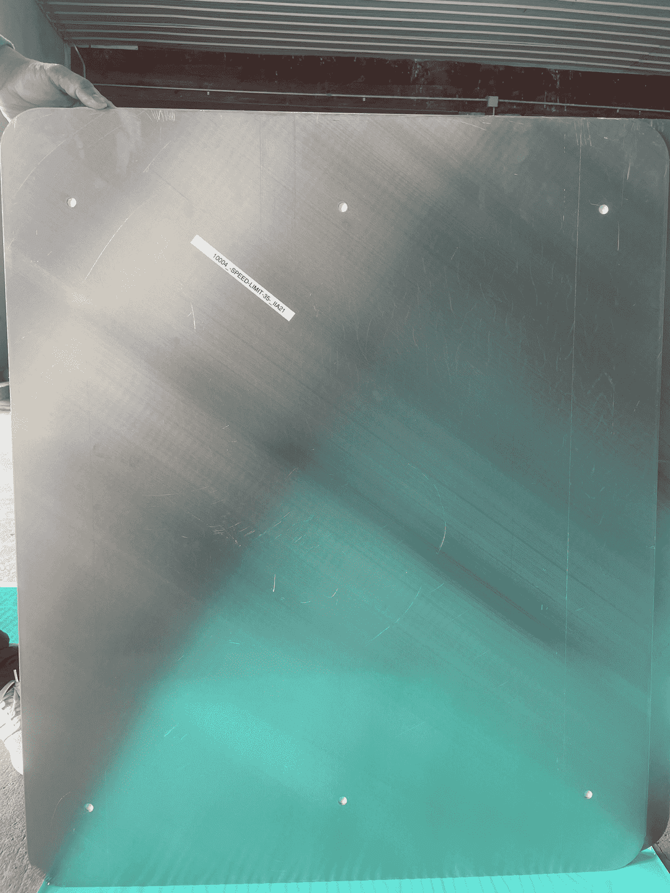
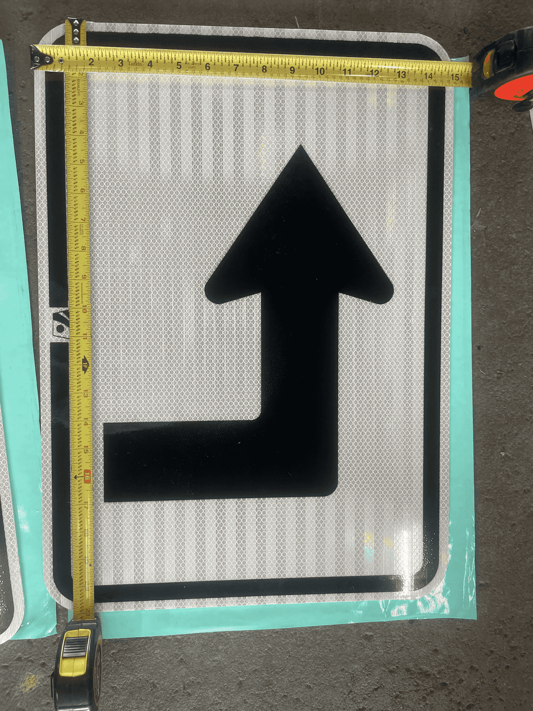

# Hardware_WorkZones_PennsylvaniaADSEquipmentInventory

<!--
The following template is based on:
Best-README-Template
Search for this, and you will find!
>
<!-- PROJECT LOGO -->
 

  <!--  -->

  <h2 align="center"> Hardware_WorkZones_PennsylvaniaADSEquipmentInventory
  </h2>

  <pre align="center">
    
    <!--figcaption>Fig.1 - The typical progression of map generation.</figcaption -->
    <!--font size="-2">Photo by <a href="https://unsplash.com/ko/@samuelchenard?utm_source=unsplash&utm_medium=referral&utm_content=creditCopyText">Samuel Chenard</a> on <a href="https://unsplash.com/photos/Bdc8uzY9EPw?utm_source=unsplash&utm_medium=referral&utm_content=creditCopyText">Unsplash</a>
</pre>

  

    The purpose of this repo is 
  

***

<!-- TABLE OF CONTENTS -->

  
<h2 style="display: inline-block">Table of Contents</h2>

  <ol>
    <li>
      <a href="#about-the-project">About the Project</a>
    </li>
    <li><a href="#directories">Directories' Structure</a>
    <li><a href="#usage">Usage</a></li>
    <li><a href="#inventory">Equipment Inventory</a></li>
    <li><a href="#license">License</a></li>
    <li><a href="#contact">Contact</a></li>
  </ol>

***

<!-- ABOUT THE PROJECT -->
## About The Project

<!--[![Product Name Screen Shot][product-screenshot]](https://example.com)-->

<a href="#hardware_workzones_pennsylvaniaadsequipmentinventory">Back to top</a>

***

<!-- STRUCTURE OF THE REPO -->
### Directories

The following are the top level directories within the repository:
<ul>
 <li>/Documents folder: </li>
 <li>/Images folder: </li>

<a href="#hardware_workzones_pennsylvaniaadsequipmentinventory">Back to top</a>

***

<!-- USAGE -->
## Usage

<a href="#hardware_workzones_pennsylvaniaadsequipmentinventory">Back to top</a>

***

## Inventory

### **1) White**
A) "Speed Limit 45" signs - Quantity: 3

**10001_-SPEED-LIMIT-45-_IIA21**
<pre align="center">
  
  <figcaption>Fig.1 - .</figcaption>
</pre>

<pre align="center">
  
  <figcaption>Fig.1 - .</figcaption>
</pre>

<pre align="center">
  
  <figcaption>Fig.1 - .</figcaption>
</pre>

**10002_-SPEED-LIMIT-45-_IIA21**
<pre align="center">
  
  <figcaption>Fig.1 - .</figcaption>
</pre>

<pre align="center">
  
  <figcaption>Fig.1 - .</figcaption>
</pre>

<pre align="center">
  
  <figcaption>Fig.1 - .</figcaption>
</pre>

**10003_-SPEED-LIMIT-45-_IIA21**
<pre align="center">
  
  <figcaption>Fig.1 - .</figcaption>
</pre>

<pre align="center">
  
  <figcaption>Fig.1 - .</figcaption>
</pre>

<pre align="center">
  
  <figcaption>Fig.1 - .</figcaption>
</pre>

B) "Speed Limit 35" signs" - Quantity: 5

**10004_-SPEED-LIMIT-35-_IIA21**
<pre align="center">
  
  <figcaption>Fig.1 - .</figcaption>
</pre>

<pre align="center">
  
  <figcaption>Fig.1 - .</figcaption>
</pre>

<pre align="center">
  
  <figcaption>Fig.1 - .</figcaption>
</pre>

**10005_-SPEED-LIMIT-35-_IIA21**
<pre align="center">
  
  <figcaption>Fig.1 - .</figcaption>
</pre>

<pre align="center">
  
  <figcaption>Fig.1 - .</figcaption>
</pre>

<pre align="center">
  
  <figcaption>Fig.1 - .</figcaption>
</pre>

**10006_-SPEED-LIMIT-35-_IIA21**
<pre align="center">
  
  <figcaption>Fig.1 - .</figcaption>
</pre>

<pre align="center">
  
  <figcaption>Fig.1 - .</figcaption>
</pre>

<pre align="center">
  
  <figcaption>Fig.1 - .</figcaption>
</pre>

**10007_-SPEED-LIMIT-35-_IIA21**
<pre align="center">
  
  <figcaption>Fig.1 - .</figcaption>
</pre>

<pre align="center">
  
  <figcaption>Fig.1 - .</figcaption>
</pre>

<pre align="center">
  
  <figcaption>Fig.1 - .</figcaption>
</pre>

**10008_-SPEED-LIMIT-35-_IIA21**
<pre align="center">
  
  <figcaption>Fig.1 - .</figcaption>
</pre>

<pre align="center">
  
  <figcaption>Fig.1 - .</figcaption>
</pre>

<pre align="center">
  
  <figcaption>Fig.1 - .</figcaption>
</pre>

C) "Speed Limit 30 signs" - Quantity: 2

**100010_-SPEED-LIMIT-30-_IIA21**
<pre align="center">
  
  <figcaption>Fig.1 - .</figcaption>
</pre>

<pre align="center">
  
  <figcaption>Fig.1 - .</figcaption>
</pre>

<pre align="center">
  
  <figcaption>Fig.1 - .</figcaption>
</pre>

**10009_-SPEED-LIMIT-30-_IIA21**
<pre align="center">
  
  <figcaption>Fig.1 - .</figcaption>
</pre>

<pre align="center">
  
  <figcaption>Fig.1 - .</figcaption>
</pre>

<pre align="center">
  
  <figcaption>Fig.1 - .</figcaption>
</pre>

D) "Speed Limit 25 signs" - Quantity: 2

**100011_-SPEED-LIMIT-25-_IIA21**
<pre align="center">
  
  <figcaption>Fig.1 - .</figcaption>
</pre>

<pre align="center">
  
  <figcaption>Fig.1 - .</figcaption>
</pre>

<pre align="center">
  
  <figcaption>Fig.1 - .</figcaption>
</pre>

**100012_-SPEED-LIMIT-25-_IIA21**
<pre align="center">
  
  <figcaption>Fig.1 - .</figcaption>
</pre>
<pre align="center">
  
  <figcaption>Fig.1 - .</figcaption>
</pre>

<pre align="center">
  
  <figcaption>Fig.1 - .</figcaption>
</pre>

E) "Stay in lane sign" - Quantity: 1

**10013_-STAY-IN-LANE-_D**
<pre align="center">
  
  <figcaption>Fig.1 - .</figcaption>
</pre>
<pre align="center">
  
  <figcaption>Fig.1 - .</figcaption>
</pre>

<pre align="center">
  
  <figcaption>Fig.1 - .</figcaption>
</pre>

F) Pennsylvania Route "45" sign - Quantity: 10 

**10014_PennsylvaniaRoute_-45-_21BII**
<pre align="center">
  
  <figcaption>Fig.1 - .</figcaption>
</pre>

<pre align="center">
  
  <figcaption>Fig.1 - .</figcaption>
</pre>

<pre align="center">
  
  <figcaption>Fig.1 - .</figcaption>
</pre>

**10015_PennsylvaniaRoute_-45-_21BII**
<pre align="center">
  
  <figcaption>Fig.1 - .</figcaption>
</pre>

<pre align="center">
  
  <figcaption>Fig.1 - .</figcaption>
</pre>

<pre align="center">
  
  <figcaption>Fig.1 - .</figcaption>
</pre>

**10017_PennsylvaniaRoute_-45-_21BII**
<pre align="center">
  
  <figcaption>Fig.1 - .</figcaption>
</pre>

<pre align="center">
  
  <figcaption>Fig.1 - .</figcaption>
</pre>

<pre align="center">
  
  <figcaption>Fig.1 - .</figcaption>
</pre>

**10018_PennsylvaniaRoute_-45-_21BII**
<pre align="center">
  
  <figcaption>Fig.1 - .</figcaption>
</pre>

<pre align="center">
  
  <figcaption>Fig.1 - .</figcaption>
</pre>

<pre align="center">
  
  <figcaption>Fig.1 - .</figcaption>
</pre>

**10020_PennsylvaniaRoute_-45-_21BII**
<pre align="center">
  
  <figcaption>Fig.1 - .</figcaption>
</pre>

<pre align="center">
  
  <figcaption>Fig.1 - .</figcaption>
</pre>

<pre align="center">
  
  <figcaption>Fig.1 - .</figcaption>
</pre>

**10021_PennsylvaniaRoute_-45-_21BII**
<pre align="center">
  
  <figcaption>Fig.1 - .</figcaption>
</pre>

<pre align="center">
  
  <figcaption>Fig.1 - .</figcaption>
</pre>

<pre align="center">
  
  <figcaption>Fig.1 - .</figcaption>
</pre>

**10022_PennsylvaniaRoute_-45-_21BII**
<pre align="center">
  
  <figcaption>Fig.1 - .</figcaption>
</pre>

<pre align="center">
  
  <figcaption>Fig.1 - .</figcaption>
</pre>

<pre align="center">
  
  <figcaption>Fig.1 - .</figcaption>
</pre>

**10023_PennsylvaniaRoute_-45-_21BII**
<pre align="center">
  
  <figcaption>Fig.1 - .</figcaption>
</pre>

<pre align="center">
  
  <figcaption>Fig.1 - .</figcaption>
</pre>

<pre align="center">
  
  <figcaption>Fig.1 - .</figcaption>
</pre>

G) Right Arrow signs - Quantity: 4

**10025_RightArrow_D22**
<pre align="center">
  
  <figcaption>Fig.1 - .</figcaption>
</pre>

<pre align="center">
  
  <figcaption>Fig.1 - .</figcaption>
</pre>

<pre align="center">
  
  <figcaption>Fig.1 - .</figcaption>
</pre>

**10026_RightArrow_D22**
<pre align="center">
  
  <figcaption>Fig.1 - .</figcaption>
</pre>

<pre align="center">
  
  <figcaption>Fig.1 - .</figcaption>
</pre>

<pre align="center">
  
  <figcaption>Fig.1 - .</figcaption>
</pre>

**10027_RightArrow_D22**
<pre align="center">
  
  <figcaption>Fig.1 - .</figcaption>
</pre>
<pre align="center">
  
  <figcaption>Fig.1 - .</figcaption>
</pre>

<pre align="center">
  
  <figcaption>Fig.1 - .</figcaption>
</pre>

H) Up Arrow signs - Quantity: 3

**10029_UpArrow_A**
<pre align="center">
  
  <figcaption>Fig.1 - .</figcaption>
</pre>

<pre align="center">
  
  <figcaption>Fig.1 - .</figcaption>
</pre>

<pre align="center">
  
  <figcaption>Fig.1 - .</figcaption>
</pre>

**10030_UpArrow_A**
<pre align="center">
  
  <figcaption>Fig.1 - .</figcaption>
</pre>

<pre align="center">
  
  <figcaption>Fig.1 - .</figcaption>
</pre>

<pre align="center">
  
  <figcaption>Fig.1 - .</figcaption>
</pre>

I) Right Turn sign - Quantity: 1

**10031_RightTurn_D**
<pre align="center">
  
  <figcaption>Fig.1 - .</figcaption>
</pre>

<pre align="center">
  
  <figcaption>Fig.1 - .</figcaption>
</pre>

<pre align="center">
  
  <figcaption>Fig.1 - .</figcaption>
</pre>

J) Left Turn sign - Quantity: 2

**10032_LeftTurn_B**
<pre align="center">
  
  <figcaption>Fig.1 - .</figcaption>
</pre>

<pre align="center">
  
  <figcaption>Fig.1 - .</figcaption>
</pre>

<pre align="center">
  
  <figcaption>Fig.1 - .</figcaption>
</pre>

**10033_LeftTurn_B**
<pre align="center">
  
  <figcaption>Fig.1 - .</figcaption>
</pre>

<pre align="center">
  
  <figcaption>Fig.1 - .</figcaption>
</pre>

<pre align="center">
  
  <figcaption>Fig.1 - .</figcaption>
</pre>

k) Left Corner ArroW "STOP HERE ON RED" sign - Quantity: 1

**10034_LeftCornerArrow_-STOP-HERE-ON-RED-_22B**
<pre align="center">
  
  <figcaption>Fig.1 - .</figcaption>
</pre>

<pre align="center">
  
  <figcaption>Fig.1 - .</figcaption>
</pre>

<pre align="center">
  
  <figcaption>Fig.1 - .</figcaption>
</pre>

L) ROAD CLOSED sign - Quantity: 2

**10035_-ROAD-CLOSED-_B**
<pre align="center">
  
  <figcaption>Fig.1 - .</figcaption>
</pre>

<pre align="center">
  
  <figcaption>Fig.1 - .</figcaption>
</pre>

<pre align="center">
  
  <figcaption>Fig.1 - .</figcaption>
</pre>

<pre align="center">
  
  <figcaption>Fig.1 - .</figcaption>
</pre>

<pre align="center">
  
  <figcaption>Fig.1 - .</figcaption>
</pre>

<pre align="center">
  
  <figcaption>Fig.1 - .</figcaption>
</pre>

**10036_-ROAD-CLOSED-_B**
<pre align="center">
  
  <figcaption>Fig.1 - .</figcaption>
</pre>

<pre align="center">
  
  <figcaption>Fig.1 - .</figcaption>
</pre>

<pre align="center">
  
  <figcaption>Fig.1 - .</figcaption>
</pre>

<pre align="center">
  
  <figcaption>Fig.1 - .</figcaption>
</pre>

<pre align="center">
  
  <figcaption>Fig.1 - .</figcaption>
</pre>

<pre align="center">
  
  <figcaption>Fig.1 - .</figcaption>
</pre>

M) ROAD CLOSED /TO /THRU TRAFFIC sign - Quantity: 1

**10037_-ROAD+CLOSED-TO-THRU+TRAFFIC-_B**
<pre align="center">
  
  <figcaption>Fig.1 - .</figcaption>
</pre>

<pre align="center">
  
  <figcaption>Fig.1 - .</figcaption>
</pre>

<pre align="center">
  
  <figcaption>Fig.1 - .</figcaption>
</pre>

N) NORTH sign - Quantitiy: 10

**10038_-NORTH-_DIII22**
<pre align="center">
  
  <figcaption>Fig.1 - .</figcaption>
</pre>

<pre align="center">
  
  <figcaption>Fig.1 - .</figcaption>
</pre>

<pre align="center">
  
  <figcaption>Fig.1 - .</figcaption>
</pre>

**10039_-NORTH-_DIII22**
<pre align="center">
  
  <figcaption>Fig.1 - .</figcaption>
</pre>

<pre align="center">
  
  <figcaption>Fig.1 - .</figcaption>
</pre>

<pre align="center">
  
  <figcaption>Fig.1 - .</figcaption>
</pre>

**10040_-NORTH-_DIII22**
<pre align="center">
  
  <figcaption>Fig.1 - .</figcaption>
</pre>

<pre align="center">
  
  <figcaption>Fig.1 - .</figcaption>
</pre>

<pre align="center">
  
  <figcaption>Fig.1 - .</figcaption>
</pre>

**10041_-NORTH-_DIII22**
<pre align="center">
  
  <figcaption>Fig.1 - .</figcaption>
</pre>

<pre align="center">
  
  <figcaption>Fig.1 - .</figcaption>
</pre>

<pre align="center">
  
  <figcaption>Fig.1 - .</figcaption>
</pre>

**10042_-NORTH-_DIII22**
<pre align="center">
  
  <figcaption>Fig.1 - .</figcaption>
</pre>

<pre align="center">
  
  <figcaption>Fig.1 - .</figcaption>
</pre>

<pre align="center">
  
  <figcaption>Fig.1 - .</figcaption>
</pre>

**10043_-NORTH-_DIII22**
<pre align="center">
  
  <figcaption>Fig.1 - .</figcaption>
</pre>

<pre align="center">
  
  <figcaption>Fig.1 - .</figcaption>
</pre>

<pre align="center">
  
  <figcaption>Fig.1 - .</figcaption>
</pre>

**10044_-NORTH-_DIII22**
<pre align="center">
  
  <figcaption>Fig.1 - .</figcaption>
</pre>

<pre align="center">
  
  <figcaption>Fig.1 - .</figcaption>
</pre>

<pre align="center">
  
  <figcaption>Fig.1 - .</figcaption>
</pre>

**10045_-NORTH-_DIII22**
<pre align="center">
  
  <figcaption>Fig.1 - .</figcaption>
</pre>

<pre align="center">
  
  <figcaption>Fig.1 - .</figcaption>
</pre>

<pre align="center">
  
  <figcaption>Fig.1 - .</figcaption>
</pre>

**10046_-NORTH-_DIII22**
<pre align="center">
  
  <figcaption>Fig.1 - .</figcaption>
</pre>

<pre align="center">
  
  <figcaption>Fig.1 - .</figcaption>
</pre>

<pre align="center">
  
  <figcaption>Fig.1 - .</figcaption>
</pre>

**10047_-NORTH-_DIII22**
<pre align="center">
  
  <figcaption>Fig.1 - .</figcaption>
</pre>

<pre align="center">
  
  <figcaption>Fig.1 - .</figcaption>
</pre>

<pre align="center">
  
  <figcaption>Fig.1 - .</figcaption>
</pre>

O) SOUTH - Quantitiy: 10

**10048_-SOUTH-_22DIII**
<pre align="center">
  
  <figcaption>Fig.1 - .</figcaption>
</pre>

<pre align="center">
  
  <figcaption>Fig.1 - .</figcaption>
</pre>

<pre align="center">
  
  <figcaption>Fig.1 - .</figcaption>
</pre>

**10049_-SOUTH-_22DIII**
<pre align="center">
  
  <figcaption>Fig.1 - .</figcaption>
</pre>
<pre align="center">
  
  <figcaption>Fig.1 - .</figcaption>
</pre>

<pre align="center">
  
  <figcaption>Fig.1 - .</figcaption>
</pre>

**10050_-SOUTH-_22DIII**
<pre align="center">
  
  <figcaption>Fig.1 - .</figcaption>
</pre>
<pre align="center">
  
  <figcaption>Fig.1 - .</figcaption>
</pre>

<pre align="center">
  
  <figcaption>Fig.1 - .</figcaption>
</pre>

**10051_-SOUTH-_22DIII**
<pre align="center">
  
  <figcaption>Fig.1 - .</figcaption>
</pre>
<pre align="center">
  
  <figcaption>Fig.1 - .</figcaption>
</pre>

<pre align="center">
  
  <figcaption>Fig.1 - .</figcaption>
</pre>

**10052_-SOUTH-_22DIII**
<pre align="center">
  
  <figcaption>Fig.1 - .</figcaption>
</pre>
<pre align="center">
  
  <figcaption>Fig.1 - .</figcaption>
</pre>

<pre align="center">
  
  <figcaption>Fig.1 - .</figcaption>
</pre>

**10053_-SOUTH-_22DIII**
<pre align="center">
  
  <figcaption>Fig.1 - .</figcaption>
</pre>
<pre align="center">
  
  <figcaption>Fig.1 - .</figcaption>
</pre>

<pre align="center">
  
  <figcaption>Fig.1 - .</figcaption>
</pre>

**10054_-SOUTH-_22DIII**
<pre align="center">
  
  <figcaption>Fig.1 - .</figcaption>
</pre>
<pre align="center">
  
  <figcaption>Fig.1 - .</figcaption>
</pre>

<pre align="center">
  
  <figcaption>Fig.1 - .</figcaption>
</pre>

**10055_-SOUTH-_22DIII**
<pre align="center">
  
  <figcaption>Fig.1 - .</figcaption>
</pre>
<pre align="center">
  
  <figcaption>Fig.1 - .</figcaption>
</pre>

<pre align="center">
  
  <figcaption>Fig.1 - .</figcaption>
</pre>

**10056_-SOUTH-_22DIII**
<pre align="center">
  
  <figcaption>Fig.1 - .</figcaption>
</pre>
<pre align="center">
  
  <figcaption>Fig.1 - .</figcaption>
</pre>

<pre align="center">
  
  <figcaption>Fig.1 - .</figcaption>
</pre>

**10057_-SOUTH-_22DIII**
<pre align="center">
  
  <figcaption>Fig.1 - .</figcaption>
</pre>
<pre align="center">
  
  <figcaption>Fig.1 - .</figcaption>
</pre>

<pre align="center">
  
  <figcaption>Fig.1 - .</figcaption>
</pre>

P) EAST - Quantitiy: 10

**10058_-EAST-_22DIII**
<pre align="center">
  
  <figcaption>Fig.1 - .</figcaption>
</pre>
<pre align="center">
  
  <figcaption>Fig.1 - .</figcaption>
</pre>

<pre align="center">
  
  <figcaption>Fig.1 - .</figcaption>
</pre>

**10059_-EAST-_22DIII**
<pre align="center">
  
  <figcaption>Fig.1 - .</figcaption>
</pre>
<pre align="center">
  
  <figcaption>Fig.1 - .</figcaption>
</pre>

<pre align="center">
  
  <figcaption>Fig.1 - .</figcaption>
</pre>

**10060_-EAST-_22DIII**
<pre align="center">
  
  <figcaption>Fig.1 - .</figcaption>
</pre>
<pre align="center">
  
  <figcaption>Fig.1 - .</figcaption>
</pre>

<pre align="center">
  
  <figcaption>Fig.1 - .</figcaption>
</pre>

**10061_-EAST-_22DIII**
<pre align="center">
  
  <figcaption>Fig.1 - .</figcaption>
</pre>
<pre align="center">
  
  <figcaption>Fig.1 - .</figcaption>
</pre>

<pre align="center">
  
  <figcaption>Fig.1 - .</figcaption>
</pre>

**10062_-EAST-_22DIII**
<pre align="center">
  
  <figcaption>Fig.1 - .</figcaption>
</pre>
<pre align="center">
  
  <figcaption>Fig.1 - .</figcaption>
</pre>

<pre align="center">
  
  <figcaption>Fig.1 - .</figcaption>
</pre>

**10063_-EAST-_22DIII**
<pre align="center">
  
  <figcaption>Fig.1 - .</figcaption>
</pre>
<pre align="center">
  
  <figcaption>Fig.1 - .</figcaption>
</pre>

<pre align="center">
  
  <figcaption>Fig.1 - .</figcaption>
</pre>

**10064_-EAST-_22DIII**
<pre align="center">
  
  <figcaption>Fig.1 - .</figcaption>
</pre>

<pre align="center">
  
  <figcaption>Fig.1 - .</figcaption>
</pre>

<pre align="center">
  
  <figcaption>Fig.1 - .</figcaption>
</pre>
**10065_-EAST-_22DIII**
<pre align="center">
  
  <figcaption>Fig.1 - .</figcaption>
</pre>

<pre align="center">
  
  <figcaption>Fig.1 - .</figcaption>
</pre>

<pre align="center">
  
  <figcaption>Fig.1 - .</figcaption>
</pre>

**10066_-EAST-_22DIII**
<pre align="center">
  
  <figcaption>Fig.1 - .</figcaption>
</pre>

<pre align="center">
  
  <figcaption>Fig.1 - .</figcaption>
</pre>

<pre align="center">
  
  <figcaption>Fig.1 - .</figcaption>
</pre>

**10067_-EAST-_22DIII**
<pre align="center">
  
  <figcaption>Fig.1 - .</figcaption>
</pre>

<pre align="center">
  
  <figcaption>Fig.1 - .</figcaption>
</pre>

<pre align="center">
  
  <figcaption>Fig.1 - .</figcaption>
</pre>

Q) WEST - Quantitiy: 10

**10068_-WEST-_IIID22**
<pre align="center">
  
  <figcaption>Fig.1 - .</figcaption>
</pre>
<pre align="center">
  
  <figcaption>Fig.1 - .</figcaption>
</pre>

<pre align="center">
  
  <figcaption>Fig.1 - .</figcaption>
</pre>

**10069_-WEST-_IIID22**
<pre align="center">
  
  <figcaption>Fig.1 - .</figcaption>
</pre>
<pre align="center">
  
  <figcaption>Fig.1 - .</figcaption>
</pre>

<pre align="center">
  
  <figcaption>Fig.1 - .</figcaption>
</pre>

**10070_-WEST-_IIID22**
<pre align="center">
  
  <figcaption>Fig.1 - .</figcaption>
</pre>
<pre align="center">
  
  <figcaption>Fig.1 - .</figcaption>
</pre>

<pre align="center">
  
  <figcaption>Fig.1 - .</figcaption>
</pre>

**10071_-WEST-_IIID22**
<pre align="center">
  
  <figcaption>Fig.1 - .</figcaption>
</pre>
<pre align="center">
  
  <figcaption>Fig.1 - .</figcaption>
</pre>

<pre align="center">
  
  <figcaption>Fig.1 - .</figcaption>
</pre>

**10072_-WEST-_IIID22**
<pre align="center">
  
  <figcaption>Fig.1 - .</figcaption>
</pre>
<pre align="center">
  
  <figcaption>Fig.1 - .</figcaption>
</pre>

<pre align="center">
  
  <figcaption>Fig.1 - .</figcaption>
</pre>

**10073_-WEST-_IIID22**
<pre align="center">
  
  <figcaption>Fig.1 - .</figcaption>
</pre>
<pre align="center">
  
  <figcaption>Fig.1 - .</figcaption>
</pre>

<pre align="center">
  
  <figcaption>Fig.1 - .</figcaption>
</pre>

**10074_-WEST-_IIID22**
<pre align="center">
  
  <figcaption>Fig.1 - .</figcaption>
</pre>
<pre align="center">
  
  <figcaption>Fig.1 - .</figcaption>
</pre>

<pre align="center">
  
  <figcaption>Fig.1 - .</figcaption>
</pre>

**10075_-WEST-_IIID22**
<pre align="center">
  
  <figcaption>Fig.1 - .</figcaption>
</pre>
<pre align="center">
  
  <figcaption>Fig.1 - .</figcaption>
</pre>

<pre align="center">
  
  <figcaption>Fig.1 - .</figcaption>
</pre>

**10076_-WEST-_IIID22**
<pre align="center">
  
  <figcaption>Fig.1 - .</figcaption>
</pre>
<pre align="center">
  
  <figcaption>Fig.1 - .</figcaption>
</pre>

<pre align="center">
  
  <figcaption>Fig.1 - .</figcaption>
</pre>

**10077_-WEST-_IIID22**
<pre align="center">
  
  <figcaption>Fig.1 - .</figcaption>
</pre>
<pre align="center">
  
  <figcaption>Fig.1 - .</figcaption>
</pre>

<pre align="center">
  
  <figcaption>Fig.1 - .</figcaption>
</pre>

### **2) Yellow**

### **3) Orange**

### **4) Red**

### **5) Green** 

### **6) Cones/Barrels/Vertical Panels**

<a href="#hardware_workzones_pennsylvaniaadsequipmentinventory">Back to top</a>

***

<!-- LICENSE -->
## License

Distributed under the MIT License. See `LICENSE` for more information.

<a href="#hardware_workzones_pennsylvaniaadsequipmentinventory">Back to top</a>

***

<!-- CONTACT -->
## Contact

Sean Brennan - sbrennan@psu.edu

Project Link: [https://github.com/ivsg-psu/Hardware_WorkZones_PennsylvaniaADSEquipmentInventory](https://github.com/ivsg-psu/Hardware_WorkZones_PennsylvaniaADSEquipmentInventory)

<a href="#hardware_workzones_pennsylvaniaadsequipmentinventory">Back to top</a>

***

<!-- MARKDOWN LINKS & IMAGES -->
<!-- https://www.markdownguide.org/basic-syntax/#reference-style-links -->
