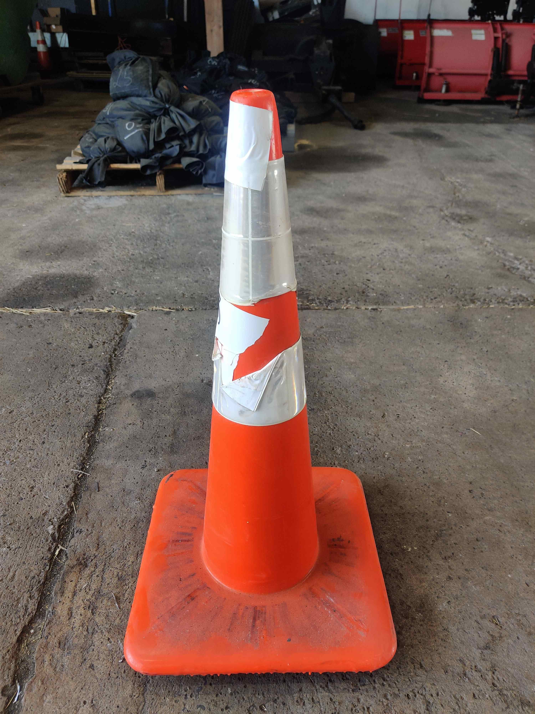

# Hardware_WorkZones_PennsylvaniaADSEquipmentInventory

<!--
The following template is based on:
Best-README-Template
Search for this, and you will find!
>
<!-- PROJECT LOGO -->
 
  <h2 align="center"> Hardware_WorkZones_PennsylvaniaADSEquipmentInventory
  </h2>

  <pre align="center">
    
    <!--font size="-2">Photo by <a href="https://www.penndot.pa.gov/Pages/default.aspx"> -->
  </pre>

  

  The purpose of this repo is to inventory the Pennsylvania ADS equipment.
     
  

***

<!-- TABLE OF CONTENTS -->

  
<h2 style="display: inline-block">Table of Contents</h2>

  <ol>
    <li>
      <a href="#about">About</a>
    </li>
    <li>
      <a href="#getting-started">Getting Started</a>
    </li>
    <li><a href="#directories">Directories</li>
    <li><a href="#inventory-cones">Inventory: Cones</li>
    <ul>
    <li><a href="#1-cones---quantity-3">1) Cones - Quantity: 3</a></li>
    <ul>
    <li><a href="#60001_cones_36inch">60001_Cones_36inch</a></li>
    <li><a href="#60002_cones_36inch">60002_Cones_36inch</a></li>
    <li><a href="#60003_cones_36inch">60003_Cones_36inch</a></li>
    </ul>
    <li><a href="#2-cones-grade-3---quantity-2"> 2) Cones Grade 3 - Quantity: 2</a></li>
    <ul>
    <li><a href="#63001_cones_28inch">63001_Cones_28inchh</a></li>
    <li><a href="#63002_cones_28inch">63002_Cones_28inchh</a></li>
    </ul>
    <li><a href="#3-cones-grade-4---quantity-4"> 3) Cones Grade 4 - Quantity: 4</a></li>
    <ul>
    <li><a href="#64001_cones_28inch">64001_Cones_28inch</a></li>
    <li><a href="#64002_cones_28inch">64002_Cones_28inch</a></li>
    <li><a href="#64003_cones_28inch">64003_Cones_28inch</a></li>
    <li><a href="#64004_cones_28inch">64004_Cones_28inch</a></li>
    </ul>
    <li><a href="#4-cones-grade-5---quantity-4"> 4) Cones Grade 5 - Quantity: 4</a></li>
    <ul>
    <li><a href="#65001_cones_28inch">65001_Cones_28inch</a></li>
    <li><a href="#65002_cones_28inch">65002_Cones_28inch</a></li>
    <li><a href="#65003_cones_28inch">65003_Cones_28inch</a></li>
    <li><a href="#65004_cones_28inch">65004_Cones_28inch</a></li>
    </ul>
    <li><a href="#5-cones-grade-6---quantity-3"> 5) Cones Grade 6 - Quantity: 3</a></li>
    <ul>
    <li><a href="#66001_cones_28inch">66001_Cones_28inch</a></li>
    <li><a href="#66002_cones_28inch">66002_Cones_28inch</a></li>
    <li><a href="#66003_cones_28inch">66003_Cones_28inch</a></li>
    </ul>
    <li><a href="#6-cones-grade-7---quantity-2"> 6) Cones Grade 7 - Quantity: 2</a></li>
    <ul>
    <li><a href="#67001_cones_28inch">67001_Cones_28inch</a></li>
    <li><a href="#67002_cones_28inch">67002_Cones_28inch</a></li>
    </ul>
    <li><a href="#7-cones-grade-8---quantity-3"> 7) Cones Grade 8 - Quantity: 3</a></li>
    <ul>
    <li><a href="#68001_cones_28inch">68001_Cones_28inch</a></li>
    <li><a href="#68002_cones_28inch">68002_Cones_28inch</a></li>
    <li><a href="#68003_cones_28inch">68003_Cones_28inch</a></li>
    </ul>
    <li><a href="#8-cones-grade-9---quantity-2"> 8) Cones Grade 9 - Quantity: 2</a></li>
    <ul>
    <li><a href="#69001_cones_28inch">69001_Cones_28inch</a></li>
    <li><a href="#69002_cones_28inch">69002_Cones_28inch</a></li>
    </ul>
    </ul>
    <li><a href="#license">License</a></li>
    <li><a href="#contact">Contact</a></li>
  </ol>

***

<!-- ABOUT -->
## About 

<!--[![Product Name Screen Shot][product-screenshot]](https://example.com)-->

The purpose of this repo is to document and inventory the ADS (Autonomous Driving System) equipment we receive from US/Penn Dot

<a href="#hardware_workzones_pennsylvaniaadsequipmentinventory">Back to top</a>

***

<!-- GETTING STARTED -->
## Getting Started

This is the main ReadMe.md file that incorporates the details of all the equipment's ReadMe files. 

<a href="#hardware_workzones_pennsylvaniaadsequipmentinventory">Back to top</a>

***

<!-- STRUCTURE OF THE REPO -->
## Directories

The following are the top level directories within the repository:
<ul>
 <li>Documents: Explains the coding method for equipment.</li>
 <li>Images folder: Contains images used in the README file.</li>
</ul>

<a href="#hardware_workzones_pennsylvaniaadsequipmentinventory">Back to top</a>

***

## Inventory: Cones

Below are the cones received on 7/11/2023. These cones are not entirely new. Thus, they are given a grade from 0 to 9 based on their quality, where 0 means new and 9 means very old/out of service. The grade is shown right after the number 6 at the beginning of their code number. For example 63001 is a cone of grade 3.

<a href="#hardware_workzones_pennsylvaniaadsequipmentinventory">Back to top</a>
***

### 1) Cones - Quantity: 3

#### 60001_Cones_36inch

<pre align="center">
  
  <figcaption>Fig.471 -  Cone.</figcaption>
</pre>

<a href="#hardware_workzones_pennsylvaniaadsequipmentinventory">Back to top</a>
***

#### 60002_Cones_36inch

<pre align="center">
  
  <figcaption>Fig.472 -  Cone.</figcaption>
</pre>

<a href="#hardware_workzones_pennsylvaniaadsequipmentinventory">Back to top</a>
***

#### 60003_Cones_36inch

<pre align="center">
  
  <figcaption>Fig.473 -  Cone.</figcaption>
</pre>

<a href="#hardware_workzones_pennsylvaniaadsequipmentinventory">Back to top</a>
***

### 2) Cones Grade 3 - Quantity: 2

<pre align="center">
  
  <figcaption>Fig.474 -  Cone.</figcaption>
</pre>

<pre align="center">
  
  <figcaption>Fig.475 -  Cone.</figcaption>
</pre>

<pre align="center">
  
  <figcaption>Fig.476 -  Cone.</figcaption>
</pre>

<a href="#hardware_workzones_pennsylvaniaadsequipmentinventory">Back to top</a>
***

#### 63001_Cones_28inch

<pre align="center">
  
  <figcaption>Fig.477 -  Cone.</figcaption>
</pre>

<pre align="center">
  
  <figcaption>Fig.478 -  Cone.</figcaption>
</pre>

<pre align="center">
  
  <figcaption>Fig.479 -  Cone.</figcaption>
</pre>

<pre align="center">
  
  <figcaption>Fig.480 -  Cone.</figcaption>
</pre>

<pre align="center">
  
  <figcaption>Fig.481 -  Cone.</figcaption>
</pre>

<a href="#hardware_workzones_pennsylvaniaadsequipmentinventory">Back to top</a>
***

#### 63002_Cones_28inch

<pre align="center">
  
  <figcaption>Fig.482 -  Cone.</figcaption>
</pre>

<pre align="center">
  
  <figcaption>Fig.483 -  Cone.</figcaption>
</pre>

<pre align="center">
  
  <figcaption>Fig.484 -  Cone.</figcaption>
</pre>

<pre align="center">
  
  <figcaption>Fig.482 -  Cone.</figcaption>
</pre>

<pre align="center">
  
  <figcaption>Fig.485 -  Cone.</figcaption>
</pre>

<a href="#hardware_workzones_pennsylvaniaadsequipmentinventory">Back to top</a>
***

### 3) Cones Grade 4 - Quantity: 4

#### 64001_Cones_28inch

<pre align="center">
  
  <figcaption>Fig.486 -  Cone.</figcaption>
</pre>

<pre align="center">
  
  <figcaption>Fig.487 -  Cone.</figcaption>
</pre>

<pre align="center">
  
  <figcaption>Fig.488 -  Cone.</figcaption>
</pre>

<pre align="center">
  
  <figcaption>Fig.489 -  Cone.</figcaption>
</pre>

<pre align="center">
  
  <figcaption>Fig.490 -  Cone.</figcaption>
</pre>

<a href="#hardware_workzones_pennsylvaniaadsequipmentinventory">Back to top</a>
***

#### 64002_Cones_28inch

<pre align="center">
  
  <figcaption>Fig.491 -  Cone.</figcaption>
</pre>

<pre align="center">
  
  <figcaption>Fig.492 -  Cone.</figcaption>
</pre>

<pre align="center">
  
  <figcaption>Fig.493 -  Cone.</figcaption>
</pre>

<pre align="center">
  
  <figcaption>Fig.494 -  Cone.</figcaption>
</pre>

<pre align="center">
  
  <figcaption>Fig.495 -  Cone.</figcaption>
</pre>

<a href="#hardware_workzones_pennsylvaniaadsequipmentinventory">Back to top</a>
***

#### 64003_Cones_28inch

<pre align="center">
  
  <figcaption>Fig.496 -  Cone.</figcaption>
</pre>
<pre align="center">
  
  <figcaption>Fig.497 -  Cone.</figcaption>
</pre>
<pre align="center">
  
  <figcaption>Fig.498 -  Cone.</figcaption>
</pre>
<pre align="center">
  
  <figcaption>Fig.499 -  Cone.</figcaption>
</pre>
<pre align="center">
  
  <figcaption>Fig.500 -  Cone.</figcaption>
</pre>

<a href="#hardware_workzones_pennsylvaniaadsequipmentinventory">Back to top</a>
***

#### 64004_Cones_28inch

<pre align="center">
  
  <figcaption>Fig.501 -  Cone.</figcaption>
</pre>
<pre align="center">
  
  <figcaption>Fig.502 -  Cone.</figcaption>
</pre>
<pre align="center">
  
  <figcaption>Fig.503 -  Cone.</figcaption>
</pre>
<pre align="center">
  
  <figcaption>Fig.504 -  Cone.</figcaption>
</pre>
<pre align="center">
  
  <figcaption>Fig.505 -  Cone.</figcaption>
</pre>

<a href="#hardware_workzones_pennsylvaniaadsequipmentinventory">Back to top</a>
***

### 4) Cones Grade 5 - Quantity: 4

#### 65001_Cones_28inch

<pre align="center">
  
  <figcaption>Fig.506 -  Cone.</figcaption>
</pre>
<pre align="center">
  
  <figcaption>Fig.507 -  Cone.</figcaption>
</pre>
<pre align="center">
  
  <figcaption>Fig.508 -  Cone.</figcaption>
</pre>
<pre align="center">
  
  <figcaption>Fig.509 -  Cone.</figcaption>
</pre>
<pre align="center">
  
  <figcaption>Fig.510 -  Cone.</figcaption>
</pre>

<a href="#hardware_workzones_pennsylvaniaadsequipmentinventory">Back to top</a>
***

#### 65002_Cones_28inch

<pre align="center">
  
  <figcaption>Fig.511 -  Cone.</figcaption>
</pre>
<pre align="center">
  
  <figcaption>Fig.512 -  Cone.</figcaption>
</pre>
<pre align="center">
  
  <figcaption>Fig.513 -  Cone.</figcaption>
</pre>
<pre align="center">
  
  <figcaption>Fig.514 -  Cone.</figcaption>
</pre>
<pre align="center">
  
  <figcaption>Fig.515 -  Cone.</figcaption>
</pre>

<a href="#hardware_workzones_pennsylvaniaadsequipmentinventory">Back to top</a>
***

#### 65003_Cones_28inch

<pre align="center">
  
  <figcaption>Fig.516 -  Cone.</figcaption>
</pre>
<pre align="center">
  
  <figcaption>Fig.517 -  Cone.</figcaption>
</pre>
<pre align="center">
  
  <figcaption>Fig.518 -  Cone.</figcaption>
</pre>
<pre align="center">
  
  <figcaption>Fig.519 -  Cone.</figcaption>
</pre>
<pre align="center">
  
  <figcaption>Fig.520 -  Cone.</figcaption>
</pre>

<a href="#hardware_workzones_pennsylvaniaadsequipmentinventory">Back to top</a>
***

#### 65004_Cones_28inch

<pre align="center">
  
  <figcaption>Fig.521 -  Cone.</figcaption>
</pre>
<pre align="center">
  
  <figcaption>Fig.522 -  Cone.</figcaption>
</pre>
<pre align="center">
  
  <figcaption>Fig.523 -  Cone.</figcaption>
</pre>
<pre align="center">
  
  <figcaption>Fig.524 -  Cone.</figcaption>
</pre>
<pre align="center">
  
  <figcaption>Fig.525 -  Cone.</figcaption>
</pre>

<a href="#hardware_workzones_pennsylvaniaadsequipmentinventory">Back to top</a>
***

### 5) Cones Grade 6 - Quantity: 3

#### 66001_Cones_28inch

<pre align="center">
  
  <figcaption>Fig.526 -  Cone.</figcaption>
</pre>
<pre align="center">
  
  <figcaption>Fig.527 -  Cone.</figcaption>
</pre>
<pre align="center">
  
  <figcaption>Fig.528 -  Cone.</figcaption>
</pre>
<pre align="center">
  
  <figcaption>Fig.529 -  Cone.</figcaption>
</pre>
<pre align="center">
  
  <figcaption>Fig.530 -  Cone.</figcaption>
</pre>

<a href="#hardware_workzones_pennsylvaniaadsequipmentinventory">Back to top</a>
***

#### 66002_Cones_28inch

<pre align="center">
  
  <figcaption>Fig.531 -  Cone.</figcaption>
</pre>
<pre align="center">
  
  <figcaption>Fig.532 -  Cone.</figcaption>
</pre>
<pre align="center">
  
  <figcaption>Fig.533 -  Cone.</figcaption>
</pre>
<pre align="center">
  
  <figcaption>Fig.534 -  Cone.</figcaption>
</pre>
<pre align="center">
  
  <figcaption>Fig.535 -  Cone.</figcaption>
</pre>

<a href="#hardware_workzones_pennsylvaniaadsequipmentinventory">Back to top</a>
***

#### 66003_Cones_28inch

<pre align="center">
  
  <figcaption>Fig.536 -  Cone.</figcaption>
</pre>
<pre align="center">
  
  <figcaption>Fig.537 -  Cone.</figcaption>
</pre>
<pre align="center">
  
  <figcaption>Fig.538 -  Cone.</figcaption>
</pre>
<pre align="center">
  
  <figcaption>Fig.539 -  Cone.</figcaption>
</pre>
<pre align="center">
  
  <figcaption>Fig.540 -  Cone.</figcaption>
</pre>

<a href="#hardware_workzones_pennsylvaniaadsequipmentinventory">Back to top</a>
***

### 6) Cones Grade 7 - Quantity: 2

#### 67001_Cones_28inch

<pre align="center">
  
  <figcaption>Fig.541 -  Cone.</figcaption>
</pre>
<pre align="center">
  
  <figcaption>Fig.542 -  Cone.</figcaption>
</pre>
<pre align="center">
  
  <figcaption>Fig.543 -  Cone.</figcaption>
</pre>
<pre align="center">
  
  <figcaption>Fig.544 -  Cone.</figcaption>
</pre>
<pre align="center">
  
  <figcaption>Fig.545 -  Cone.</figcaption>
</pre>

<a href="#hardware_workzones_pennsylvaniaadsequipmentinventory">Back to top</a>
***

#### 67002_Cones_28inch

<pre align="center">
  
  <figcaption>Fig.546 -  Cone.</figcaption>
</pre>
<pre align="center">
  
  <figcaption>Fig.547 -  Cone.</figcaption>
</pre>
<pre align="center">
  
  <figcaption>Fig.548 -  Cone.</figcaption>
</pre>
<pre align="center">
  
  <figcaption>Fig.549 -  Cone.</figcaption>
</pre>
<pre align="center">
  
  <figcaption>Fig.550 -  Cone.</figcaption>
</pre>

<a href="#hardware_workzones_pennsylvaniaadsequipmentinventory">Back to top</a>
***

### 7) Cones Grade 8 - Quantity: 3

#### 68001_Cones_28inch

<pre align="center">
  
  <figcaption>Fig.551 -  Cone.</figcaption>
</pre>
<pre align="center">
  
  <figcaption>Fig.552 -  Cone.</figcaption>
</pre>
<pre align="center">
  
  <figcaption>Fig.553 -  Cone.</figcaption>
</pre>
<pre align="center">
  
  <figcaption>Fig.554 -  Cone.</figcaption>
</pre>
<pre align="center">
  
  <figcaption>Fig.555 -  Cone.</figcaption>
</pre>

<a href="#hardware_workzones_pennsylvaniaadsequipmentinventory">Back to top</a>
***

#### 68002_Cones_28inch

<pre align="center">
  
  <figcaption>Fig.556 -  Cone.</figcaption>
</pre>
<pre align="center">
  
  <figcaption>Fig.557 -  Cone.</figcaption>
</pre>
<pre align="center">
  
  <figcaption>Fig.558 -  Cone.</figcaption>
</pre>
<pre align="center">
  
  <figcaption>Fig.559 -  Cone.</figcaption>
</pre>
<pre align="center">
  
  <figcaption>Fig.560 -  Cone.</figcaption>
</pre>

<a href="#hardware_workzones_pennsylvaniaadsequipmentinventory">Back to top</a>
***

#### 68003_Cones_28inch

<pre align="center">
  
  <figcaption>Fig.561 -  Cone.</figcaption>
</pre>
<pre align="center">
  
  <figcaption>Fig.562 -  Cone.</figcaption>
</pre>
<pre align="center">
  
  <figcaption>Fig.563 -  Cone.</figcaption>
</pre>
<pre align="center">
  
  <figcaption>Fig.564 -  Cone.</figcaption>
</pre>
<pre align="center">
  
  <figcaption>Fig.565 -  Cone.</figcaption>
</pre>

<a href="#hardware_workzones_pennsylvaniaadsequipmentinventory">Back to top</a>
***

### 8) Cones Grade 9 - Quantity: 2

#### 69001_Cones_28inch

<pre align="center">
  
  <figcaption>Fig.566 -  Cone.</figcaption>
</pre>
<pre align="center">
  
  <figcaption>Fig.567 -  Cone.</figcaption>
</pre>
<pre align="center">
  
  <figcaption>Fig.568 -  Cone.</figcaption>
</pre>
<pre align="center">
  
  <figcaption>Fig.569 -  Cone.</figcaption>
</pre>
<pre align="center">
  
  <figcaption>Fig.570 -  Cone.</figcaption>
</pre>

<a href="#hardware_workzones_pennsylvaniaadsequipmentinventory">Back to top</a>
***

#### 69002_Cones_28inch

<pre align="center">
  
  <figcaption>Fig.570 -  Cone.</figcaption>
</pre>
<pre align="center">
  
  <figcaption>Fig.571 -  Cone.</figcaption>
</pre>
<pre align="center">
  
  <figcaption>Fig.572 -  Cone.</figcaption>
</pre>
<pre align="center">
  
  <figcaption>Fig.573 -  Cone.</figcaption>
</pre>
<pre align="center">
  
  <figcaption>Fig.574 -  Cone.</figcaption>
</pre>

<a href="#hardware_workzones_pennsylvaniaadsequipmentinventory">Back to top</a>
***

<!-- LICENSE -->
## License

Distributed under the MIT License. See `LICENSE` for more information.

<a href="#hardware_workzones_pennsylvaniaadsequipmentinventory">Back to top</a>

***

<!-- CONTACT -->
## Contact

Sean Brennan - sbrennan@psu.edu

Project Link: [https://github.com/ivsg-psu/FeatureExtraction_DataTransforms_TransformClassLibrary](https://github.com/ivsg-psu/FeatureExtraction_DataTransforms_TransformClassLibrary)

<a href="#hardware_workzones_pennsylvaniaadsequipmentinventory">Back to top</a>

***

<!-- MARKDOWN LINKS & IMAGES -->
<!-- https://www.markdownguide.org/basic-syntax/#reference-style-links -->
