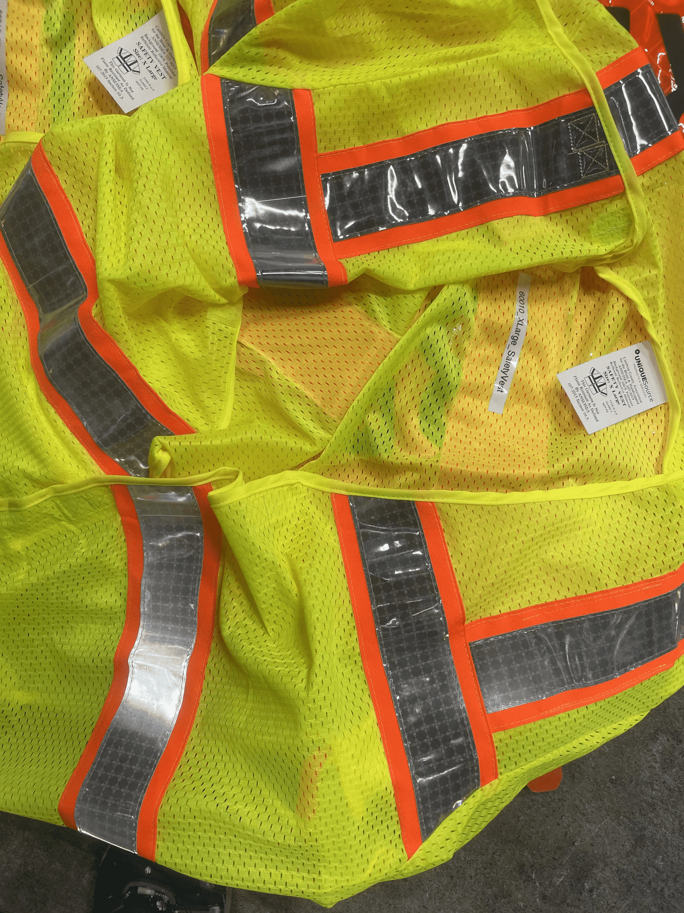
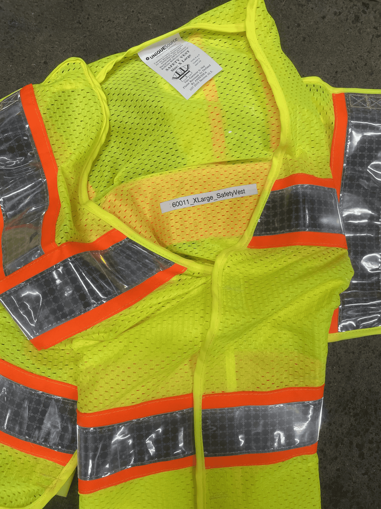
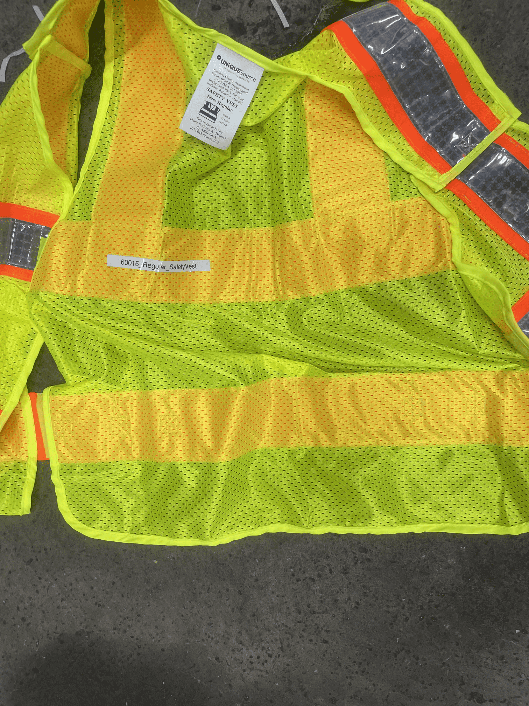
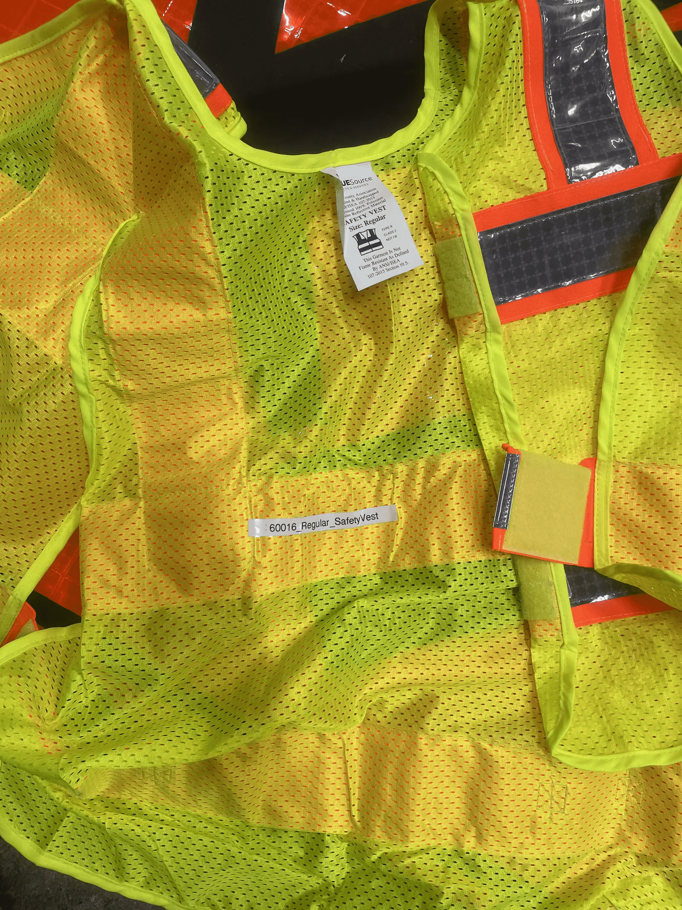
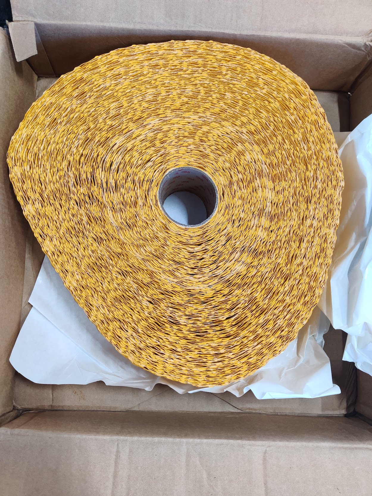

# Hardware_WorkZones_PennsylvaniaADSEquipmentInventory

<!--
The following template is based on:
Best-README-Template
Search for this, and you will find!
>
<!-- PROJECT LOGO -->
 
  <h2 align="center"> Hardware_WorkZones_PennsylvaniaADSEquipmentInventory
  </h2>

  <pre align="center">
    
    <!--font size="-2">Photo by <a href="https://www.penndot.pa.gov/Pages/default.aspx"> -->
  </pre>

  

  The purpose of this repo is to inventory the Pennsylvania ADS equipment.
     
  

***

<!-- TABLE OF CONTENTS -->

  
<h2 style="display: inline-block">Table of Contents</h2>

  <ol>
    <li>
      <a href="#about">About</a>
    </li>
    <li>
      <a href="#getting-started">Getting Started</a>
    </li>
    <li><a href="#directories">Directories</li>
    <li><a href="#inventory-miscellaneous">Inventory: Miscellaneous</li>
    <ul>
    <li><a href="#1-xlarge-safety-vest---quantity-3">1) XLarge Safety Vest - Quantity: 3</a></li>
    <ul>
    <li><a href="#60010_xlarge_safetyvest">60010_XLarge_SafetyVest</a></li>
    <li><a href="#60011_xlarge_safetyvest">60011_XLarge_SafetyVest</a></li>
    <li><a href="#60012_xlarge_safetyvest">60012_XLarge_SafetyVest</a></li>
    </ul>
    <li><a href="#2-large-safety-vest---quantity-2">2) Large Safety Vest - Quantity: 2</a></li>
    <ul>
    <li><a href="#60013_large_safetyvest">60013_Large_SafetyVest</a></li>
    <li><a href="#60014_large_safetyvest">60014_Large_SafetyVest</a></li>
    </ul>
    <li><a href="#3-regular-safety-vest---quantity-2">3) Regular Safety Vest - Quantity: 2</a></li>
    <ul>
    <li><a href="#60015_regular_safetyvest">60015_Regular_SafetyVest</a></li>
    <li><a href="#60016_regular_safetyvest">60016_Regular_SafetyVest</a></li>
    </ul>
    <li><a href="#4-safety-vest-class-3-level-2---quantity-1">4) Safety Vest Class 3 Level 2 - Quantity: 1</a></li>
    <ul>
    <li><a href="#60017_safetyvest_class3_level2">60017_SafetyVest_Class3_Level2</a></li>
    </ul>
    <li><a href="#5-boxesshipmentstapes">5) Boxes/Shipments/Tapes</a></li>
    <ul>
    <li><a href="#4-x-120-yds-yellow-tape---quantity-1">4” x 120 yds Yellow Tape - Quantity: 1</a></li>
    <li><a href="#4-x-120-yds-white-tape---quantity-1">4” x 120 yds White Tape - Quantity: 1</a></li>
    <li><a href="#6-x-120-yds-white-tape---quantity-1">6” x 120 yds White Tape - Quantity: 1</a></li>
    <li><a href="#6-x-120-yds-black-tape---quantity-15"> 6” x 120 yds Black Tape - Quantity: 15</a></li>
    <li><a href="#8-x-50-yds-white-tape---quantity-1">8” x 50 yds White Tape - Quantity: 1</a></li>
    <li><a href="#8-x-50-yds-black-tape---quantity-23">8” x 50 yds Black Tape - Quantity: 23</a></li>
    </ul>
    </ul>
    <li><a href="#license">License</a></li>
    <li><a href="#contact">Contact</a></li>
  </ol>

***

<!-- ABOUT -->
## About 

<!--[![Product Name Screen Shot][product-screenshot]](https://example.com)-->

The purpose of this repo is to document and inventory the ADS (Autonomous Driving System) equipment we receive from US/Penn Dot

<a href="#hardware_workzones_pennsylvaniaadsequipmentinventory">Back to top</a>
***

<!-- GETTING STARTED -->
## Getting Started

This is the main ReadMe.md file that incorporates the details of all the equipment's ReadMe files. 

<a href="#hardware_workzones_pennsylvaniaadsequipmentinventory">Back to top</a>

***

<!-- STRUCTURE OF THE REPO -->
## Directories

The following are the top level directories within the repository:
<ul>
 <li>Documents: Explains the coding method for equipment.</li>
 <li>Images folder: Contains images used in the README file.</li>
</ul>

<a href="#hardware_workzones_pennsylvaniaadsequipmentinventory">Back to top</a>

***

## Inventory: Miscellaneous

### 1) XLarge Safety Vest - Quantity: 3

#### 60010_XLarge_SafetyVest

<pre align="center">
  
  <figcaption>Fig.581 - XLarge Safety Vest.</figcaption>
</pre>

<a href="#hardware_workzones_pennsylvaniaadsequipmentinventory">Back to top</a>
***

#### 60011_XLarge_SafetyVest

<pre align="center">
  
  <figcaption>Fig.582 - XLarge Safety Vest.</figcaption>
</pre>

<a href="#hardware_workzones_pennsylvaniaadsequipmentinventory">Back to top</a>
***

#### 60012_XLarge_SafetyVest

<pre align="center">
  
  <figcaption>Fig.583 - XLarge Safety Vest.</figcaption>
</pre>

<a href="#hardware_workzones_pennsylvaniaadsequipmentinventory">Back to top</a>
***

### 2) Large Safety Vest - Quantity: 2

#### 60013_Large_SafetyVest

<pre align="center">
  
  <figcaption>Fig.584 - Large Safety Vest.</figcaption>
</pre>

<a href="#hardware_workzones_pennsylvaniaadsequipmentinventory">Back to top</a>
***

#### 60014_Large_SafetyVest

<pre align="center">
  
  <figcaption>Fig.585 - Large Safety Vest.</figcaption>
</pre>

<a href="#hardware_workzones_pennsylvaniaadsequipmentinventory">Back to top</a>
***

### 3) Regular Safety Vest - Quantity: 2

#### 60015_Regular_SafetyVest

<pre align="center">
  
  <figcaption>Fig.586 - Regular Safety Vest.</figcaption>
</pre>

<a href="#hardware_workzones_pennsylvaniaadsequipmentinventory">Back to top</a>
***

#### 60016_Regular_SafetyVest

<pre align="center">
  
  <figcaption>Fig.587 - Regular Safety Vest.</figcaption>
</pre>

<a href="#hardware_workzones_pennsylvaniaadsequipmentinventory">Back to top</a>
***

### 4) Safety Vest Class 3 Level 2 - Quantity: 1

#### 60017_SafetyVest_Class3_Level2

Note: Vest mislabelled as 60016

<pre align="center">
  
  <figcaption>Fig.588 - Safety Vest Class 3 Level 2.</figcaption>
</pre>

<a href="#hardware_workzones_pennsylvaniaadsequipmentinventory">Back to top</a>
***

### 5) Boxes/Shipments/Tapes

<pre align="center">
  
  <figcaption>Fig.589 - Shipment.</figcaption>
</pre>

<pre align="center">
  
  <figcaption>Fig.590 - Shipment.</figcaption>
</pre>

<a href="#hardware_workzones_pennsylvaniaadsequipmentinventory">Back to top</a>
***

#### 4” x 120 yds Yellow Tape - Quantity: 1

<pre align="center">
  
  <figcaption>Fig.705 - Yellow Tape.</figcaption>
</pre>

<pre align="center">
  
  <figcaption>Fig.706 - Yellow Tape.</figcaption>
</pre>

<a href="#hardware_workzones_pennsylvaniaadsequipmentinventory">Back to top</a>
***

#### 4” x 120 yds White Tape - Quantity: 1

<pre align="center">
  
  <figcaption>Fig.707 - White Tape.</figcaption>
</pre>

<pre align="center">
  
  <figcaption>Fig.708 - White Tape.</figcaption>
</pre>

<a href="#hardware_workzones_pennsylvaniaadsequipmentinventory">Back to top</a>
***

#### 6” x 120 yds White Tape - Quantity: 1

<pre align="center">
  
  <figcaption>Fig.709 - White Tape.</figcaption>
</pre>

<pre align="center">
  
  <figcaption>Fig.710 - White Tape.</figcaption>
</pre>

<a href="#hardware_workzones_pennsylvaniaadsequipmentinventory">Back to top</a>
***

#### 6” x 120 yds Black Tape - Quantity: 15

<pre align="center">
  
  <figcaption>Fig.711 - Black Tape.</figcaption>
</pre>

<pre align="center">
  
  <figcaption>Fig.712 - Black Tape.</figcaption>
</pre>

<pre align="center">
  
  <figcaption>Fig.713 - Black Tape.</figcaption>
</pre>

<a href="#hardware_workzones_pennsylvaniaadsequipmentinventory">Back to top</a>
***

#### 8” x 50 yds White Tape - Quantity: 1

<pre align="center">
  
  <figcaption>Fig.714 - White Tape.</figcaption>
</pre>

<a href="#hardware_workzones_pennsylvaniaadsequipmentinventory">Back to top</a>
***

#### 8” x 50 yds Black Tape - Quantity: 23

<pre align="center">
  
  <figcaption>Fig.715 - Black Tape.</figcaption>
</pre>

<pre align="center">
  
  <figcaption>Fig.716 - Black Tape.</figcaption>
</pre>

<a href="#hardware_workzones_pennsylvaniaadsequipmentinventory">Back to top</a>
***

<!-- LICENSE -->
## License

Distributed under the MIT License. See `LICENSE` for more information.

<a href="#hardware_workzones_pennsylvaniaadsequipmentinventory">Back to top</a>

***

<!-- CONTACT -->
## Contact

Sean Brennan - sbrennan@psu.edu

Project Link: [https://github.com/ivsg-psu/FeatureExtraction_DataTransforms_TransformClassLibrary](https://github.com/ivsg-psu/FeatureExtraction_DataTransforms_TransformClassLibrary)

<a href="#hardware_workzones_pennsylvaniaadsequipmentinventory">Back to top</a>

***

<!-- MARKDOWN LINKS & IMAGES -->
<!-- https://www.markdownguide.org/basic-syntax/#reference-style-links -->
