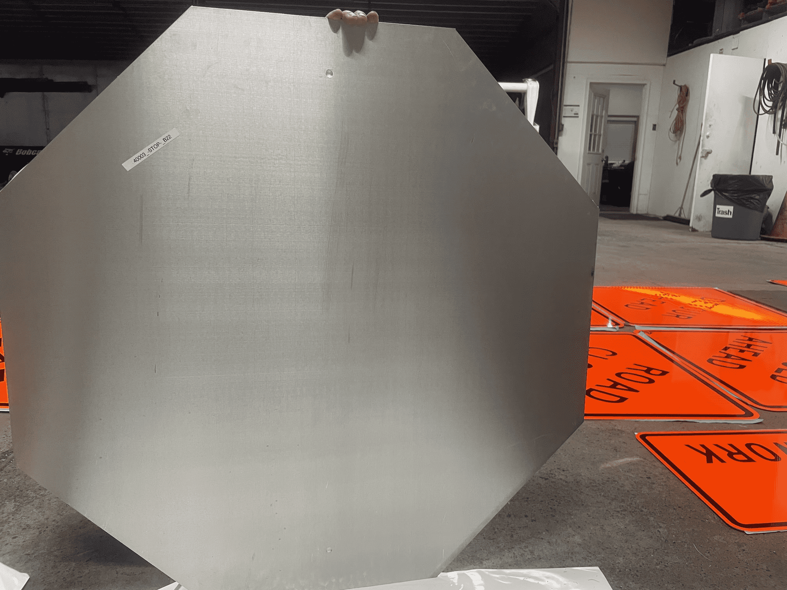
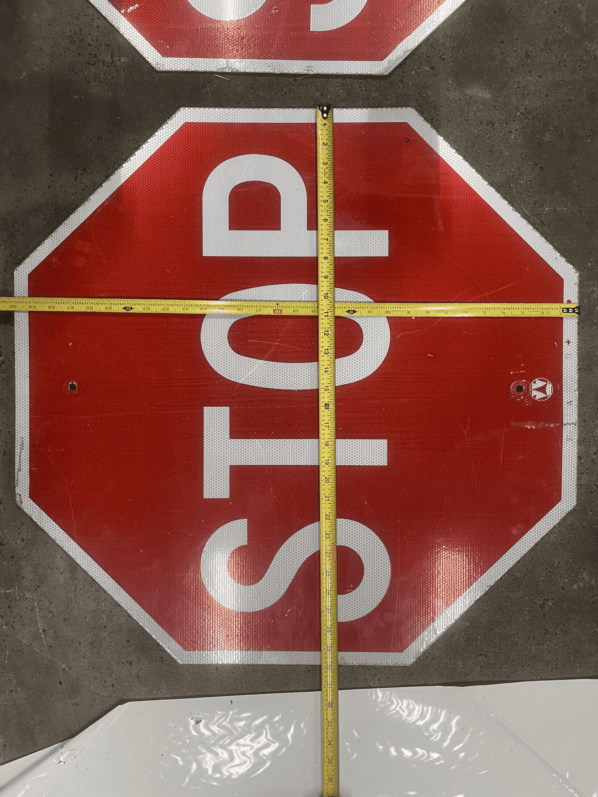
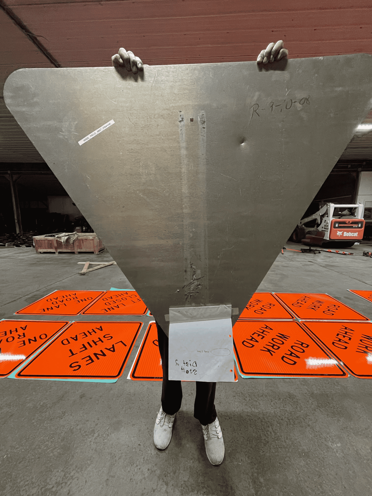
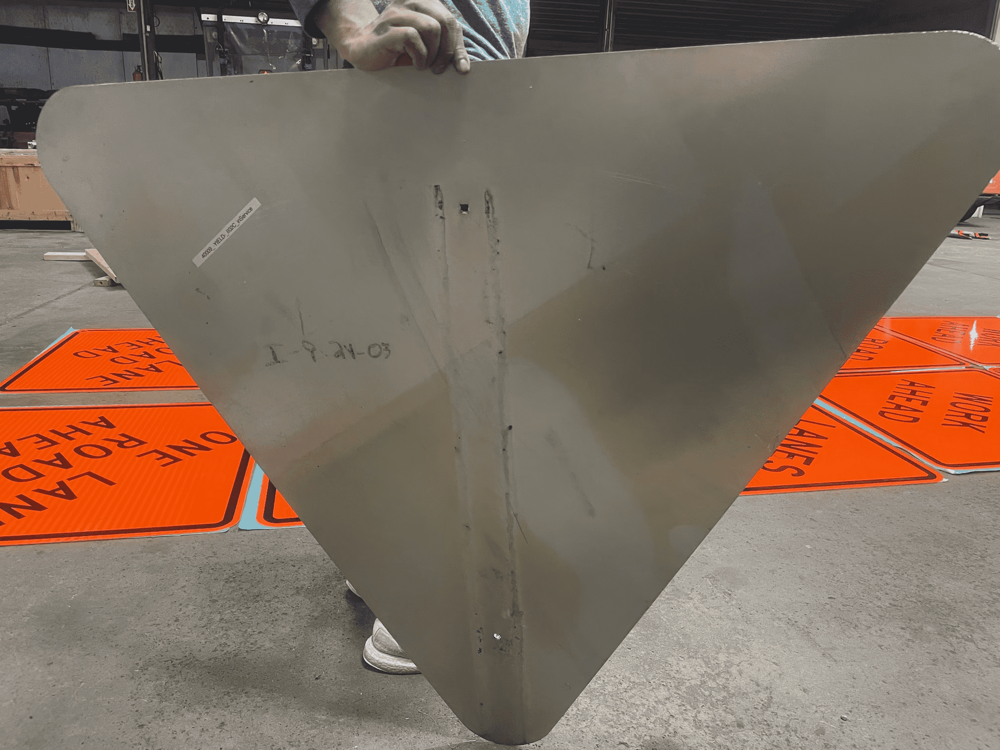
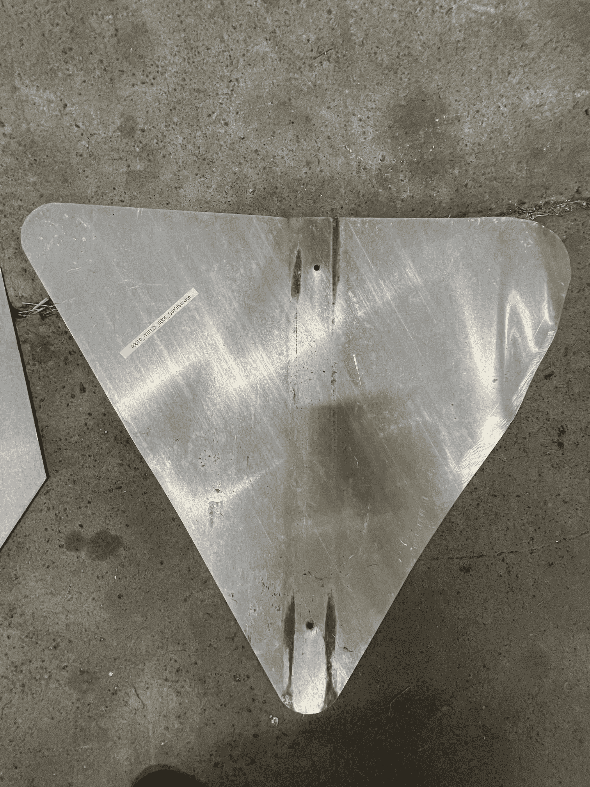

# Hardware_WorkZones_PennsylvaniaADSEquipmentInventory

<!--
The following template is based on:
Best-README-Template
Search for this, and you will find!
>
<!-- PROJECT LOGO -->
 
  <h2 align="center"> Hardware_WorkZones_PennsylvaniaADSEquipmentInventory
  </h2>

  <pre align="center">
    
    <!--font size="-2">Photo by <a href="https://www.penndot.pa.gov/Pages/default.aspx"> -->
  </pre>

  

  The purpose of this repo is to inventory the Pennsylvania ADS equipment.
     
  

***

<!-- TABLE OF CONTENTS -->

  
<h2 style="display: inline-block">Table of Contents</h2>

  <ol>
    <li>
      <a href="#about">About</a>
    </li>
    <li>
      <a href="#getting-started">Getting Started</a>
    </li>
    <li><a href="#directories">Directories</li>
    <li><a href="#inventory-red-signs">Inventory: Red Signs</li>
    <ul>
    <li><a href="#1-stop-sign---quantity-7">  1) STOP sign - Quantity: 7</a></li>
    <ul>
    <li><a href="#40001_-stop-_b22">40001_-STOP-_B22</a></li>
    <li><a href="#40002_-stop-_b22">40002_-STOP-_B22</a></li>
    <li><a href="#40003_-stop-_b22">40003_-STOP-_B22</a></li>
    <li><a href="#40004_-stop-_b22">40004_-STOP-_B22</a></li>
    <li><a href="#40005_-stop-_97aii_inservice">40005_-STOP-_97AII_inService</a></li>
    <li><a href="#40006_-stop-_96cii_outofservice">40006_-STOP-_96CII_OutOfService</a></li>
    <li><a href="#40007_-stop-_outofservice">40007_-STOP-_OutOfService</a></li>
    </ul>
    <li><a href="#2-yield-sign---quantity-3">  2) YIELD sign - Quantity: 3</a></li>
    <ul>
    <li><a href="#40008_-yield-_iia07_inservice">40008_-YIELD-_IIA07_inService</a></li>
    <li><a href="#40009_-yield-_ii02c_inservice">40009_-YIELD-_II02C_inService</a></li>
    <li><a href="#40010_-yield-_iib05_outofservice">40010_-YIELD-_ IIB05_OutOfService</a></li>
    </ul>
    </ul>
    <li><a href="#license">License</a></li>
    <li><a href="#contact">Contact</a></li>
  </ol>

***

<!-- ABOUT -->
## About 

<!--[![Product Name Screen Shot][product-screenshot]](https://example.com)-->

The purpose of this repo is to document and inventory the ADS (Autonomous Driving System) equipment we receive from US/Penn Dot

<a href="#hardware_workzones_pennsylvaniaadsequipmentinventory">Back to top</a>

***

<!-- GETTING STARTED -->
## Getting Started

This is the main ReadMe.md file that incorporates the details of all the equipment's ReadMe files. 

<a href="#hardware_workzones_pennsylvaniaadsequipmentinventory">Back to top</a>

***

<!-- STRUCTURE OF THE REPO -->
## Directories

The following are the top level directories within the repository:
<ul>
 <li>Documents: Explains the coding method for equipment.</li>
 <li>Images folder: Contains images used in the README file.</li>
</ul>

<a href="#hardware_workzones_pennsylvaniaadsequipmentinventory">Back to top</a>

***

## Inventory: Red Signs

### 1) STOP sign - Quantity: 7

#### 40001_-STOP-_B22

<pre align="center">
  
  <figcaption>Fig.433 - STOP sign.</figcaption>
</pre>

<pre align="center">
  
  <figcaption>Fig.434 - STOP sign.</figcaption>
</pre>

<pre align="center">
  
  <figcaption>Fig.435 - STOP sign.</figcaption>
</pre>

<a href="#hardware_workzones_pennsylvaniaadsequipmentinventory">Back to top</a>
***

#### 40002_-STOP-_B22

<pre align="center">
  
  <figcaption>Fig.436 - STOP sign.</figcaption>
</pre>

<pre align="center">
  
  <figcaption>Fig.437 - STOP sign.</figcaption>
</pre>

<pre align="center">
  
  <figcaption>Fig.438 - STOP sign.</figcaption>
</pre>

<a href="#hardware_workzones_pennsylvaniaadsequipmentinventory">Back to top</a>
***

#### 40003_-STOP-_B22

<pre align="center">
  
  <figcaption>Fig.439 - STOP sign.</figcaption>
</pre>

<pre align="center">
  
  <figcaption>Fig.440 - STOP sign.</figcaption>
</pre>

<pre align="center">
  
  <figcaption>Fig.441 - STOP sign.</figcaption>
</pre>

<a href="#hardware_workzones_pennsylvaniaadsequipmentinventory">Back to top</a>
***

#### 40004_-STOP-_B22

<pre align="center">
  
  <figcaption>Fig.442 - STOP sign.</figcaption>
</pre>

<pre align="center">
  
  <figcaption>Fig.443 - STOP sign.</figcaption>
</pre>

<pre align="center">
  
  <figcaption>Fig.444 - STOP sign.</figcaption>
</pre>

<a href="#hardware_workzones_pennsylvaniaadsequipmentinventory">Back to top</a>
***

#### 40005_-STOP-_97AII_inService

<pre align="center">
  
  <figcaption>Fig.445 - STOP sign.</figcaption>
</pre>

<pre align="center">
  
  <figcaption>Fig.446 - STOP sign.</figcaption>
</pre>

<pre align="center">
  
  <figcaption>Fig.447 - STOP sign.</figcaption>
</pre>

<a href="#hardware_workzones_pennsylvaniaadsequipmentinventory">Back to top</a>
***

#### 40006_-STOP-_96CII_OutOfService

<pre align="center">
  
  <figcaption>Fig.448 - STOP sign.</figcaption>
</pre>

<pre align="center">
  
  <figcaption>Fig.449 - STOP sign.</figcaption>
</pre>

<pre align="center">
  
  <figcaption>Fig.450 - STOP sign.</figcaption>
</pre>

<a href="#hardware_workzones_pennsylvaniaadsequipmentinventory">Back to top</a>
***

#### 40007_-STOP-_OutOfService

<pre align="center">
  
  <figcaption>Fig.451 - STOP sign.</figcaption>
</pre>

<pre align="center">
  
  <figcaption>Fig.452 - STOP sign.</figcaption>
</pre>

<pre align="center">
  
  <figcaption>Fig.453 - STOP sign.</figcaption>
</pre>

<a href="#hardware_workzones_pennsylvaniaadsequipmentinventory">Back to top</a>
***

### 2) YIELD sign - Quantity: 3

#### 40008_-YIELD-_IIA07_inService

<pre align="center">
  
  <figcaption>Fig.454 - YIELD sign.</figcaption>
</pre>

<pre align="center">
  
  <figcaption>Fig.455 - YIELD sign.</figcaption>
</pre>

<pre align="center">
  
  <figcaption>Fig.456 - YIELD sign.</figcaption>
</pre>

<pre align="center">
  
  <figcaption>Fig.457 - YIELD sign.</figcaption>
</pre>

<pre align="center">
  
  <figcaption>Fig.458 - YIELD sign.</figcaption>
</pre>

<a href="#hardware_workzones_pennsylvaniaadsequipmentinventory">Back to top</a>
***

#### 40009_-YIELD-_II02C_inService

<pre align="center">
  
  <figcaption>Fig.459 - YIELD sign.</figcaption>
</pre>

<pre align="center">
  
  <figcaption>Fig.460 - YIELD sign.</figcaption>
</pre>

<pre align="center">
  
  <figcaption>Fig.461 - YIELD sign.</figcaption>
</pre>

<pre align="center">
  
  <figcaption>Fig.462 - YIELD sign.</figcaption>
</pre>

<pre align="center">
  
  <figcaption>Fig.463 - YIELD sign.</figcaption>
</pre>

<a href="#hardware_workzones_pennsylvaniaadsequipmentinventory">Back to top</a>
***

#### 40010_-YIELD-_IIB05_OutOfService

<pre align="center">
  
  <figcaption>Fig.464 - YIELD sign.</figcaption>
</pre>

<pre align="center">
  
  <figcaption>Fig.465 - YIELD sign.</figcaption>
</pre>

<pre align="center">
  
  <figcaption>Fig.466 - YIELD sign.</figcaption>
</pre>

<a href="#hardware_workzones_pennsylvaniaadsequipmentinventory">Back to top</a>
***

<!-- LICENSE -->
## License

Distributed under the MIT License. See `LICENSE` for more information.

<a href="#hardware_workzones_pennsylvaniaadsequipmentinventory">Back to top</a>
***

<!-- CONTACT -->
## Contact

Sean Brennan - sbrennan@psu.edu

Project Link: [https://github.com/ivsg-psu/FeatureExtraction_DataTransforms_TransformClassLibrary](https://github.com/ivsg-psu/FeatureExtraction_DataTransforms_TransformClassLibrary)

<a href="#hardware_workzones_pennsylvaniaadsequipmentinventory">Back to top</a>

***

<!-- MARKDOWN LINKS & IMAGES -->
<!-- https://www.markdownguide.org/basic-syntax/#reference-style-links -->
