# Hardware_WorkZones_PennsylvaniaADSEquipmentInventory

<!--
The following template is based on:
Best-README-Template
Search for this, and you will find!
>
<!-- PROJECT LOGO -->
 
  <h2 align="center"> Hardware_WorkZones_PennsylvaniaADSEquipmentInventory
  </h2>

  <pre align="center">
    
    <!--font size="-2">Photo by <a href="https://www.penndot.pa.gov/Pages/default.aspx"> -->
  </pre>

  

  The purpose of this repo is to inventory the Pennsylvania ADS equipment.
     
  

***

<!-- TABLE OF CONTENTS -->

  
<h2 style="display: inline-block">Table of Contents</h2>

  <ol>
    <li>
      <a href="#about">About</a>
    </li>
    <li>
      <a href="#getting-started">Getting Started</a>
    </li>
    <li><a href="#directories">Directories</a></li>
    <li><a href="#inventory-white-signs">Inventory: White </a></li>
    <ul>
    <li><a href="#1-speed-limit-45-signs---quantity-3">1) "Speed Limit 45" signs - Quantity: 3</a></li>
    <ul>
    <li><a href="#10001_-speed-limit-45-_iia21">10001_-SPEED-LIMIT-45-_IIA21</a></li>
    <li><a href="#10002_-speed-limit-45-_iia21">10002_-SPEED-LIMIT-45-_IIA21</a></li>
    <li><a href="#10003_-speed-limit-45-_iia21">10003_-SPEED-LIMIT-45-_IIA21</a></li>
    </ul>
    <li><a href="#2-speed-limit-35-signs---quantity-5">2) "Speed Limit 35" signs - Quantity: 5</a></li>
    <ul>
    <li><a href="#10004_-speed-limit-35-_iia21">10004_-SPEED-LIMIT-35-_IIA21</a></li>
    <li><a href="#10005_-speed-limit-35-_iia21">10005_-SPEED-LIMIT-35-_IIA21</a></li>
    <li><a href="#10006_-speed-limit-35-_iia21">10006_-SPEED-LIMIT-35-_IIA21</a></li>
    <li><a href="#10007_-speed-limit-35-_iia21">10007_-SPEED-LIMIT-35-_IIA21</a></li>
    <li><a href="#10008_-speed-limit-35-_iia21">10008_-SPEED-LIMIT-35-_IIA21</a></li>
    </ul>
    <li><a href="#3-speed-limit-30-signs---quantity-2">3) "Speed Limit 30" signs - Quantity: 2</a></li>
    <ul>
    <li><a href="#10009_-speed-limit-30-_iia21">10009_-SPEED-LIMIT-30-_IIA21</a></li>
    <li><a href="#10010_-speed-limit-30-_iia21">10010_-SPEED-LIMIT-30-_IIA21</a></li>
    </ul>
    <li><a href="#4-speed-limit-25-signs---quantity-2">4) "Speed Limit 25" signs - Quantity: 2</a></li>
    <ul>
    <li><a href="#10011_-speed-limit-25-_iia21">100011_-SPEED-LIMIT-25-_IIA21</a></li>
    <li><a href="#10012_-speed-limit-25-_iia21">100012_-SPEED-LIMIT-25-_IIA21</a></li>
    </ul>
    <li><a href="#5-stay-in-lane-sign---quantity-1">5) "Stay in lane" sign - Quantity: 1</a></li>
    <ul>
    <li><a href="#10013_-stay-in-lane-_d">10013_-STAY-IN-LANE-_D</a></li>
    </ul>
    <li><a href="#6-pennsylvania-route-45-sign---quantity-10">6) Pennsylvania Route "45" sign - Quantity: 10</a></li>
    <ul>
    <li><a href="#10014_pennsylvaniaroute_-45-_21bii">10014_PennsylvaniaRoute_-45-_21BII</a></li>
    <li><a href="#10015_pennsylvaniaroute_-45-_21bii">10015_PennsylvaniaRoute_-45-_21BII</a></li>
    <li><a href="#10016_pennsylvaniaroute_-45-_21bii">10016_PennsylvaniaRoute_-45-_21BII</a></li>
    <li><a href="#10017_pennsylvaniaroute_-45-_21bii">10017_PennsylvaniaRoute_-45-_21BII</a></li>
    <li><a href="#10018_pennsylvaniaroute_-45-_21bii">10018_PennsylvaniaRoute_-45-_21BII</a></li>
    <li><a href="#10019_pennsylvaniaroute_-45-_21bii">10019_PennsylvaniaRoute_-45-_21BII</a></li>
    <li><a href="#10020_pennsylvaniaroute_-45-_21bii">10020_PennsylvaniaRoute_-45-_21BII</a></li>
    <li><a href="#10021_pennsylvaniaroute_-45-_21bii">10021_PennsylvaniaRoute_-45-_21BII</a></li>
    <li><a href="#10022_pennsylvaniaroute_-45-_21bii">10022_PennsylvaniaRoute_-45-_21BII</a></li>
    <li><a href="#10023_pennsylvaniaroute_-45-_21bii">10023_PennsylvaniaRoute_-45-_21BII</a></li>
    </ul>
    <li><a href="#7-right-arrow-signs---quantity-4">7) Right Arrow signs - Quantity: 4</a></li>
    <ul>
    <li><a href="#10024_rightarrow_d22">10024_RightArrow_D22</a></li>
    <li><a href="#10025_rightarrow_d22">10025_RightArrow_D22</a></li>
    <li><a href="#10026_rightarrow_d22">10026_RightArrow_D22</a></li>
    <li><a href="#10027_rightarrow_d22">10027_RightArrow_D22</a></li>
    </ul>
    <li><a href="#8-up-arrow-signs---quantity-3"> 8) Up Arrow signs - Quantity: 3</a></li>
    <ul>
    <li><a href="#10028_uparrow_a">10028_UpArrow_A</a></li>
    <li><a href="#10029_uparrow_a">10029_UpArrow_A</a></li>
    <li><a href="#10030_uparrow_a">10030_UpArrow_A</a></li>
    </ul>
    <li><a href="#9-right-turn-sign---quantity-1"> 9) Right Turn sign - Quantity: 1</a></li>
    <ul>
    <li><a href="#10031_rightturn_d">10031_RightTurn_D</a></li>
    </ul>
    <li><a href="#10-left-turn-sign---quantity-2"> 10) Left Turn sign - Quantity: 2</a></li>
    <ul>
    <li><a href="#10032_leftturn_b">10032_LeftTurn_B</a></li>
    <li><a href="#10033_leftturn_b">10033_LeftTurn_B</a></li>
    </ul>
    <li><a href="#11-left-corner-arrow-stop-here-on-red-sign---quantity-1"> 11) Left Corner Arrow "STOP HERE ON RED" sign - Quantity: 1</a></li>
    <ul>
    <li><a href="#10034_leftcornerarrow_-stop-here-on-red-_22b">10034_LeftCornerArrow_-STOP-HERE-ON-RED-_22B</a></li>
    </ul>
    <li><a href="#12-road-closed-sign---quantity-2"> 12) ROAD CLOSED sign - Quantity: 2</a></li>
    <ul>
    <li><a href="#10035_-road-closed-_b">10035_-ROAD-CLOSED-_B</a></li>
    <li><a href="#10036_-road-closed-_b">10036_-ROAD-CLOSED-_B</a></li>
    </ul>
    <li><a href="#13-road-closed-to-thru-traffic-sign---quantity-1"> 13) ROAD CLOSED /TO /THRU TRAFFIC sign - Quantity: 1</a></li>
    <ul>
    <li><a href="#10037_-roadclosed-to-thrutraffic-_b">10037_-ROAD+CLOSED-TO-THRU+TRAFFIC-_B</a></li>
    </ul>
    <li><a href="#14-north-sign---quantity-10"> 14) NORTH sign - Quantity: 10</a></li>
    <ul>
    <li><a href="#10038_-north-_diii22">10038_-NORTH-_DIII22</a></li>
    <li><a href="#10039_-north-_diii22">10039_-NORTH-_DIII22</a></li>
    <li><a href="#10040_-north-_diii22">10040_-NORTH-_DIII22</a></li>
    <li><a href="#10041_-north-_diii22">10041_-NORTH-_DIII22</a></li>
    <li><a href="#10042_-north-_diii22">10042_-NORTH-_DIII22</a></li>
    <li><a href="#10043_-north-_diii22">10043_-NORTH-_DIII22</a></li>
    <li><a href="#10044_-north-_diii22">10044_-NORTH-_DIII22</a></li>
    <li><a href="#10045_-north-_diii22">10045_-NORTH-_DIII22</a></li>
    <li><a href="#10046_-north-_diii22">10046_-NORTH-_DIII22</a></li>
    <li><a href="#10047_-north-_diii22">10047_-NORTH-_DIII22</a></li>
    </ul>
    <li><a href="#15-south-sign---quantity-10"> 15) SOUTH sign - Quantity: 10</a></li>
    <ul>
    <li><a href="#10048_-south-_22diii">10048_-SOUTH-_22DIII</a></li>
    <li><a href="#10049_-south-_22diii">10039_-SOUTH-_22DIII</a></li>
    <li><a href="#10050_-south-_22diii">10040_-SOUTH-_22DIII</a></li>
    <li><a href="#10051_-south-_22diii">10041_-SOUTH-_22DIII</a></li>
    <li><a href="#10052_-south-_22diii">10042_-SOUTH-_22DIII</a></li>
    <li><a href="#10053_-south-_22diii">10043_-SOUTH-_22DIII</a></li>
    <li><a href="#10054_-south-_22diii">10044_-SOUTH-_22DIII</a></li>
    <li><a href="#10055_-south-_22diii">10045_-SOUTH-_22DIII</a></li>
    <li><a href="#10056_-south-_22diii">10046_-SOUTH-_22DIII</a></li>
    <li><a href="#10057_-south-_22diii">10047_-SOUTH-_22DIII</a></li>
    </ul>
    <li><a href="#16-east-sign---quantity-10"> 16) EAST sign - Quantitiy: 10</a></li>
    <ul>
    <li><a href="#10058_-east-_22diii">10058_-EAST-_22DIII</a></li>
    <li><a href="#10059_-east-_22diii">10059_-EAST-_22DIII</a></li>
    <li><a href="#10060_-east-_22diii">10060_-EAST-_22DIII</a></li>
    <li><a href="#10061_-east-_22diii">10061_-EAST-_22DIII</a></li>
    <li><a href="#10062_-east-_22diii">10062_-EAST-_22DIII</a></li>
    <li><a href="#10063_-east-_22diii">10063_-EAST-_22DIII</a></li>
    <li><a href="#10064_-east-_22diii">10064_-EAST-_22DIII</a></li>
    <li><a href="#10065_-east-_22diii">10065_-EAST-_22DIII</a></li>
    <li><a href="#10066_-east-_22diii">10066_-EAST-_22DIII</a></li>
    <li><a href="#10067_-east-_22diii">10067_-EAST-_22DIII</a></li>
    </ul>
    <li><a href="#17-west-sign---quantity-10"> 17) WEST sign - Quantitiy: 10</a></li>
    <ul>
    <li><a href="#10068_-west-_iiid22">10068_-WEST-_IIID22</a></li>
    <li><a href="#10069_-west-_iiid22">10069_-WEST-_IIID22</a></li>
    <li><a href="#10070_-west-_iiid22">10070_-WEST-_IIID22</a></li>
    <li><a href="#10071_-west-_iiid22">10071_-WEST-_IIID22</a></li>
    <li><a href="#10072_-west-_iiid22">10072_-WEST-_IIID22</a></li>
    <li><a href="#10073_-west-_iiid22">10073_-WEST-_IIID22</a></li>
    <li><a href="#10074_-west-_iiid22">10074_-WEST-_IIID22</a></li>
    <li><a href="#10075_-west-_iiid22">10075_-WEST-_IIID22</a></li>
    <li><a href="#10076_-west-_iiid22">10076_-WEST-_IIID22</a></li>
    <li><a href="#10077_-west-_iiid22">10077_-WEST-_IIID22</a></li>
    </ul>
    </ul>
    <li><a href="#license">License</a></li>
    <li><a href="#contact">Contact</a></li>
  </ol>

***

13) ROAD CLOSED /TO /THRU TRAFFIC sign - Quantity: 1

<!-- ABOUT -->
## About 

<!--[![Product Name Screen Shot][product-screenshot]](https://example.com)-->

The purpose of this repo is to document and inventory the ADS (Autonomous Driving System) equipment we receive from US/Penn Dot

<a href="#hardware_workzones_pennsylvaniaadsequipmentinventory">Back to top</a>

***

<!-- GETTING STARTED -->
## Getting Started

This is the main ReadMe.md file that incorporates the details of all the equipment's ReadMe files. 

<a href="#hardware_workzones_pennsylvaniaadsequipmentinventory">Back to top</a>

***

<!-- STRUCTURE OF THE REPO -->
## Directories

The following are the top level directories within the repository:
<ul>
 <li>Documents: Explains the coding method for equipment.</li>
 <li>Images folder: Contains images used in the README file.</li>
</ul>

<a href="#hardware_workzones_pennsylvaniaadsequipmentinventory">Back to top</a>

***

## Inventory: White Signs

### 1) "Speed Limit 45" signs - Quantity: 3 

#### 10001_-SPEED-LIMIT-45-_IIA21

<pre align="center">
  
  <figcaption>Fig.1 - "Speed Limit 45" sign.</figcaption>
</pre>

<pre align="center">
  
  <figcaption>Fig.2 - "Speed Limit 45" sign.</figcaption>
</pre>

<pre align="center">
  
  <figcaption>Fig.3 - "Speed Limit 45" sign.</figcaption>
</pre>

<a href="#hardware_workzones_pennsylvaniaadsequipmentinventory">Back to top</a>

***

#### 10002_-SPEED-LIMIT-45-_IIA21

<pre align="center">
  
  <figcaption>Fig.4 - "Speed Limit 45" sign.</figcaption>
</pre>

<pre align="center">
  
  <figcaption>Fig.5 - "Speed Limit 45" sign.</figcaption>
</pre>

<pre align="center">
  
  <figcaption>Fig.6 - "Speed Limit 45" sign.</figcaption>
</pre>

<a href="#hardware_workzones_pennsylvaniaadsequipmentinventory">Back to top</a>

***

#### 10003_-SPEED-LIMIT-45-_IIA21

<pre align="center">
  
  <figcaption>Fig.7 - "Speed Limit 45" sign.</figcaption>
</pre>

<pre align="center">
  
  <figcaption>Fig.8 - "Speed Limit 45" sign.</figcaption>
</pre>

<pre align="center">
  
  <figcaption>Fig.9 - "Speed Limit 45" sign.</figcaption>
</pre>

<a href="#hardware_workzones_pennsylvaniaadsequipmentinventory">Back to top</a>

***

### 2) "Speed Limit 35" signs - Quantity: 5

#### 10004_-SPEED-LIMIT-35-_IIA21

<pre align="center">
  
  <figcaption>Fig.10 - "Speed Limit 35" sign.</figcaption>
</pre>

<pre align="center">
  
  <figcaption>Fig.11 - "Speed Limit 35" sign.</figcaption>
</pre>

<pre align="center">
  
  <figcaption>Fig.12 - "Speed Limit 35" sign.</figcaption>
</pre>

<a href="#hardware_workzones_pennsylvaniaadsequipmentinventory">Back to top</a>

***

#### 10005_-SPEED-LIMIT-35-_IIA21

<pre align="center">
  
  <figcaption>Fig.13 - "Speed Limit 35" sign.</figcaption>
</pre>

<pre align="center">
  
  <figcaption>Fig.14 - "Speed Limit 35" sign.</figcaption>
</pre>

<pre align="center">
  
  <figcaption>Fig.15 - "Speed Limit 35" sign.</figcaption>
</pre>

<a href="#hardware_workzones_pennsylvaniaadsequipmentinventory">Back to top</a>

***

#### 10006_-SPEED-LIMIT-35-_IIA21

<pre align="center">
  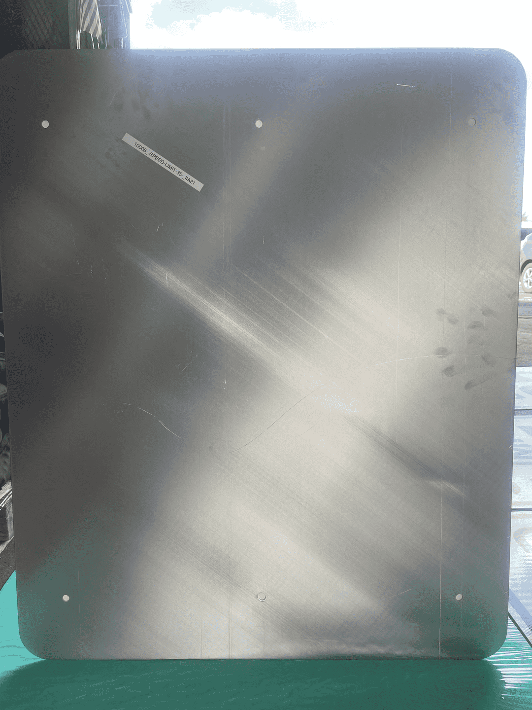
  <figcaption>Fig.16 - "Speed Limit 35" sign.</figcaption>
</pre>

<pre align="center">
  
  <figcaption>Fig.17 - "Speed Limit 35" sign.</figcaption>
</pre>

<pre align="center">
  
  <figcaption>Fig.18 - "Speed Limit 35" sign.</figcaption>
</pre>

<a href="#hardware_workzones_pennsylvaniaadsequipmentinventory">Back to top</a>

***

#### 10007_-SPEED-LIMIT-35-_IIA21

<pre align="center">
  
  <figcaption>Fig.19 - "Speed Limit 35" sign.</figcaption>
</pre>

<pre align="center">
  
  <figcaption>Fig.20 - "Speed Limit 35" sign.</figcaption>
</pre>

<pre align="center">
  
  <figcaption>Fig.21 - "Speed Limit 35" sign.</figcaption>
</pre>

<a href="#hardware_workzones_pennsylvaniaadsequipmentinventory">Back to top</a>

***

#### 10008_-SPEED-LIMIT-35-_IIA21

<pre align="center">
  
  <figcaption>Fig.22 - "Speed Limit 35" sign.</figcaption>
</pre>

<pre align="center">
  
  <figcaption>Fig.23 - "Speed Limit 35" sign.</figcaption>
</pre>

<pre align="center">
  
  <figcaption>Fig.24 - "Speed Limit 35" sign.</figcaption>
</pre>

<a href="#hardware_workzones_pennsylvaniaadsequipmentinventory">Back to top</a>

***

### 3) "Speed Limit 30" signs - Quantity: 2

#### 10009_-SPEED-LIMIT-30-_IIA21

<pre align="center">
  
  <figcaption>Fig.28 - "Speed Limit 30" sign.</figcaption>
</pre>

<pre align="center">
  
  <figcaption>Fig.29 - "Speed Limit 30" sign.</figcaption>
</pre>

<pre align="center">
  
  <figcaption>Fig.30 - "Speed Limit 30" sign.</figcaption>
</pre>

<a href="#hardware_workzones_pennsylvaniaadsequipmentinventory">Back to top</a>

***

#### 10010_-SPEED-LIMIT-30-_IIA21

<pre align="center">
  
  <figcaption>Fig.25 - "Speed Limit 30" sign.</figcaption>
</pre>

<pre align="center">
  
  <figcaption>Fig.26 - "Speed Limit 30" sign.</figcaption>
</pre>

<pre align="center">
  
  <figcaption>Fig.27 - "Speed Limit 30" sign.</figcaption>
</pre>

<a href="#hardware_workzones_pennsylvaniaadsequipmentinventory">Back to top</a>

***

### 4) "Speed Limit 25" signs - Quantity: 2

#### 10011_-SPEED-LIMIT-25-_IIA21

<pre align="center">
  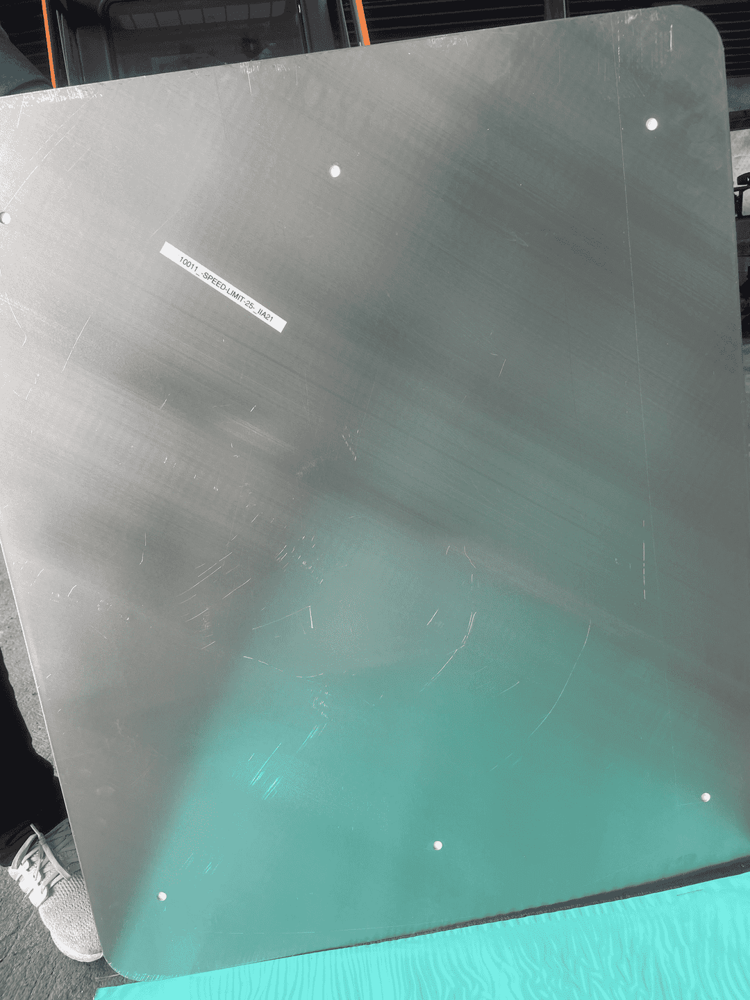
  <figcaption>Fig.31 - "Speed Limit 25" sign.</figcaption>
</pre>

<pre align="center">
  
  <figcaption>Fig.32 - "Speed Limit 25" sign.</figcaption>
</pre>

<pre align="center">
  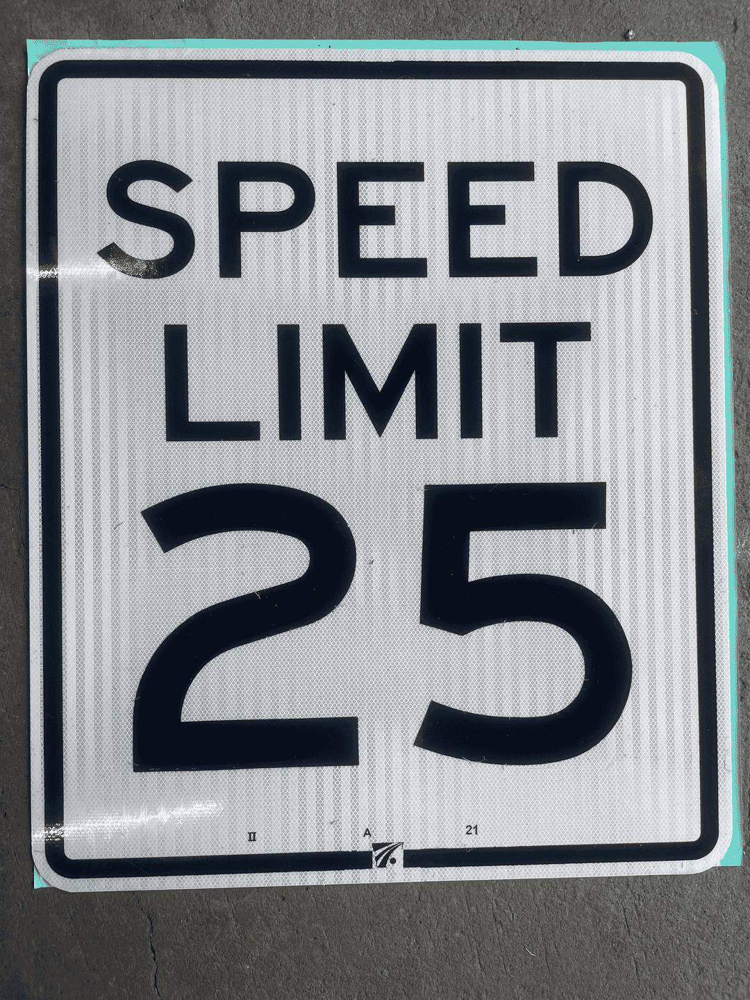
  <figcaption>Fig.33 - "Speed Limit 25" sign.</figcaption>
</pre>

<a href="#hardware_workzones_pennsylvaniaadsequipmentinventory">Back to top</a>

***

#### 10012_-SPEED-LIMIT-25-_IIA21

<pre align="center">
  
  <figcaption>Fig.34 - "Speed Limit 25" sign.</figcaption>
</pre>
<pre align="center">
  
  <figcaption>Fig.35 - "Speed Limit 25" sign.</figcaption>
</pre>

<pre align="center">
  
  <figcaption>Fig.36 - "Speed Limit 25" sign.</figcaption>
</pre>

<a href="#hardware_workzones_pennsylvaniaadsequipmentinventory">Back to top</a>
***

### 5) "Stay in lane" sign - Quantity: 1

#### 10013_-STAY-IN-LANE-_D

<pre align="center">
  
  <figcaption>Fig.37 - "Stay in lane" sign.</figcaption>
</pre>
<pre align="center">
  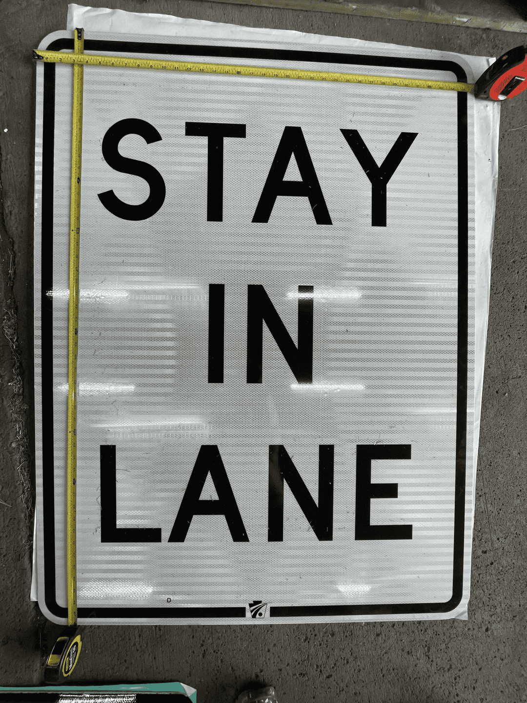
  <figcaption>Fig.38 - "Stay in lane" sign.</figcaption>
</pre>

<pre align="center">
  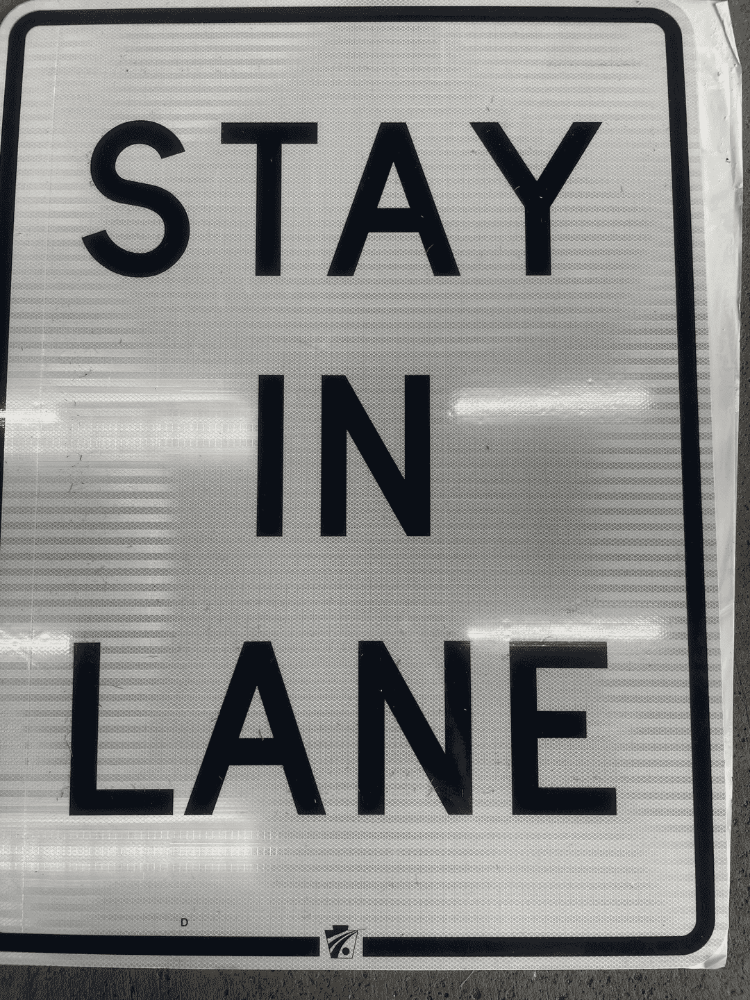
  <figcaption>Fig.39 - "Stay in lane" sign.</figcaption>
</pre>

<a href="#hardware_workzones_pennsylvaniaadsequipmentinventory">Back to top</a>
***

### 6) Pennsylvania Route "45" sign - Quantity: 10

#### 10014_PennsylvaniaRoute_-45-_21BII

<pre align="center">
  
  <figcaption>Fig.40 - Pennsylvania Route "45" sign.</figcaption>
</pre>

<pre align="center">
  
  <figcaption>Fig.41 - Pennsylvania Route "45" sign.</figcaption>
</pre>

<pre align="center">
  
  <figcaption>Fig.42 - Pennsylvania Route "45" sign.</figcaption>
</pre>

<a href="#hardware_workzones_pennsylvaniaadsequipmentinventory">Back to top</a>
***

#### 10015_PennsylvaniaRoute_-45-_21BII

<pre align="center">
  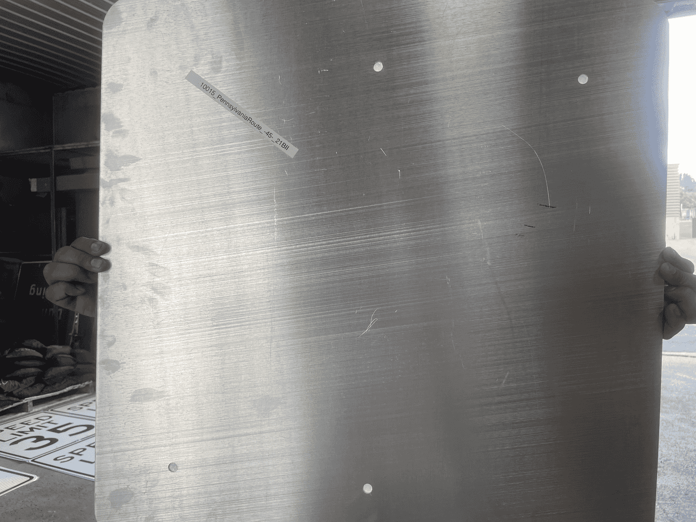
  <figcaption>Fig.43 - Pennsylvania Route "45" sign.</figcaption>
</pre>

<pre align="center">
  
  <figcaption>Fig.44 - Pennsylvania Route "45" sign.</figcaption>
</pre>

<pre align="center">
  
  <figcaption>Fig.45 - Pennsylvania Route "45" sign.</figcaption>
</pre>

<a href="#hardware_workzones_pennsylvaniaadsequipmentinventory">Back to top</a>
***

#### 10017_PennsylvaniaRoute_-45-_21BII

<pre align="center">
  
  <figcaption>Fig.46 - Pennsylvania Route "45" sign.</figcaption>
</pre>

<pre align="center">
  
  <figcaption>Fig.47 - Pennsylvania Route "45" sign.</figcaption>
</pre>

<pre align="center">
  
  <figcaption>Fig.48 - Pennsylvania Route "45" sign.</figcaption>
</pre>

<a href="#hardware_workzones_pennsylvaniaadsequipmentinventory">Back to top</a>
***

#### 10018_PennsylvaniaRoute_-45-_21BII

<pre align="center">
  
  <figcaption>Fig.49 - Pennsylvania Route "45" sign.</figcaption>
</pre>

<pre align="center">
  
  <figcaption>Fig.50 - Pennsylvania Route "45" sign.</figcaption>
</pre>

<pre align="center">
  
  <figcaption>Fig.51 - Pennsylvania Route "45" sign.</figcaption>
</pre>

<a href="#hardware_workzones_pennsylvaniaadsequipmentinventory">Back to top</a>
***

#### 10020_PennsylvaniaRoute_-45-_21BII

<pre align="center">
  
  <figcaption>Fig.52 - Pennsylvania Route "45" sign.</figcaption>
</pre>

<pre align="center">
  
  <figcaption>Fig.53 - Pennsylvania Route "45" sign.</figcaption>
</pre>

<pre align="center">
  
  <figcaption>Fig.54 - Pennsylvania Route "45" sign.</figcaption>
</pre>

<a href="#hardware_workzones_pennsylvaniaadsequipmentinventory">Back to top</a>
***

#### 10021_PennsylvaniaRoute_-45-_21BII

<pre align="center">
  
  <figcaption>Fig.55 - Pennsylvania Route "45" sign.</figcaption>
</pre>

<pre align="center">
  
  <figcaption>Fig.56 - Pennsylvania Route "45" sign.</figcaption>
</pre>

<pre align="center">
  
  <figcaption>Fig.57 - Pennsylvania Route "45" sign.</figcaption>
</pre>

<a href="#hardware_workzones_pennsylvaniaadsequipmentinventory">Back to top</a>
***

#### 10022_PennsylvaniaRoute_-45-_21BII

<pre align="center">
  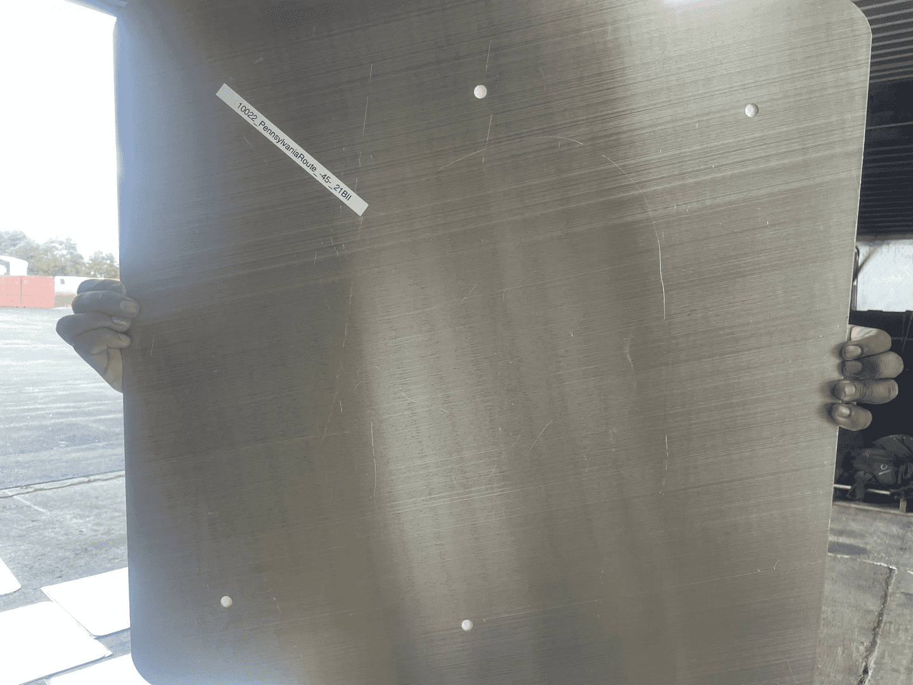
  <figcaption>Fig.58 - Pennsylvania Route "45" sign.</figcaption>
</pre>

<pre align="center">
  
  <figcaption>Fig.59 - Pennsylvania Route "45" sign.</figcaption>
</pre>

<pre align="center">
  
  <figcaption>Fig.60 - Pennsylvania Route "45" sign.</figcaption>
</pre>

<a href="#hardware_workzones_pennsylvaniaadsequipmentinventory">Back to top</a>
***

#### 10023_PennsylvaniaRoute_-45-_21BII

<pre align="center">
  
  <figcaption>Fig.61 - Pennsylvania Route "45" sign.</figcaption>
</pre>

<pre align="center">
  
  <figcaption>Fig.62 - Pennsylvania Route "45" sign.</figcaption>
</pre>

<pre align="center">
  
  <figcaption>Fig.63 - Pennsylvania Route "45" sign.</figcaption>
</pre>

<a href="#hardware_workzones_pennsylvaniaadsequipmentinventory">Back to top</a>
***

### 7) Right Arrow signs - Quantity: 4

#### 10024_RightArrow_D22

<pre align="center">
  
  <figcaption>Fig.64 - Right Arrow sign.</figcaption>
</pre>

<pre align="center">
  
  <figcaption>Fig.65 - Right Arrow sign.</figcaption>
</pre>

<pre align="center">
  
  <figcaption>Fig.66 - Right Arrow sign.</figcaption>
</pre>

<a href="#hardware_workzones_pennsylvaniaadsequipmentinventory">Back to top</a>
***

#### 10025_RightArrow_D22

<pre align="center">
  
  <figcaption>Fig.67 - Right Arrow sign.</figcaption>
</pre>

<pre align="center">
  
  <figcaption>Fig.68 - Right Arrow sign.</figcaption>
</pre>

<pre align="center">
  
  <figcaption>Fig.69 - Right Arrow sign.</figcaption>
</pre>

<a href="#hardware_workzones_pennsylvaniaadsequipmentinventory">Back to top</a>
***

#### 10026_RightArrow_D22

<pre align="center">
  
  <figcaption>Fig.70 - Right Arrow sign.</figcaption>
</pre>

<pre align="center">
  
  <figcaption>Fig.71 - Right Arrow sign.</figcaption>
</pre>

<pre align="center">
  
  <figcaption>Fig.72 - Right Arrow sign.</figcaption>
</pre>

<a href="#hardware_workzones_pennsylvaniaadsequipmentinventory">Back to top</a>
***

#### 10027_RightArrow_D22

<pre align="center">
  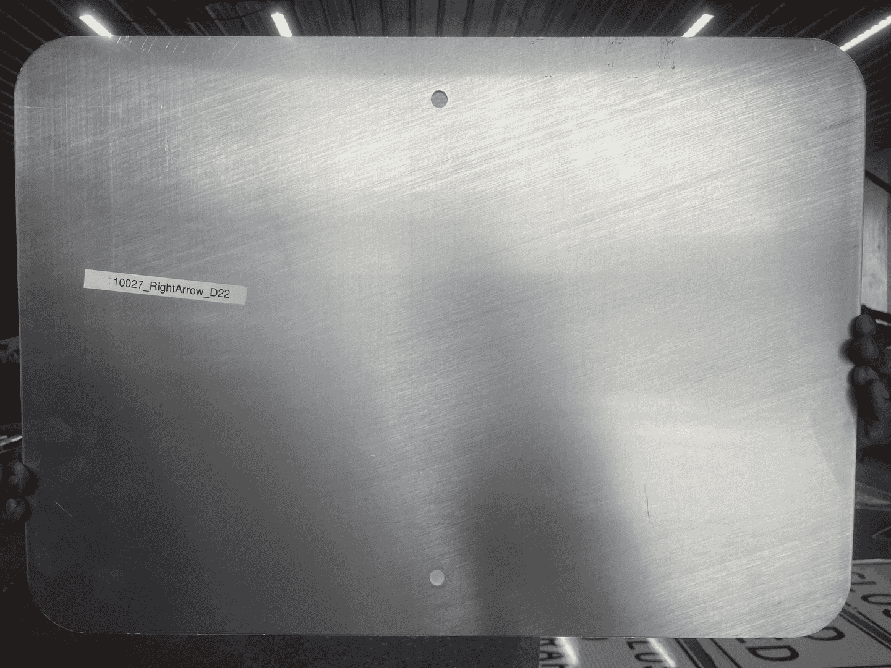
  <figcaption>Fig.73 - Right Arrow sign.</figcaption>
</pre>
<pre align="center">
  
  <figcaption>Fig.74 - Right Arrow sign.</figcaption>
</pre>

<pre align="center">
  
  <figcaption>Fig.75 - Right Arrow sign.</figcaption>
</pre>

<a href="#hardware_workzones_pennsylvaniaadsequipmentinventory">Back to top</a>
***

### 8) Up Arrow signs - Quantity: 3

#### 10028_UpArrow_A

<pre align="center">
  
  <figcaption>Fig.76 - Up Arrow sign.</figcaption>
</pre>

<pre align="center">
  
  <figcaption>Fig.77 - Up Arrow sign.</figcaption>
</pre>

<pre align="center">
  
  <figcaption>Fig.78 - Up Arrow sign.</figcaption>
</pre>

<a href="#hardware_workzones_pennsylvaniaadsequipmentinventory">Back to top</a>
***

#### 10029_UpArrow_A

<pre align="center">
  
  <figcaption>Fig.79 - Up Arrow sign.</figcaption>
</pre>

<pre align="center">
  
  <figcaption>Fig.80 - Up Arrow sign.</figcaption>
</pre>

<pre align="center">
  
  <figcaption>Fig.81 - Up Arrow sign.</figcaption>
</pre>

<a href="#hardware_workzones_pennsylvaniaadsequipmentinventory">Back to top</a>
***

#### 10030_UpArrow_A

<pre align="center">
  
  <figcaption>Fig.82 - Up Arrow sign.</figcaption>
</pre>

<pre align="center">
  
  <figcaption>Fig.83 - Up Arrow sign.</figcaption>
</pre>

<pre align="center">
  
  <figcaption>Fig.84 - Up Arrow sign.</figcaption>
</pre>

<a href="#hardware_workzones_pennsylvaniaadsequipmentinventory">Back to top</a>

***

### 9) Right Turn sign - Quantity: 1

#### 10031_RightTurn_D

<pre align="center">
  
  <figcaption>Fig.85 - Up Arrow sign.</figcaption>
</pre>

<pre align="center">
  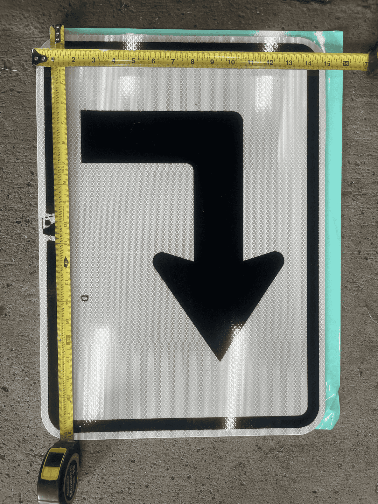
  <figcaption>Fig.86 - Up Arrow sign.</figcaption>
</pre>

<pre align="center">
  
  <figcaption>Fig.87 - Up Arrow sign.</figcaption>
</pre>

<a href="#hardware_workzones_pennsylvaniaadsequipmentinventory">Back to top</a>
***

### 10) Left Turn sign - Quantity: 2

#### 10032_LeftTurn_B

<pre align="center">
  
  <figcaption>Fig.88 - Up Arrow sign.</figcaption>
</pre>

<pre align="center">
  
  <figcaption>Fig.89 - Up Arrow sign.</figcaption>
</pre>

<pre align="center">
  
  <figcaption>Fig.90 - Up Arrow sign.</figcaption>
</pre>

<a href="#hardware_workzones_pennsylvaniaadsequipmentinventory">Back to top</a>
***

#### 10033_LeftTurn_B

<pre align="center">
  
  <figcaption>Fig.91 - Up Arrow sign.</figcaption>
</pre>

<pre align="center">
  
  <figcaption>Fig.92 - Up Arrow sign.</figcaption>
</pre>

<pre align="center">
  
  <figcaption>Fig.93 - Up Arrow sign.</figcaption>
</pre>

<a href="#hardware_workzones_pennsylvaniaadsequipmentinventory">Back to top</a>
***

### 11) Left Corner Arrow "STOP HERE ON RED" sign - Quantity: 1

#### 10034_LeftCornerArrow_-STOP-HERE-ON-RED-_22B

<pre align="center">
  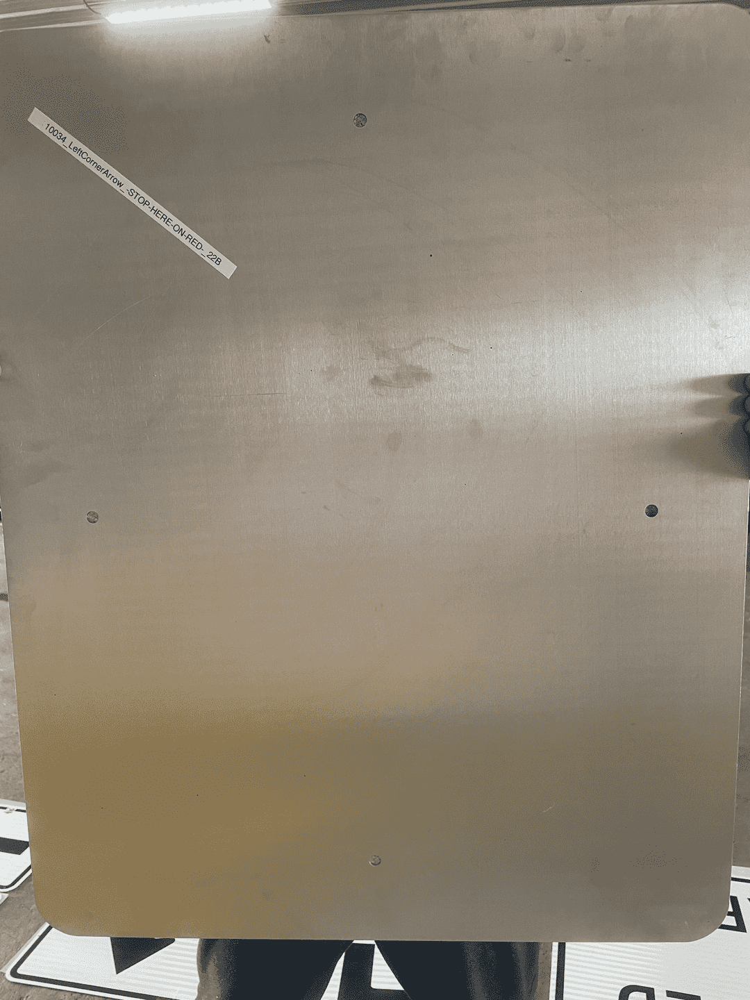
  <figcaption>Fig.94 - Left Corner ArroW "STOP HERE ON RED" sign.</figcaption>
</pre>

<pre align="center">
  
  <figcaption>Fig.95 - Left Corner ArroW "STOP HERE ON RED" sign.</figcaption>
</pre>

<pre align="center">
  
  <figcaption>Fig.96 - Left Corner ArroW "STOP HERE ON RED" sign.</figcaption>
</pre>

<a href="#hardware_workzones_pennsylvaniaadsequipmentinventory">Back to top</a>
***

### 12) ROAD CLOSED sign - Quantity: 2

#### 10035_-ROAD-CLOSED-_B

<pre align="center">
  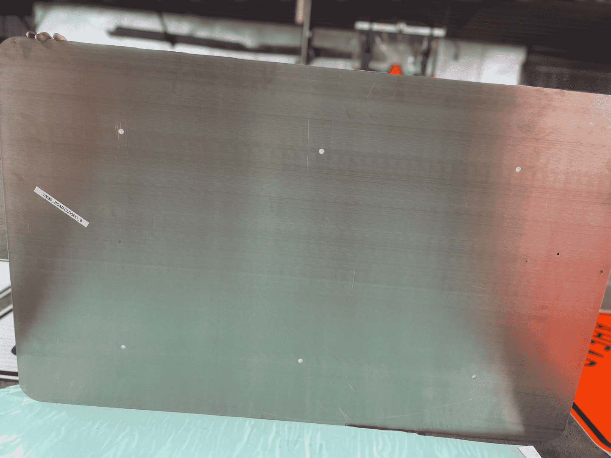
  <figcaption>Fig.97 - ROAD CLOSED sign.</figcaption>
</pre>

<pre align="center">
  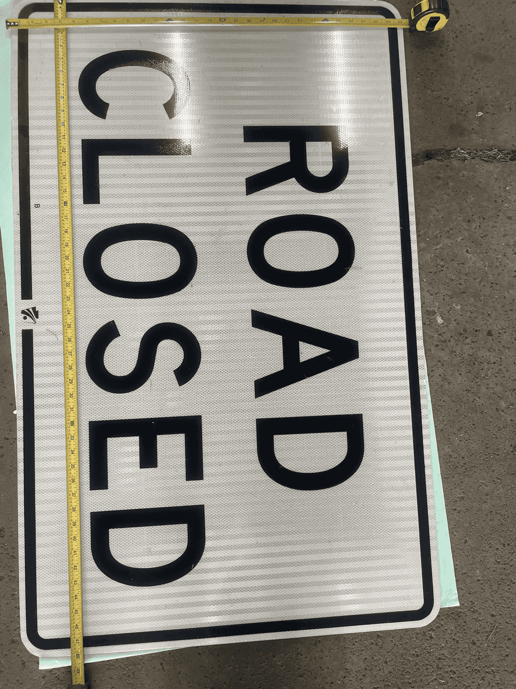
  <figcaption>Fig.98 - ROAD CLOSED sign.</figcaption>
</pre>

<pre align="center">
  
  <figcaption>Fig.99 - ROAD CLOSED sign.</figcaption>
</pre>

<pre align="center">
  
  <figcaption>Fig.100 - ROAD CLOSED sign.</figcaption>
</pre>

<pre align="center">
  
  <figcaption>Fig.101 - ROAD CLOSED sign.</figcaption>
</pre>

<pre align="center">
  
  <figcaption>Fig.102 - ROAD CLOSED sign.</figcaption>
</pre>

<a href="#hardware_workzones_pennsylvaniaadsequipmentinventory">Back to top</a>
***

#### 10036_-ROAD-CLOSED-_B

<pre align="center">
  
  <figcaption>Fig.103 - ROAD CLOSED sign.</figcaption>
</pre>

<pre align="center">
  
  <figcaption>Fig.104 - ROAD CLOSED sign.</figcaption>
</pre>

<pre align="center">
  
  <figcaption>Fig.105 - ROAD CLOSED sign.</figcaption>
</pre>

<pre align="center">
  
  <figcaption>Fig.106 - ROAD CLOSED sign.</figcaption>
</pre>

<pre align="center">
  
  <figcaption>Fig.107 - ROAD CLOSED sign.</figcaption>
</pre>

<pre align="center">
  
  <figcaption>Fig.108 - ROAD CLOSED sign.</figcaption>
</pre>

<a href="#hardware_workzones_pennsylvaniaadsequipmentinventory">Back to top</a>
***

### 13) ROAD CLOSED /TO /THRU TRAFFIC sign - Quantity: 1

#### 10037_-ROAD+CLOSED-TO-THRU+TRAFFIC-_B

<pre align="center">
  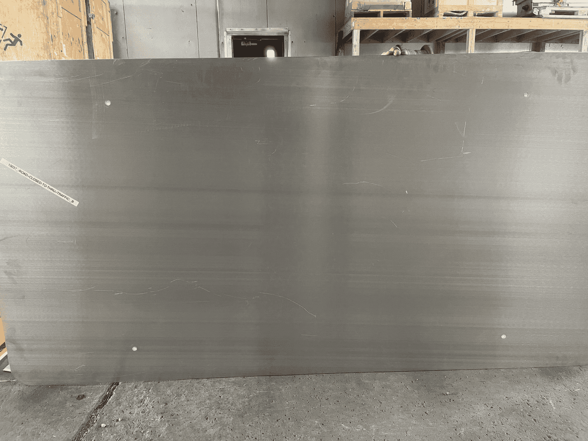
  <figcaption>Fig.109 - ROAD CLOSED /TO /THRU TRAFFIC sign.</figcaption>
</pre>

<pre align="center">
  
  <figcaption>Fig.1110 - ROAD CLOSED /TO /THRU TRAFFIC sign.</figcaption>
</pre>

<pre align="center">
  
  <figcaption>Fig.111 - ROAD CLOSED /TO /THRU TRAFFIC sign.</figcaption>
</pre>

<a href="#hardware_workzones_pennsylvaniaadsequipmentinventory">Back to top</a>
***

### 14) NORTH sign - Quantity: 10

#### 10038_-NORTH-_DIII22

<pre align="center">
  
  <figcaption>Fig.112 - NORTH sign.</figcaption>
</pre>

<pre align="center">
  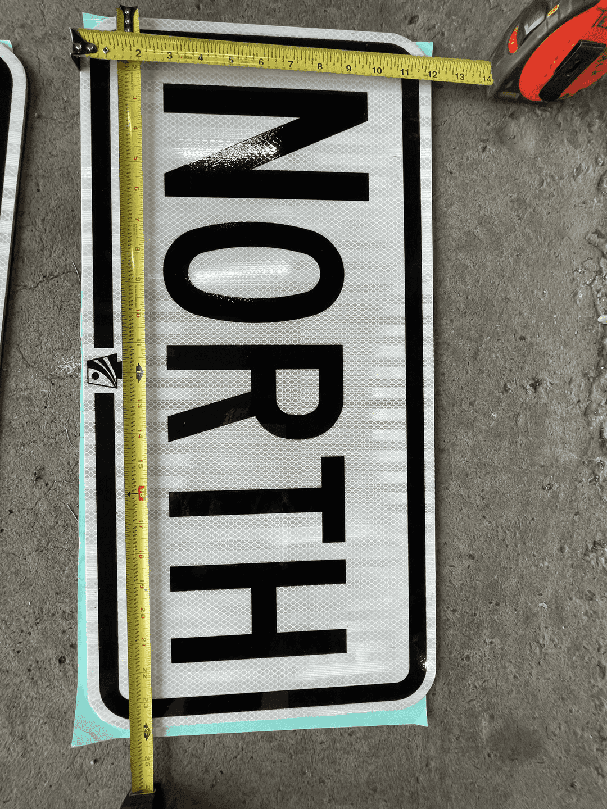
  <figcaption>Fig.113 - NORTH sign.</figcaption>
</pre>

<pre align="center">
  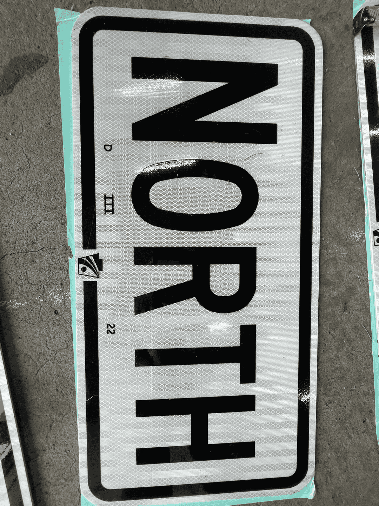
  <figcaption>Fig.114 - NORTH sign.</figcaption>
</pre>

<a href="#hardware_workzones_pennsylvaniaadsequipmentinventory">Back to top</a>
***

#### 10039_-NORTH-_DIII22

<pre align="center">
  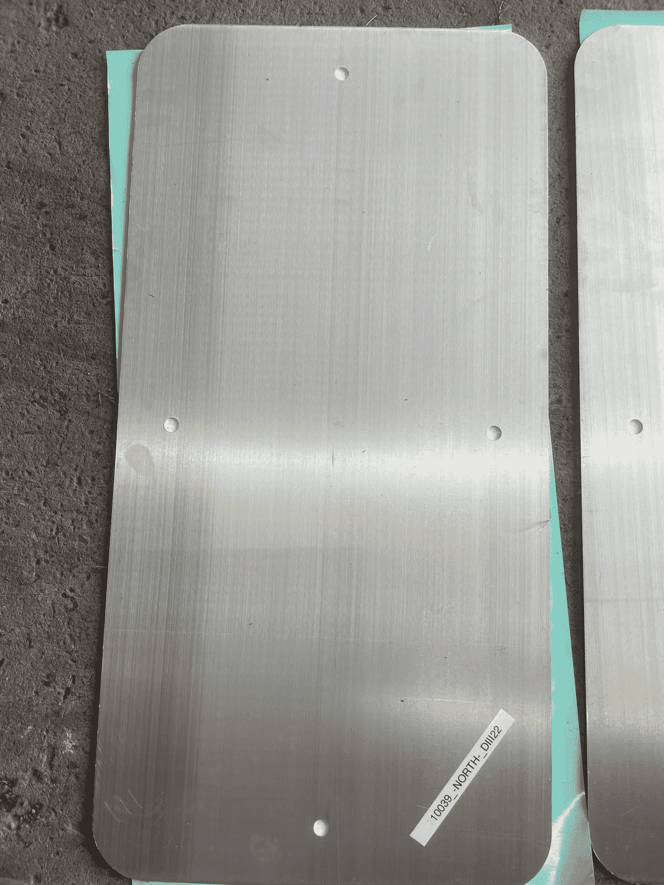
  <figcaption>Fig.115 - NORTH sign.</figcaption>
</pre>

<pre align="center">
  
  <figcaption>Fig.116 - NORTH sign.</figcaption>
</pre>

<pre align="center">
  
  <figcaption>Fig.117 - NORTH sign.</figcaption>
</pre>

<a href="#hardware_workzones_pennsylvaniaadsequipmentinventory">Back to top</a>
***

#### 10040_-NORTH-_DIII22

<pre align="center">
  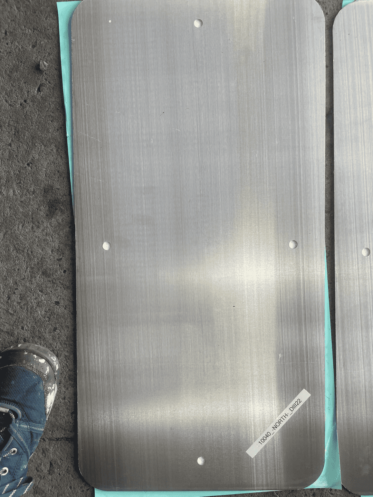
  <figcaption>Fig.118 - NORTH sign.</figcaption>
</pre>

<pre align="center">
  
  <figcaption>Fig.119 - NORTH sign.</figcaption>
</pre>

<pre align="center">
  
  <figcaption>Fig.120 - NORTH sign.</figcaption>
</pre>

<a href="#hardware_workzones_pennsylvaniaadsequipmentinventory">Back to top</a>
***

#### 10041_-NORTH-_DIII22

<pre align="center">
  
  <figcaption>Fig.121 - NORTH sign.</figcaption>
</pre>

<pre align="center">
  
  <figcaption>Fig.122 - NORTH sign.</figcaption>
</pre>

<pre align="center">
  
  <figcaption>Fig.123 - NORTH sign.</figcaption>
</pre>

<a href="#hardware_workzones_pennsylvaniaadsequipmentinventory">Back to top</a>
***

#### 10042_-NORTH-_DIII22

<pre align="center">
  
  <figcaption>Fig.124 - NORTH sign.</figcaption>
</pre>

<pre align="center">
  
  <figcaption>Fig.125 - NORTH sign.</figcaption>
</pre>

<pre align="center">
  
  <figcaption>Fig.126 - NORTH sign.</figcaption>
</pre>

<a href="#hardware_workzones_pennsylvaniaadsequipmentinventory">Back to top</a>
***

#### 10043_-NORTH-_DIII22

<pre align="center">
  
  <figcaption>Fig.127 - NORTH sign.</figcaption>
</pre>

<pre align="center">
  
  <figcaption>Fig.128 - NORTH sign.</figcaption>
</pre>

<pre align="center">
  
  <figcaption>Fig.129 - NORTH sign.</figcaption>
</pre>

<a href="#hardware_workzones_pennsylvaniaadsequipmentinventory">Back to top</a>
***

#### 10044_-NORTH-_DIII22

<pre align="center">
  
  <figcaption>Fig.130 - NORTH sign.</figcaption>
</pre>

<pre align="center">
  
  <figcaption>Fig.131 - NORTH sign.</figcaption>
</pre>

<pre align="center">
  
  <figcaption>Fig.132 - NORTH sign.</figcaption>
</pre>

<a href="#hardware_workzones_pennsylvaniaadsequipmentinventory">Back to top</a>
***

#### 10045_-NORTH-_DIII22

<pre align="center">
  
  <figcaption>Fig.133 - NORTH sign.</figcaption>
</pre>

<pre align="center">
  
  <figcaption>Fig.134 - NORTH sign.</figcaption>
</pre>

<pre align="center">
  
  <figcaption>Fig.135 - NORTH sign.</figcaption>
</pre>

<a href="#hardware_workzones_pennsylvaniaadsequipmentinventory">Back to top</a>
***

#### 10046_-NORTH-_DIII22

<pre align="center">
  
  <figcaption>Fig.136 - NORTH sign.</figcaption>
</pre>

<pre align="center">
  
  <figcaption>Fig.137 - NORTH sign.</figcaption>
</pre>

<pre align="center">
  
  <figcaption>Fig.138 - NORTH sign.</figcaption>
</pre>

<a href="#hardware_workzones_pennsylvaniaadsequipmentinventory">Back to top</a>
***

#### 10047_-NORTH-_DIII22

<pre align="center">
  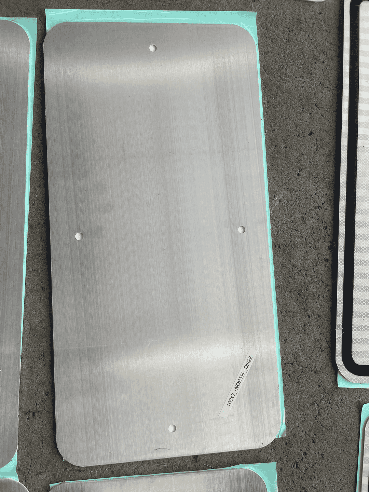
  <figcaption>Fig.139 - NORTH sign.</figcaption>
</pre>

<pre align="center">
  
  <figcaption>Fig.140 - NORTH sign.</figcaption>
</pre>

<pre align="center">
  
  <figcaption>Fig.141 - NORTH sign.</figcaption>
</pre>

<a href="#hardware_workzones_pennsylvaniaadsequipmentinventory">Back to top</a>
***

### 15) SOUTH sign - Quantity: 10

#### 10048_-SOUTH-_22DIII

<pre align="center">
  
  <figcaption>Fig.142 - SOUTH sign.</figcaption>
</pre>

<pre align="center">
  
  <figcaption>Fig.143 - SOUTH sign.</figcaption>
</pre>

<pre align="center">
  
  <figcaption>Fig.144 - SOUTH sign.</figcaption>
</pre>

<a href="#hardware_workzones_pennsylvaniaadsequipmentinventory">Back to top</a>
***

#### 10049_-SOUTH-_22DIII

<pre align="center">
  
  <figcaption>Fig.145 - SOUTH sign.</figcaption>
</pre>
<pre align="center">
  
  <figcaption>Fig.146 - SOUTH sign.</figcaption>
</pre>

<pre align="center">
  
  <figcaption>Fig.147 - SOUTH sign.</figcaption>
</pre>

<a href="#hardware_workzones_pennsylvaniaadsequipmentinventory">Back to top</a>
***

#### 10050_-SOUTH-_22DIII

<pre align="center">
  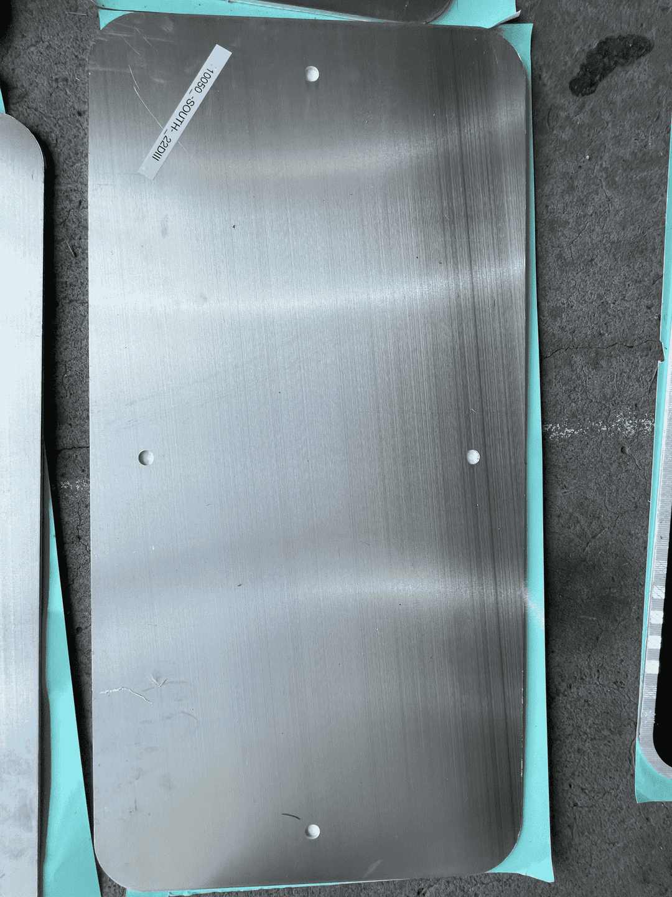
  <figcaption>Fig.148 - SOUTH sign.</figcaption>
</pre>
<pre align="center">
  
  <figcaption>Fig.149 - SOUTH sign.</figcaption>
</pre>

<pre align="center">
  
  <figcaption>Fig.150 - SOUTH sign.</figcaption>
</pre>

<a href="#hardware_workzones_pennsylvaniaadsequipmentinventory">Back to top</a>
***

#### 10051_-SOUTH-_22DIII

<pre align="center">
  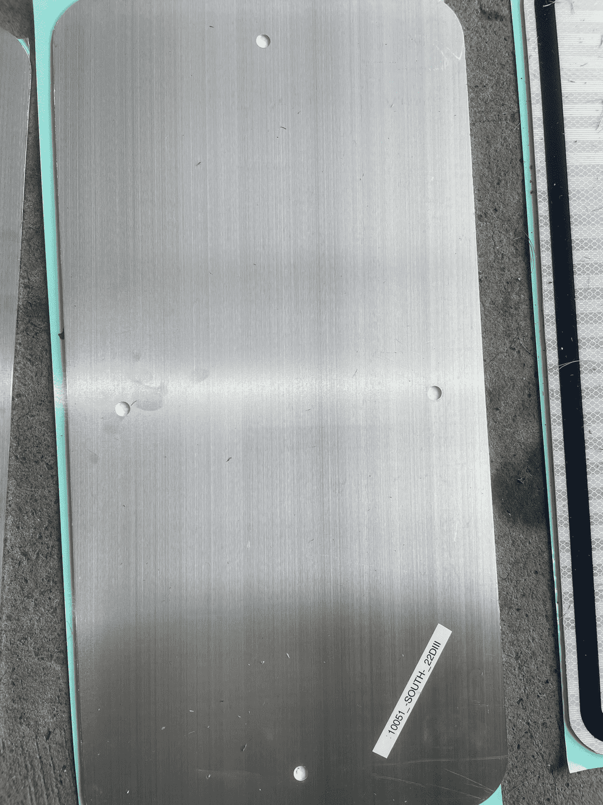
  <figcaption>Fig.151 - SOUTH sign.</figcaption>
</pre>
<pre align="center">
  
  <figcaption>Fig.152 - .</figcaption>
</pre>

<pre align="center">
  
  <figcaption>Fig.153 - SOUTH sign.</figcaption>
</pre>

<a href="#hardware_workzones_pennsylvaniaadsequipmentinventory">Back to top</a>
***

#### 10052_-SOUTH-_22DIII

<pre align="center">
  
  <figcaption>Fig.154 - SOUTH sign.</figcaption>
</pre>
<pre align="center">
  
  <figcaption>Fig.155 - SOUTH sign.</figcaption>
</pre>

<pre align="center">
  
  <figcaption>Fig.156 - SOUTH sign.</figcaption>
</pre>

<a href="#hardware_workzones_pennsylvaniaadsequipmentinventory">Back to top</a>
***

#### 10053_-SOUTH-_22DIII

<pre align="center">
  
  <figcaption>Fig.157 - SOUTH sign.</figcaption>
</pre>
<pre align="center">
  
  <figcaption>Fig.158 - SOUTH sign.</figcaption>
</pre>

<pre align="center">
  
  <figcaption>Fig.159 - SOUTH sign.</figcaption>
</pre>

<a href="#hardware_workzones_pennsylvaniaadsequipmentinventory">Back to top</a>
***

#### 10054_-SOUTH-_22DIII

<pre align="center">
  
  <figcaption>Fig.160 - SOUTH sign.</figcaption>
</pre>
<pre align="center">
  
  <figcaption>Fig.161 - SOUTH sign.</figcaption>
</pre>

<pre align="center">
  
  <figcaption>Fig.162 - SOUTH sign.</figcaption>
</pre>

<a href="#hardware_workzones_pennsylvaniaadsequipmentinventory">Back to top</a>
***

#### 10055_-SOUTH-_22DIII

<pre align="center">
  
  <figcaption>Fig.163 - SOUTH sign.</figcaption>
</pre>
<pre align="center">
  
  <figcaption>Fig.164 - SOUTH sign.</figcaption>
</pre>

<pre align="center">
  
  <figcaption>Fig.165 - SOUTH sign.</figcaption>
</pre>

<a href="#hardware_workzones_pennsylvaniaadsequipmentinventory">Back to top</a>
***

#### 10056_-SOUTH-_22DIII

<pre align="center">
  
  <figcaption>Fig.166 - SOUTH sign.</figcaption>
</pre>
<pre align="center">
  
  <figcaption>Fig.167 - SOUTH sign.</figcaption>
</pre>

<pre align="center">
  
  <figcaption>Fig.168 - SOUTH sign.</figcaption>
</pre>

<a href="#hardware_workzones_pennsylvaniaadsequipmentinventory">Back to top</a>
***

#### 10057_-SOUTH-_22DIII

<pre align="center">
  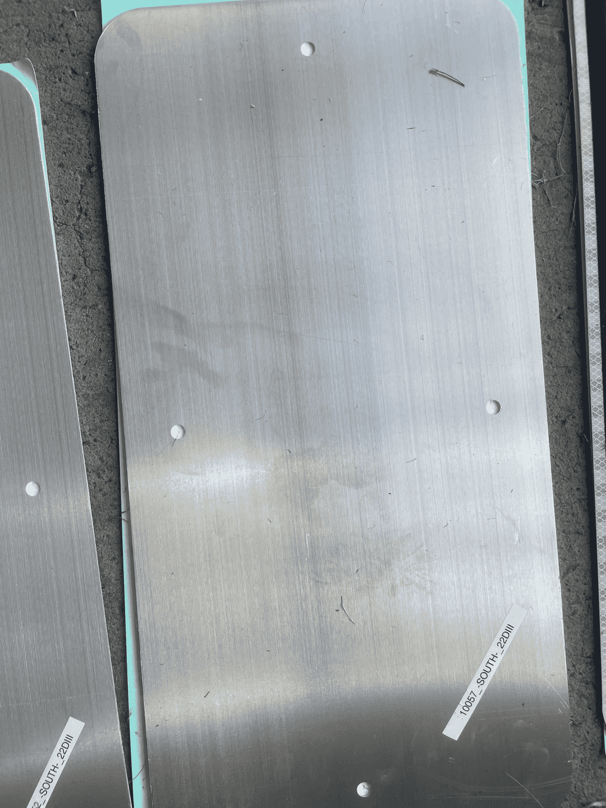
  <figcaption>Fig.169 - SOUTH sign.</figcaption>
</pre>
<pre align="center">
  
  <figcaption>Fig.170 - SOUTH sign.</figcaption>
</pre>

<pre align="center">
  
  <figcaption>Fig.171 - SOUTH sign.</figcaption>
</pre>

<a href="#hardware_workzones_pennsylvaniaadsequipmentinventory">Back to top</a>
***

### 16) EAST sign - Quantity: 10

#### 10058_-EAST-_22DIII

<pre align="center">
  
  <figcaption>Fig.172 - EAST sign.</figcaption>
</pre>
<pre align="center">
  
  <figcaption>Fig.173 - EAST sign.</figcaption>
</pre>

<pre align="center">
  
  <figcaption>Fig.174 - EAST sign.</figcaption>
</pre>

<a href="#hardware_workzones_pennsylvaniaadsequipmentinventory">Back to top</a>
***

#### 10059_-EAST-_22DIII

<pre align="center">
  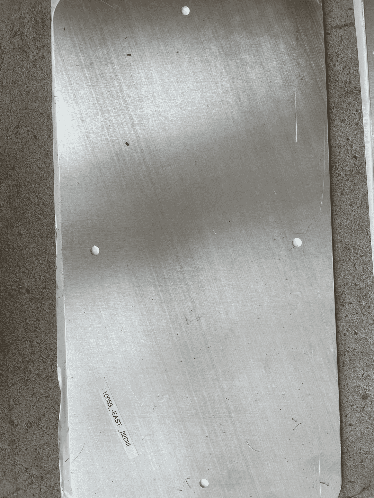
  <figcaption>Fig.175 - EAST sign.</figcaption>
</pre>
<pre align="center">
  
  <figcaption>Fig.176 - EAST sign.</figcaption>
</pre>

<pre align="center">
  
  <figcaption>Fig.177 - EAST sign.</figcaption>
</pre>

<a href="#hardware_workzones_pennsylvaniaadsequipmentinventory">Back to top</a>
***

#### 10060_-EAST-_22DIII

<pre align="center">
  
  <figcaption>Fig.178- EAST sign.</figcaption>
</pre>
<pre align="center">
  
  <figcaption>Fig.179 - EAST sign.</figcaption>
</pre>

<pre align="center">
  
  <figcaption>Fig.180 - EAST sign.</figcaption>
</pre>

<a href="#hardware_workzones_pennsylvaniaadsequipmentinventory">Back to top</a>
***

#### 10061_-EAST-_22DIII

<pre align="center">
  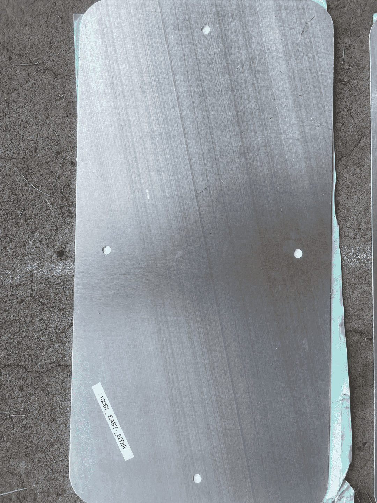
  <figcaption>Fig.181 - EAST sign.</figcaption>
</pre>
<pre align="center">
  
  <figcaption>Fig.182 - EAST sign.</figcaption>
</pre>

<pre align="center">
  
  <figcaption>Fig.183 - EAST sign.</figcaption>
</pre>

<a href="#hardware_workzones_pennsylvaniaadsequipmentinventory">Back to top</a>
***

#### 10062_-EAST-_22DIII

<pre align="center">
  
  <figcaption>Fig.184 - EAST sign.</figcaption>
</pre>
<pre align="center">
  
  <figcaption>Fig.185 - EAST sign.</figcaption>
</pre>

<pre align="center">
  
  <figcaption>Fig.186 - EAST sign.</figcaption>
</pre>

<a href="#hardware_workzones_pennsylvaniaadsequipmentinventory">Back to top</a>
***

#### 10063_-EAST-_22DIII

<pre align="center">
  
  <figcaption>Fig.187 - EAST sign.</figcaption>
</pre>
<pre align="center">
  
  <figcaption>Fig.188 - EAST sign.</figcaption>
</pre>

<pre align="center">
  
  <figcaption>Fig.189 - EAST sign.</figcaption>
</pre>

<a href="#hardware_workzones_pennsylvaniaadsequipmentinventory">Back to top</a>
***

#### 10064_-EAST-_22DIII

<pre align="center">
  
  <figcaption>Fig.190 - EAST sign.</figcaption>
</pre>

<pre align="center">
  
  <figcaption>Fig.191 - EAST sign.</figcaption>
</pre>

<pre align="center">
  
  <figcaption>Fig.192 - EAST sign.</figcaption>
</pre>

<a href="#hardware_workzones_pennsylvaniaadsequipmentinventory">Back to top</a>
***

#### 10065_-EAST-_22DIII

<pre align="center">
  
  <figcaption>Fig.193 - EAST sign.</figcaption>
</pre>

<pre align="center">
  
  <figcaption>Fig.194 - EAST sign.</figcaption>
</pre>

<pre align="center">
  
  <figcaption>Fig.195 - EAST sign.</figcaption>
</pre>

<a href="#hardware_workzones_pennsylvaniaadsequipmentinventory">Back to top</a>
***

#### 10066_-EAST-_22DIII

<pre align="center">
  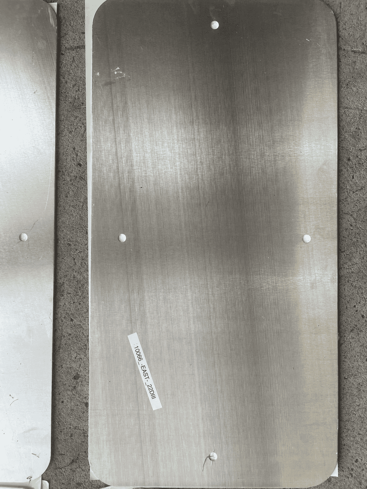
  <figcaption>Fig.196 - EAST sign.</figcaption>
</pre>

<pre align="center">
  
  <figcaption>Fig.197 - EAST sign.</figcaption>
</pre>

<pre align="center">
  
  <figcaption>Fig.198 - EAST sign.</figcaption>
</pre>

<a href="#hardware_workzones_pennsylvaniaadsequipmentinventory">Back to top</a>
***

#### 10067_-EAST-_22DIII

<pre align="center">
  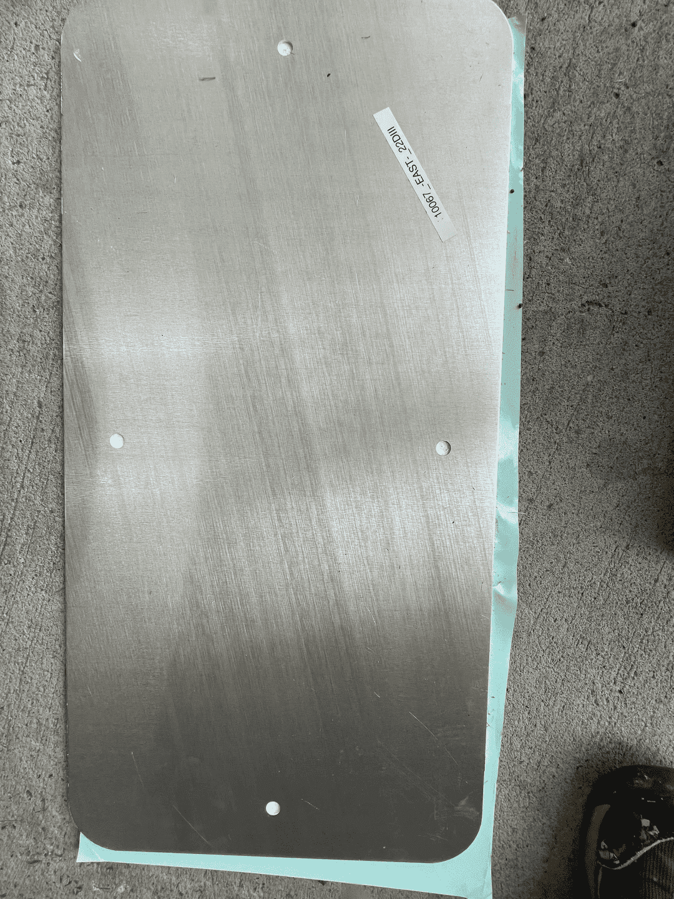
  <figcaption>Fig.199 - EAST sign.</figcaption>
</pre>

<pre align="center">
  
  <figcaption>Fig.200 - EAST sign.</figcaption>
</pre>

<pre align="center">
  
  <figcaption>Fig.201 - EAST sign.</figcaption>
</pre>

<a href="#hardware_workzones_pennsylvaniaadsequipmentinventory">Back to top</a>
***

### 17) WEST sign - Quantitiy: 10

#### 10068_-WEST-_IIID22

<pre align="center">
  
  <figcaption>Fig.202 - WEST sign.</figcaption>
</pre>
<pre align="center">
  
  <figcaption>Fig.203 - WEST sign.</figcaption>
</pre>

<pre align="center">
  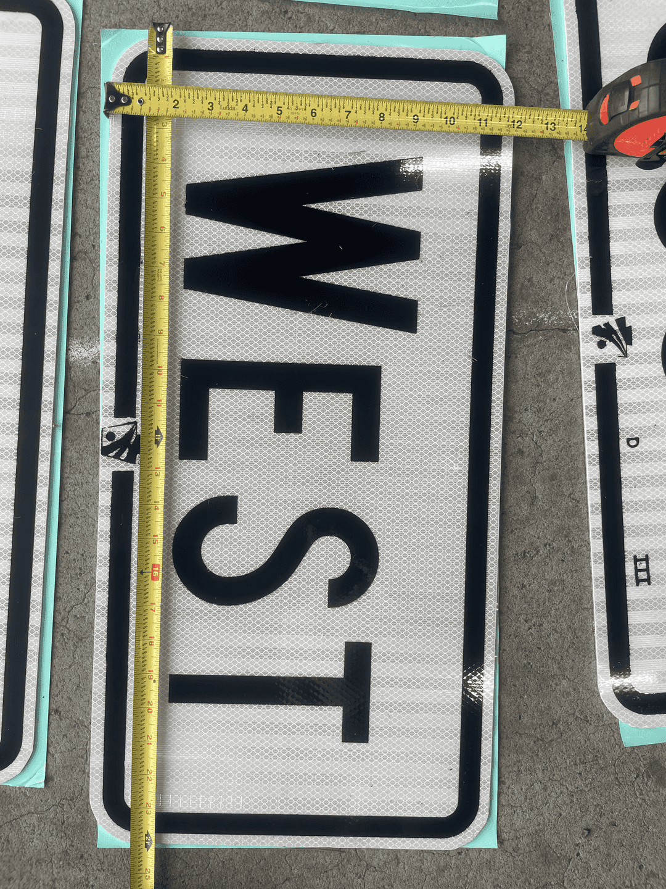
  <figcaption>Fig.204 - WEST sign.</figcaption>
</pre>

<a href="#hardware_workzones_pennsylvaniaadsequipmentinventory">Back to top</a>
***

#### 10069_-WEST-_IIID22

<pre align="center">
  
  <figcaption>Fig.205 - WEST sign.</figcaption>
</pre>
<pre align="center">
  
  <figcaption>Fig.206 - WEST sign.</figcaption>
</pre>

<pre align="center">
  
  <figcaption>Fig.207 - WEST sign.</figcaption>
</pre>

<a href="#hardware_workzones_pennsylvaniaadsequipmentinventory">Back to top</a>
***

#### 10070_-WEST-_IIID22

<pre align="center">
  
  <figcaption>Fig.208 - WEST sign.</figcaption>
</pre>
<pre align="center">
  
  <figcaption>Fig.208 - WEST sign.</figcaption>
</pre>

<pre align="center">
  
  <figcaption>Fig.209 - WEST sign.</figcaption>
</pre>

<a href="#hardware_workzones_pennsylvaniaadsequipmentinventory">Back to top</a>
***

#### 10071_-WEST-_IIID22

<pre align="center">
  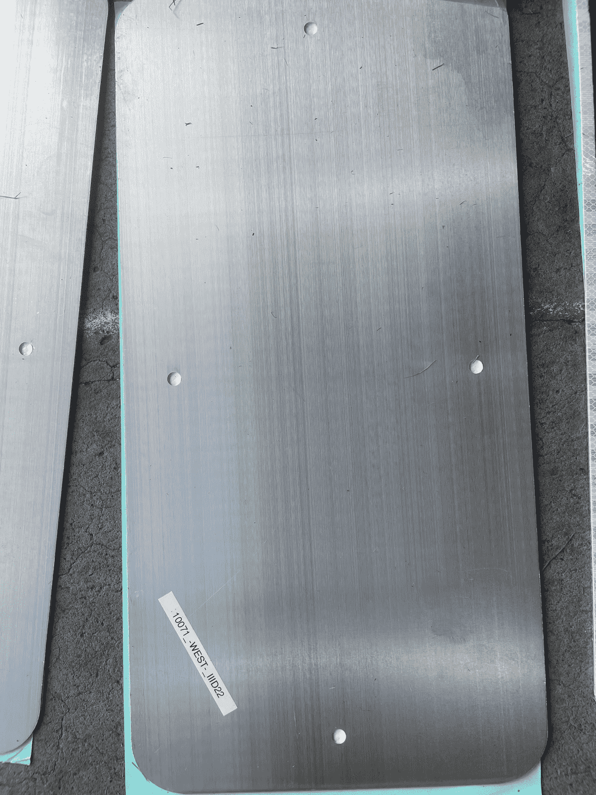
  <figcaption>Fig.210 - WEST sign.</figcaption>
</pre>
<pre align="center">
  
  <figcaption>Fig.211 - WEST sign.</figcaption>
</pre>

<pre align="center">
  
  <figcaption>Fig.212 - WEST sign.</figcaption>
</pre>

<a href="#hardware_workzones_pennsylvaniaadsequipmentinventory">Back to top</a>
***

#### 10072_-WEST-_IIID22

<pre align="center">
  
  <figcaption>Fig.213 - WEST sign.</figcaption>
</pre>
<pre align="center">
  
  <figcaption>Fig.214 - WEST sign.</figcaption>
</pre>

<pre align="center">
  
  <figcaption>Fig.215 - WEST sign.</figcaption>
</pre>

<a href="#hardware_workzones_pennsylvaniaadsequipmentinventory">Back to top</a>
***

#### 10073_-WEST-_IIID22

<pre align="center">
  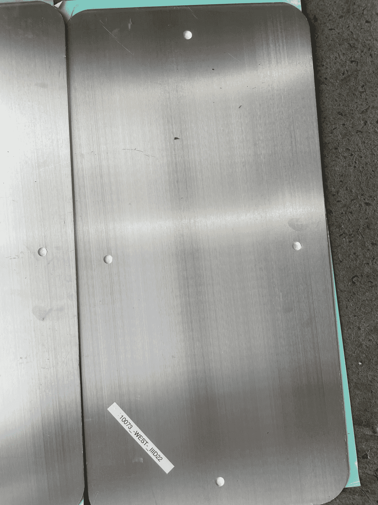
  <figcaption>Fig.216 - WEST sign.</figcaption>
</pre>
<pre align="center">
  
  <figcaption>Fig.217 - WEST sign.</figcaption>
</pre>

<pre align="center">
  
  <figcaption>Fig.218 - WEST sign.</figcaption>
</pre>

<a href="#hardware_workzones_pennsylvaniaadsequipmentinventory">Back to top</a>
***

#### 10074_-WEST-_IIID22

<pre align="center">
  
  <figcaption>Fig.219 - WEST sign.</figcaption>
</pre>
<pre align="center">
  
  <figcaption>Fig.220 - WEST sign.</figcaption>
</pre>

<pre align="center">
  
  <figcaption>Fig.221 - WEST sign.</figcaption>
</pre>

<a href="#hardware_workzones_pennsylvaniaadsequipmentinventory">Back to top</a>
***

#### 10075_-WEST-_IIID22

<pre align="center">
  
  <figcaption>Fig.222 - WEST sign.</figcaption>
</pre>
<pre align="center">
  
  <figcaption>Fig.223 - WEST sign.</figcaption>
</pre>

<pre align="center">
  
  <figcaption>Fig.224 - WEST sign.</figcaption>
</pre>

<a href="#hardware_workzones_pennsylvaniaadsequipmentinventory">Back to top</a>
***

#### 10076_-WEST-_IIID22

<pre align="center">
  
  <figcaption>Fig.225 - WEST sign.</figcaption>
</pre>
<pre align="center">
  
  <figcaption>Fig.226 - WEST sign.</figcaption>
</pre>

<pre align="center">
  
  <figcaption>Fig.227 - WEST sign.</figcaption>
</pre>

<a href="#hardware_workzones_pennsylvaniaadsequipmentinventory">Back to top</a>
***

#### 10077_-WEST-_IIID22

<pre align="center">
  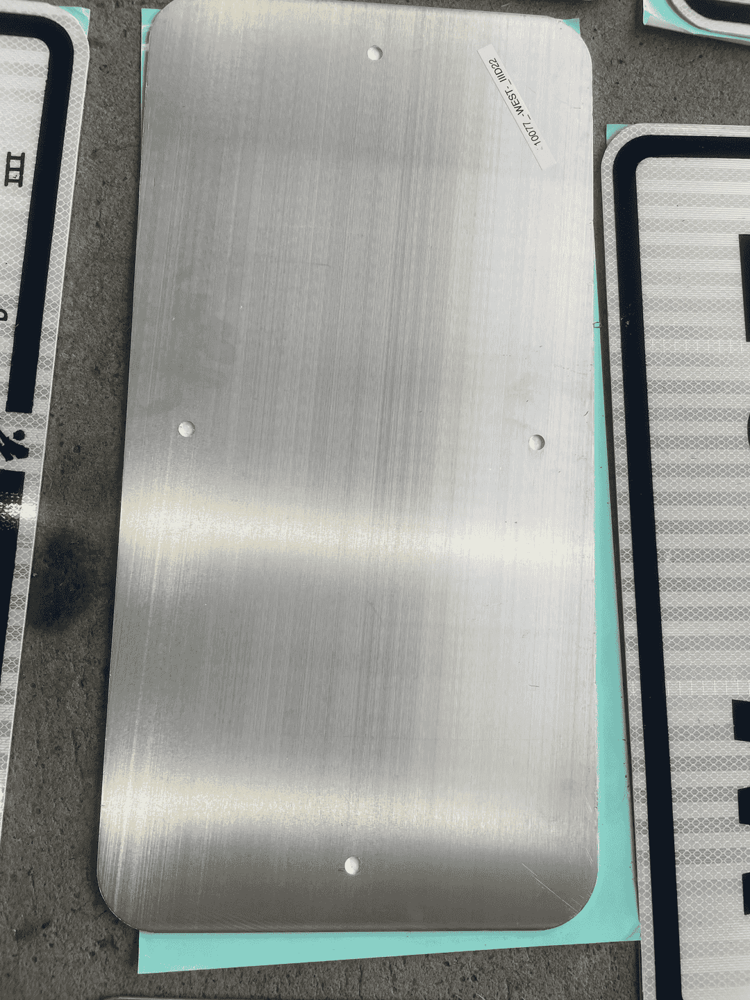
  <figcaption>Fig.228 - WEST sign.</figcaption>
</pre>
<pre align="center">
  
  <figcaption>Fig.229 - WEST sign.</figcaption>
</pre>

<pre align="center">
  
  <figcaption>Fig.230 - WEST sign.</figcaption>
</pre>

<a href="#hardware_workzones_pennsylvaniaadsequipmentinventory">Back to top</a>
***

<!-- LICENSE -->
## License

Distributed under the MIT License. See `LICENSE` for more information.

<a href="#hardware_workzones_pennsylvaniaadsequipmentinventory">Back to top</a>

***

<!-- CONTACT -->
## Contact

Sean Brennan - sbrennan@psu.edu

Project Link: [https://github.com/ivsg-psu/FeatureExtraction_DataTransforms_TransformClassLibrary](https://github.com/ivsg-psu/FeatureExtraction_DataTransforms_TransformClassLibrary)

<a href="#hardware_workzones_pennsylvaniaadsequipmentinventory">Back to top</a>

***

<!-- MARKDOWN LINKS & IMAGES -->
<!-- https://www.markdownguide.org/basic-syntax/#reference-style-links -->
